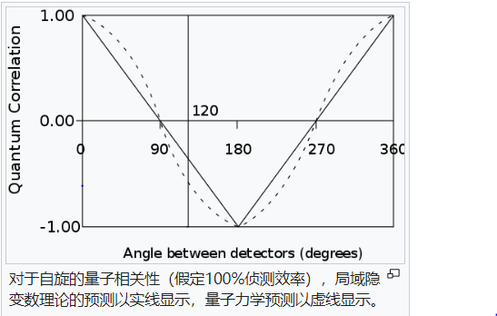

<meta http-equiv='Content-Type' content='text/html; charset=utf-8' />

2022 年 Aspect 终于得了炸弹奖了，*为什么是终于呢，还以为他早就得过了*。Bell不等式是一个当年只是看懂，而没有“理解”的东西，好好想想吧。

## EPR ##
说到 Bell 不等式，说到 Aspect 实验，一般都会说EPR佯谬。然而，EPR佯谬和 Bell 不等式其实没有直接的关系：它只是给出了一个 **同时** 测量两个不对易的物理量的一个思想方式：对于**某物理量**有相互关系的两个“粒子”，如果在它们分离后，这个关系可以保持。那么可以对其中的一个进行某量的测量，从而推断出另一个粒子的该物理量；此时，还可以直接测量另一粒子的某个不对易的物理量，从而**同时**得到它俩的准确结果。以 $p$ 和 $q$ 为例，这个命题是说：

1. 可以由静止的粒子分裂出两个粒子，则一定有：$p_1 = - p_2$；
2. 在两粒子距离很远的时候，可以同时测量 $p_1$ 和 $q_2$，*而 $p1$ 的测量不会影响到 $q2$* ，那 $(-p_1, q_2)$ 就是粒子2的对于两个不对易量的同时确定。

上面是一个可以实验验证的现象：如果两者都同时测准了，那么一切都还是经典的。否则，有两种可能：1) 测量会影响状态，这个影响是 **非定域**的，可以瞬时的影响到另一个粒子；2) 粒子的状态不是“经典”的，确定的，而是“量子”的。

那么，到底“量子”和“经典”的区别在哪？常常听说量子是“概率”的，而经典是“确定”的。那么就有一个问题：我们觉得“概率”是不是因为有什么没有测量到的“确定”的状态量呢？也就是说，有没有一个“隐参量”呢？(事实上，在柯尔莫哥洛夫的公理化的概率论中，在那个$\Sigma$代数上，对一个“事件”一切也都是确定的)

## 量子的“概率”和数学的“概率”

其实，在开始学到双缝实验时，应该已经注意到，量子理论中的“概率”是有点奇怪的：**可以叠加的是波函数，而概率对应的是模方**。这造成数学上“概率”(事实上是确定的，逐事件可加的)表述同量子的结论是不一致的。后来用于Bell不等式的原理也是这么得来的。

在[Bell不等式的中文wiki词条](https://zh.wikipedia.org/wiki/%E8%B4%9D%E5%B0%94%E5%AE%9A%E7%90%86)上有这么一个图，认为隐变量理论中，两根不平行的轴下的通过概率应该是随角度线性的。

这个可以从下面的推导中得出：

对于相隔很微小的角 $d \theta$ 的两个方向 $A, B$，$A$通过而$B$不通过的条件概率认为应该是一个小量$d\alpha$：
$$
\begin{eqnarray*}
d\alpha &=& P(\bar{B} \vert A)\\
\end{eqnarray*}
$$
又由对称性的要求，可以得到：

$$
\begin{eqnarray*}
P(AB) &=& P(\bar{A}\bar{B}) = (1-\alpha)/2\\
P(A\bar{B}) &=& P(B\bar{A}) = \alpha/2
\end{eqnarray*}
$$

同时，若再过一个小角$d \theta$的角度$C$进行测量，由对称性应该有$B$通过而$C$不通过的概率也是$d\alpha$。加一些“独立性”的要求可以推得：

$$
\begin{eqnarray*}
P(\bar{C} \vert A) &=& P(\bar{B},\bar{C} \vert A) + P(B,\bar{C} \vert{A}) \\
                   &=& P(\bar{C}|\bar{B})P(\bar{B} \vert A) + P(\bar{C}|B)P(B|A) \\
				   &=& 2d \alpha -2(d\alpha)^2 \\
				   &\sim& 2d\alpha
\end{eqnarray*}
$$
得到了线性的关系。
而量子理论给出的结论是 $\sin^2 2\theta \sim 4 \sin^2 \theta \sim 4\alpha$。
这就出现了偏差。不过注意到上面的假设太多，可以弱化。这就有了Bell不等式。

## Bell不等式 ##
还沿着上面的来，有：

$$
\begin{eqnarray*}
P(\bar{C} \vert A) &=& P(\bar{B},\bar{C} \vert A) + P(B,\bar{C} \vert{A}) \\
                   &=& (P(A,\bar{B},\bar{C})+P(A,B,\bar{C}))/P(A)\\
                   &\le& (P(A,\bar{B})+P(B,\bar{C}))/P(A)\\
P(\bar{C}) &\le& P(A,\bar{B})+P(B,\bar{C})
\end{eqnarray*}
$$

记 $C(a,b) = P(A,B)+P(\bar{A},\bar{B})-P(A,\bar{B})-P(\bar{A},B)$，有：
$$
\begin{eqnarray*}
\lvert C(a,b) - C(a,c) \rvert \le 1+ C(b,c) 
\end{eqnarray*}
$$
这就是贝尔不等式。另有一个扩展的CHSH不等式：
$$
\begin{eqnarray*}
\lvert C(a,b)-C(a,c) \rvert + \lvert C(d,b) + C(d,c) \rvert \le 2
\end{eqnarray*}
$$

