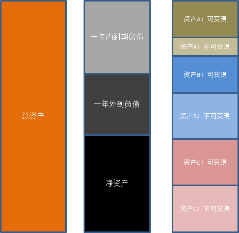

<meta http-equiv='Content-Type' content='text/html; charset=utf-8' />

NSFR在定义上是：可用稳定资金比例/所需稳定资金比例。其中：
* 可用稳定资金 = 净资产+1年以上到期负债
* 所需稳定资金是和不同业务有关、乘上不同比例的业务规模

这个定义比较不好理解，特别是看不出同“流动性”有什么关系。但是换一个角度就会比较好理解，如下图：

用总资产同时减分子和分母，那么分子变为：
* 一年内到期负债，可以理解为一年内要还的钱。

分母中，如果把所需稳定资金理解成：一年内变现不了的资产。分母变成：
* 一年内可以变现的资产。

显然如果一年内可变现的资产可以覆盖一年内到期的负债，那么是安全的。这样也容易看出，容易波动的资产（股票）和业务不容易退出变现或需要维持规模（融资融券）变现能力弱，所需稳定资金比例高。
