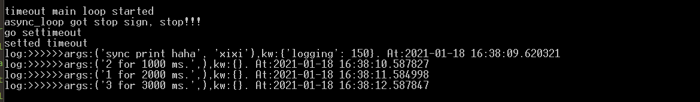

<meta http-equiv='Content-Type' content='text/html; charset=utf-8' />

看JavaScript的异步代码的时候，看上去“无阻断”的代码模式是一个神奇的问题，但是在重新看到`delay`的实现后，发现这其实是一个简单的事。下面的代码用 Python 实现了一下，函数就实现了一个`set_timeout`。

``` python
import time
import datetime
import random
import threading
import queue

class timeout_loop():
    def __init__(self):
        self.timeout_dict = {}
        self.stop_sign = False
        self.serve_forever()

    def push(self, time_obj, back_dict):
        key = time_obj['key']
        time_now = time.time()
        self.timeout_dict[key] = {
            'time': time_now + time_obj['time'],
            'back_dict': back_dict
        }

    def serve_forever(self):
        def _serve_forever(obj):
            while (not obj.stop_sign):
                for key, item in obj.timeout_dict.copy().items():
                    if time.time() > item['time']:
                        item['back_dict'][key] = True
                        del obj.timeout_dict[key]

            print('timeout_loop got stop sign, stop!!!')

        server_thread = threading.Thread(target=_serve_forever, args=[self])
        server_thread.start()
        print('timeout main loop started')
        return True

    def stop(self):
        self.stop_sign = True

TIMEOUT_LOOP = timeout_loop()
def push_to_timeout_loop(time_obj, back_dict):
    TIMEOUT_LOOP.push(time_obj, back_dict)


class async_loop():
    def __init__(self):
        self.rslt_dict = {}
        self.stop_sign = False
        self.callback_dict = {}

    def serve_forever(self):
        """
        使用一个轮询来处理已经拿到结果的情况。之所以不用IO来直接驱动，是因为那样IO还需要等运行的结果
        """
        def _serve_forever(obj):
            while (not obj.stop_sign):
                for key, rslt in obj.rslt_dict.copy().items():
                    obj.do_to_callback(key, rslt)
                    del obj.rslt_dict[key]
            print('got stop sign, stop!!!')
            return True

        server_thread = threading.Thread(target=_serve_forever, args=[self])
        server_thread.start()
        print('async_loop got stop sign, stop!!!')
        return True

    def do_to_callback(self, key, rslt):
        callback_func_obj = self.callback_dict[key]
        waiting_func_name = callback_func_obj['waiting_func']
        if waiting_func_name == 'set_timeout' or waiting_func_name == 'sync_call':
            _args = callback_func_obj['callback_args']
            _kw = callback_func_obj['callback_kw']
            if 'callback_func' in callback_func_obj: # 处理callback的方式
                _cb = callback_func_obj['callback_func']
                rslt = _cb(*_args, **_kw)
            else:
                print('bad callback func obj')
                rslt = None
            del self.callback_dict[key]
            return rslt
        else:
            raise NotImplementedError('only settimeout is implemented')

    def push_waiting_func(self, func_obj):
        waiting_func_name = func_obj['waiting_func']
        _key = '{}/{}/{}'.format(waiting_func_name, datetime.datetime.now(),
                                 random.randint(0, 1000000))
        if waiting_func_name == 'set_timeout':
            self.callback_dict[_key] = func_obj
            push_to_timeout_loop(
                {
                    'key': _key,
                    'time': func_obj['waiting_para'][0]
                }, self.rslt_dict) # 传递给“IO”的只有存回数据的地点，Key，和取数的参数
        elif waiting_func_name == 'sync_call':
            self.callback_dict[_key] = func_obj
            self.rslt_dict[_key] = func_obj
        else:
            raise NotImplementedError('only settimeout is implemented')

    def stop(self):
        self.stop_sign = True
A_LOOP = async_loop()
A_LOOP.serve_forever()

def push_to_async_loop(call_back_func_obj):
    A_LOOP.push_waiting_func(call_back_func_obj)

def set_timeout(callback_func, time_in_ms, *args, **kw):
    push_to_async_loop({
        'waiting_func': 'set_timeout',
        'waiting_para': [time_in_ms / 1000],
        'callback_func': callback_func,
        'callback_args': args,
        'callback_kw': kw
    })
    return True
def sync_call(callback_func, *args, **kw):
    push_to_async_loop({
        'waiting_func': 'sync_call',
        'callback_func': callback_func,
        'callback_args': args,
        'callback_kw': kw
    })
    return True


# #############################################测试
def log(*args, **kw):
    print("log:>>>>>>args:{},kw:{}. At:{}".format(args, kw, datetime.datetime.now()))


print('go settimeout')
set_timeout(log, 2000, '1 for 2000 ms.')
set_timeout(log, 1000, '2 for 1000 ms.')
set_timeout(log, 3000, '3 for 3000 ms.')
print('setted timeout')
sync_call(log, 'sync print haha','xixi',logging=150)


```
结果输出：

看到，`set_timeout`只是把`callback`和异步函数的参数push到了另一个**Loop**中。JavaScript的真异步主要是对这个**Loop**的实现更加省。这也是[我们实现Promise中](https://app.yinxiang.com/fx/ca083092-c3c7-458c-9ae5-9acec156164d)把`callback`函数加到一个`list`中就完成了的同样逻辑。


运行上面代码的时候，看到CPU的占用一直很高，这是由于持续的`while`循环的原因，下面使用`queue`进行一下优化，结果是在没有等待任务的时候，占用下来了。可是有还等待时，占用仍然很高。
``` python
import time
import datetime
import random
import threading
import queue
import asyncio

class timeout_loop():
    def __init__(self):
        self.timeout_queue = queue.Queue()
        self.stop_sign = False
        self.serve_forever()

    def push(self, time_obj, back_queue):
        key = time_obj['key']
        time_now = time.time()
        self.timeout_queue.put({"key":key,
                                'time': time_now + time_obj['time'],
                                'back_queue': back_queue                                
                                })

    def serve_forever(self):
        def _serve_forever(obj):
            while (not obj.stop_sign):
                item = obj.timeout_queue.get()
                key = item['key']
                if time.time() > item['time']:
                    item['back_queue'].put({'key':key, 'value':True})
                else:
                    obj.timeout_queue.put(item)
            print('timeout_loop got stop sign, stop!!!')

        server_thread = threading.Thread(target=_serve_forever, args=[self])
        server_thread.start()
        print('timeout main loop started')
        return True

    def stop(self):
        self.stop_sign = True

TIMEOUT_LOOP = timeout_loop()
def push_to_timeout_loop(time_obj, back_dict):
    TIMEOUT_LOOP.push(time_obj, back_dict)


class async_loop():
    def __init__(self):
        self.rslt_queue = queue.Queue()
        self.stop_sign = False
        self.callback_dict = {}

    def serve_forever(self):
        """
        使用一个轮询来处理已经拿到结果的情况。之所以不用IO来直接驱动，是因为那样IO还需要等运行的结果
        """
        def _serve_forever(obj):
            while (not obj.stop_sign):
                # 使用Queue来处理，使得待处理队列是空的时候，不过多的占用资源
                v = obj.rslt_queue.get(block=True, timeout=None)
                obj.do_to_callback(v['key'],v['value'])
            print('got stop sign, stop!!!')
            return True

        server_thread = threading.Thread(target=_serve_forever, args=[self])
        server_thread.start()
        print('async_loop got stop sign, stop!!!')
        return True

    def do_to_callback(self, key, rslt):
        callback_func_obj = self.callback_dict[key]
        waiting_func_name = callback_func_obj['waiting_func']
        if waiting_func_name == 'set_timeout' or waiting_func_name == 'sync_call':
            _args = callback_func_obj['callback_args']
            _kw = callback_func_obj['callback_kw']
            if 'callback_func' in callback_func_obj: # 处理callback的方式
                _cb = callback_func_obj['callback_func']
                rslt = _cb(*_args, **_kw)
            else:
                print('bad callback func obj')
                rslt = None
            del self.callback_dict[key]
            return rslt
        else:
            raise NotImplementedError('only settimeout is implemented')

    def push_waiting_func(self, func_obj):
        waiting_func_name = func_obj['waiting_func']
        _key = '{}/{}/{}'.format(waiting_func_name, datetime.datetime.now(),
                                 random.randint(0, 1000000))
        if waiting_func_name == 'set_timeout':
            self.callback_dict[_key] = func_obj
            push_to_timeout_loop(
                {
                    'key': _key,
                    'time': func_obj['waiting_para'][0]
                }, self.rslt_queue) # 传递给“IO”的只有存回数据的地点，Key，和取数的参数
        elif waiting_func_name == 'sync_call':
            self.callback_dict[_key] = func_obj
            self.rslt_queue.put({'key':_key,'value':func_obj})
        else:
            raise NotImplementedError('only settimeout is implemented')

    def stop(self):
        self.stop_sign = True
A_LOOP = async_loop()
A_LOOP.serve_forever()

def push_to_async_loop(call_back_func_obj):
    A_LOOP.push_waiting_func(call_back_func_obj)

def set_timeout(callback_func, time_in_ms, *args, **kw):
    push_to_async_loop({
        'waiting_func': 'set_timeout',
        'waiting_para': [time_in_ms / 1000],
        'callback_func': callback_func,
        'callback_args': args,
        'callback_kw': kw
    })
    return True
def sync_call(callback_func, *args, **kw):
    push_to_async_loop({
        'waiting_func': 'sync_call',
        'callback_func': callback_func,
        'callback_args': args,
        'callback_kw': kw
    })
    return True


# #############################################测试
def log(*args, **kw):
    print("log:>>>>>>args:{},kw:{}. At:{}".format(args, kw, datetime.datetime.now()))


print('go settimeout')
set_timeout(log, 2000, '1 for 2000 ms.')
set_timeout(log, 1000, '2 for 1000 ms.')
set_timeout(log, 3000, '3 for 3000 ms.')
set_timeout(log, 30000, '3 for 30000 ms.')
print('setted timeout')
sync_call(log, 'sync print haha','xixi',logging=150)
```
其原因是`timeout_loop`中还有一个在存在waiting任务时是一直运行的循环。

下面通过Event来最后优化一下。
``` python
from threading import Event
from sortedcontainers import SortedList

RENEW_TIME = 1000
class timeout_loop():
    def __init__(self):
        """
        通过一个SortedList来维护需要等待的时间
        """
        self.timeout_list = SortedList([{'time':time.time() + RENEW_TIME,'key':'fake'}], key = lambda x:x['time']) # 等待的List中，始终维持一个假需求，保持循环的持续
        self.stop_sign = False
        self._exit = Event()    # 通过Event来接受中止等待的信号
        self.lock = threading.RLock()
        self.serve()


    def push(self, time_obj, back_queue):
        """
        将新的需等待的时间，压入表。同时，需要判断新的时间和当前等待的先后关系。如果早于当前等待，需要重新开始等待。
        """
        key = time_obj['key']
        time_now = time.time()
        to_add_time = time_now + time_obj['time']
        with self.lock:
            old_next = self.timeout_list[0]
            old_last = self.timeout_list[-1]
            self.timeout_list.add({"key":key,
                                   'time': to_add_time,
                                   'back_queue': back_queue})
            if to_add_time > old_last['time']:
                self.timeout_list.remove(old_last)
                self.timeout_list.add({'time':to_add_time + RENEW_TIME,'key':'fake'})
                # print('{} longer than fake, set new fake'.format(key))
                # print(self.timeout_list)
            if to_add_time < old_next['time']:
                self._exit.set() # 通过Event中断已有等待
            
    def serve(self):
        def _serve_forever(obj):
            while (not obj.stop_sign):
                while not obj._exit.is_set():
                    the_next = obj.timeout_list[0]
                    time_to_next = the_next['time'] - time.time()
                    key = the_next['key']
                    obj._exit.wait(timeout = time_to_next) #要么等到信号，要么timeout。
                    if not obj._exit.is_set():
                        # print('time up for:',key)
                        if key == 'fake':
                            with obj.lock:
                                obj.timeout_list.add({'time':time.time() + RENEW_TIME,'key':'fake'})
                            # print('old fake touched, set new fake')
                        else:
                            the_next['back_queue'].put({'key':key, 'value':True})
                        with obj.lock:
                            obj.timeout_list.remove(the_next)
                    else:
                        pass
                        # print('got new next')
                obj._exit.clear()
                
            # print('timeout_loop got stop sign, stop!!!')

        server_thread = threading.Thread(target=_serve_forever, args=[self])
        server_thread.start()
        print('timeout main loop started')
        return True

    def stop(self):
        self._exit.set()
        self.stop_sign = True
```
Event似乎是一个应该好好理解一下的对象。 
