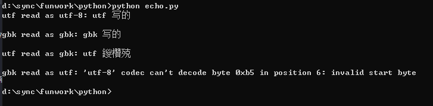
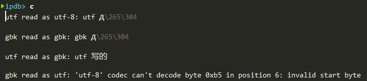
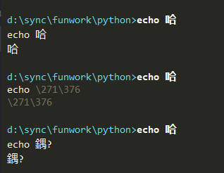

<meta http-equiv='Content-Type' content='text/html; charset=utf-8' />

之前一直没特别搞清Encoding和Decoding。最近Emacs用realgud的时候，出了显示的问题，所以又研究了一下。解决见[这个笔记](https://app.yinxiang.com/fx/e352a21c-e2a4-4fee-8c12-012859f71062)。另外，参考了一个[知乎上的帖子](https://app.yinxiang.com/fx/1990cb67-491d-4490-ae31-5e966b984663)对Python中的介绍，基本清楚了。

下面更清楚的说明其中关键。先看一个例子：
``` python
#echo.py
try:
    with open('utf.txt', encoding="utf-8") as fil:
        d = fil.read()
        print("utf read as utf-8:",d)
except Exception as e:
    print("read utf-8:", e)

try:
    with open('gbk.txt', encoding="gbk") as fil:
        d = fil.read()
        print("gbk read as gbk:",d)
except Exception as e:
    print("read gbk:", e)

try:
    with open('utf.txt', encoding="gbk") as fil:
        d = fil.read()
        print("utf read as gbk:",d)
except Exception as e:
    print("utf read as gbk:", e)

try:
    with open('gbk.txt', encoding="utf-8") as fil:
        d = fil.read()
        print("gbk read as utf:",d)
except Exception as e:
    print("gbk read as utf:", e)
    

```
上面gbk.txt和utf.txt分别是用gbk和utf-8编码保存的，有：
**windows系统编码是gbk的**，所以一个正常的process输出的应该是gbk encoding的才能够正常显示。
1. 用utf8读入utf8，gbk读入gbk，都可以在console正常输出。因为console 默认是接受gbk 输出，说明process输出的是gbk的。
2. 用utf8读入gbk，gbk读入utf8，都不可以在console正常输出，甚至应该有不能读入的。


注意到，上面依赖于**windows系统编码是gbk的**这约束了cmd输入输出的规则，那么要是不用cmd呢？
3. 在emacs中设置process输出coding为utf8。对于1应该为乱码，但应该是同一个乱码。
4. 对于2，期待utf文件被gbk方式读入后，输出的是正确的样子。


到此，基本明了了：
### 逻辑说明
定义可视字符集$C$，信号集$B$，Encoding为$C$到$B$的映射，Decoding相反。上述记为$eu,du; eg,dg$有$eu = du^{-1}; eg=dg^{-1}$(含义自明)。注意到录入、运算、显示，是在$C$上的，程序间传递是在$B$上的。写入文件$e$，读出文件$d$，程序内处理$C$，输出时$e$，**显示时$d$**。特别的，windows下的python输出时是$eg$，正常cmd的显示是$dg$，而刚才在emacs下设置了$du$。

显然，对于任意字符$c$，有：
1. 有 $dg(eg(du(eu(c))))=c$
2. 有 $dg(eg(du(eg(c)))) !=c$
3. 有 $du(eg(du(eu(c)))) !=c$
4. 有一个特别的 $du(eg(dg(eu(c))))=c$

在emacs中，也可以简单的测试：

上面第一个是正常对程序input as gbk, output as gbk; 第二个是 input as gbk, output as utf-8; 第三个是 input as utf-8, output as gbk。

