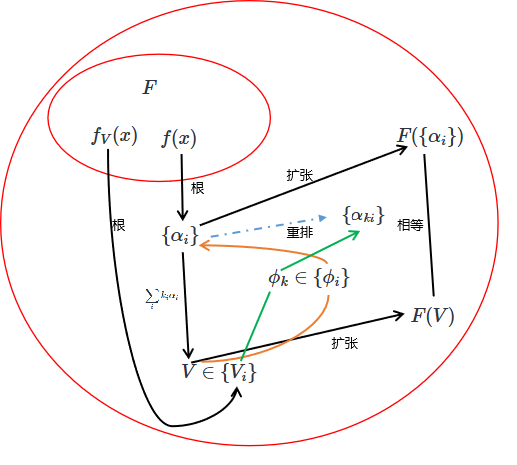

<meta http-equiv='Content-Type' content='text/html; charset=utf-8' />

关于五次以上的方程没有求根公式，网上看得零零散散的，还是自己再整理一下吧。主要的参考是*结城浩*的《数学女孩5》。
首先，如果是提到伽罗瓦理论就说群论的，大概率应该是没有读过这一块的。这中间“域”的部分更加复杂。

#### 符号约定

* 大写 $F$：基域
* $K$：$F$ 的扩域
* $F[x]$： 系数在域$F$上的以$x$为未知数的多项式集
* $F(\alpha)$：$F$ 添加 $\alpha$ 得到的扩域（记号同[抽象代数](./抽象代数.md#多项式)）
* $f(x)$: 以$x$为未知数的多项式

群、环、域、可约/不可约、代数元/超越元、极小多项式、正规子群等基本概念，见[抽象代数](./抽象代数.md)

### 逻辑链

### 理论、定义和证明

#### 定义：域扩张的度数

域扩张$K/F$的度数$[K:F]$是指$K$作为一个$F-$向量空间的维度（扩域的定义见[抽象代数](./抽象代数.md#域)）。

#### 定义：代数元、代数扩张与生成扩张

代数元与超越元的定义，以及添加代数元得到的扩域，见[抽象代数](./抽象代数.md#多项式)（那里的 $\tilde{a}$ 即本页的 $\alpha$）。
如果$K$中所有的元素在$F$上都是代数元，则$K/F$叫作一个**代数扩张**。
$K$的所有含$F$和$a_1,\cdots,a_l$的子域的交集，记为$F(a_1,\cdots,a_l)$，叫$a_1,\cdots,a_l$生成的$F$的扩张。若$\alpha$是代数元，则$F(\alpha)$叫作$F$的简单代数扩张。

目前我们只知道$\alpha$是代数元，可是不知道$F(\alpha)$的所有元素都是代数元。不过这是可以简单证明的：
* 设$f(\alpha) = 0, b = h(\alpha), h\in F[x]$
* 不妨令$f$是$n$次的，那么有 $\alpha^n$ 可以由$1,\alpha,\alpha^2,\cdots, \alpha^{n-1}$表示出来，进而，$\alpha$ 的任意多项式都可以用$n-1$ 次之内表示。
* 考虑$1,b,b^2,\cdots,b^n$，都可以表示为 $\alpha$ 的 $n-1$次式，而$n-1$次式线性无关的只有 $n$个，知必然可以组合成$0$。得证。

#### 引理d1

（可约/不可约、因子、素元的定义见[抽象代数](./抽象代数.md#环)）
设$f(x), p(x)$ 为系数域 $F$ 上的多项式，若$p(x)$在$F$上不可约，且$p(x),f(x)$有一个共同的根，则$p(x) \vert  f(x)$。证明：

若 $p(x)$ 是$1$次的，则自然成立。 若$p(x)$是高于一次的，由于它是不可约的，则知道它的根都不在$F$内。假设$p(x) \nmid f(x)$。注意$f(x), p(x)$ 通过辗转相除法，可以得到他们的“最大公因式”$g(x) \in F[x]$。

* 由于有共同的根$\alpha$，$\alpha$ 在 $F$ 上的极小多项式整除 $f$ 和 $p$，故 $g$ 至少$1$次。否则，如果公因式只有常数项，知存在$u(x)f(x) + v(x)p(x) = 1$，但代入$\alpha$时，应该为$0$, 矛盾。
* 由 $p \nmid f$ 知 $g$ 是 $p(x)$ 的真因式，且 $g \in F[x]$（辗转相除法的结果）
但 $F[x]$ 中不可约多项式 $p$ 除常数和自己外没有别的因式，矛盾。
故只能有$p(x) \vert f(x)$。

**引理d1** 有一个强力的含义。从系数域外的根出发，要在 $F[x]$ 内构造以它为根的多项式，方法只有一种（相差常数倍）：即它的不可约极小多项式。注意 $(x-\alpha)$ 在 $\alpha \notin F$ 时并不属于 $F[x]$，所以不能靠乘一列**一次**多项式回到 $F$。另外，在 $F[x]$ 中起到**质数**地位的是**不可约多项式**，而不只是一次的 $(x-\alpha)$——后者只有当根在 $F$ 内时才是不可约因子。等等，它还有一个更强力的含义：

**如果不可约多项式有一个根$\alpha$满足一个$F$中的代数关系$g(\alpha) = 0$，那么它的其他的根也都满足这个关系。**

#### 引理无重

如果$f(x) \in F[x]$ 不可约，则$f(x)$无重根。
证明：
如果有重根$\alpha$，可知$f^{\prime}(\alpha) = 0$。而$f,f^{\prime} \in F[x]$，它俩有共同的根$\alpha$，所以由[引理d1](#引理d1) $f\vert f^{\prime}$。 但$f^{\prime}$比$f$低一阶，矛盾。

#### 单代数扩域定理

$F$是一个数域，$f(x) \in F[x]$，根为$\alpha_1,\cdots,\alpha_n$。那么可以找到数$V = \sum \limits_{i=1}^n k_i \alpha_i$，其中$k_i$为整数，使得：$F(V) = F(\alpha_1,\cdots,\alpha_n)$。

先考虑一下这个命题的问题。显然，并不是所有的$F(a+b) = F(a,b)$，例如$F = \mathbb{Q}, a = \pi, b = 2-\pi$。于是知道这个结论和原方程是有关的。比如，我们知道有方程的根是$\sqrt{2}, \sqrt{3}$。考虑$F(\sqrt{2}+\sqrt{3})$中有$\sqrt{2}+\sqrt{3}$，从而有$1/(\sqrt{2}+\sqrt{3}) = \sqrt{3}-\sqrt{2}$，而进一步有$\sqrt{2}$ 和 $\sqrt{3}$。

最直接的想法是用某种方式把$V$代入到$f$中来得到一个关系，通过这个关系说明某个根在$F(V)$中。这个比较复杂，所以可能从数学归纳法入手。

* 证明$V_1 =k_1\alpha_1+k_2\alpha_2, F(V_1) = F(\alpha_1,\alpha_2)$。
* 另外，为了可以往下串，需要一个多项式$h(x) \in F[x]$，使得 $V$ 和所有 $\alpha_i$ 都是 $h$ 的根。这时，若有 $g(x) \in F[x]$ 满足 $g(V) = 0$，取 $h = f\cdot g$(相乘，不是复合) 即可。

证明：
先证上面第一条。若$\alpha_1 = \alpha_2$，令$k=1$自然是成立的，如果$\alpha_1 \ne \alpha_2$。于是可以找到整数$k$，满足：
$$
\forall i \ne 2,~ \forall j,~ \alpha_1+k\alpha_2-k\alpha_i \ne \alpha_j
$$
这个说的是，对于$\sigma: \sigma(y) = \alpha_1+k\alpha_2-ky$除了把$\alpha_2$映射到$\alpha_1$外不会把其他根映射到根。这样的 $k$ 存在：对每一对 $(i,j),~ i\ne 2$ 只有一个 $k$ 被排除，被排除的 $k$ 值有限，故可取整数避开。令$V = \alpha_1+k\alpha_2$, $l(x) = f(V-kx)$，$l(x)$的系数域被扩到$F(V)$。$l(x)$ 和 $f(x)$ 的公共根有且只有 $\alpha_2$，而且它们的系数都在域$F(V)$内。在 $F(V)$ 内对 $f(x), l(x)$ 做辗转相除法，得到的最大公因式属于 $F(V)[x]$；它俩的公共根有且只有 $\alpha_2$，故最大公因式只能是 $(x-\alpha_2)^i$ 的形式（这里并不要求 $\alpha_2$ 不是重根），于是 $\alpha_2 \in F(V)$。由 $\alpha_1 = V - k\alpha_2$ 得 $\alpha_1 \in F(V)$，所以$F(V) = F(\alpha_1,\alpha_2)$。

再来找上面需要的$g(x)$。他的一个根是$\alpha_1 + k\alpha_2$，要凑出一些其它的根来，让系数域回到$F$。考虑根和系数的关系，找到一个“最对称”的根集：$V_{ij} = \alpha_i + k \alpha_j$， 令$g(x) = \prod \limits_{i,j} (x-V_{ij})$。它的系数都是$\alpha$的对称式，于是能由初等对称多项式组成，而初等对称多项式都是$f(x)$的系数，所以$g(x)$的系数域会回到$F$，同时由于$V = V_{12}$，$g(V) = 0$。于是得证。

根据这个定理，我们可以得到《数学女孩5》上的两个引理：

1. 沿用上面第一步的证明可知：如果$f(x)\in F[x]$的根是$\alpha_1,\cdots,\alpha_n$，无重。可以找到一个$\phi(x_1,\cdots, x_n) = \sum \limits_{i=1}^n k_ix_i, ~k_i\in \mathbb{Z}$使得对于根的不同排列$\alpha_{p_i}$和$\alpha_{q_i}$，$\phi(\alpha_{p_i}) \ne \phi(\alpha_{q_i})$。
2. 任意$\alpha_i$都可以表示为$\alpha_i = \phi_i(V)$。其中$\phi_i$是$F$上的有理函数($F(V)$的任意成员都是$F$的有理函数)。

#### 引理共轭

对上一段两个引理的 $V$ 和 $\phi_i$，设 $f_V(x) \in F[x]$ 是 $V$ 在 $F$ 上的极小多项式（即满足 $f_V(V) = 0$ 且不可约），其根为$V_1,\cdots,V_m$。对于$m$有：

* 由[引理无重](#引理无重)，这$m$个根是互异的，$m$等于$f_V(x)$的次数。
* 而$f_V(x)$的次数，就是扩域的次数。因为$V^m$可被$V$的低次项表示，故扩域次数不高于$m$；而$f_V$不可约，知没有更低次的非零关系，扩域次数不低于$m$。

对每个固定的 $k$，集合 $\{\phi_1(V_k),\cdots,\phi_n(V_k)\}$ 都是根 $\{\alpha_1,\cdots,\alpha_n\}$ 的一个排列。即：

1. $\forall i$ 都有 $f(\phi_i(V_k)) = 0$。
2. $\forall i\ne j$ 都有 $\phi_i(V_k) \ne \phi_j(V_k)$。

证明：

1. 有 $f(\phi_i(V)) = f(\alpha_i) = 0$。考虑有理函数 $f \circ \phi_i$，它以 $V$ 为零点，通分后其分子 $N(x)$ 是 $F[x]$ 中以 $V$ 为根的多项式。$f_V$ 不可约，由[引理d1](#引理d1)得 $f_V \vert N(x)$，所以每个 $V_k$ 也是 $N(x)$ 的根，从而是 $f \circ \phi_i$ 的零点，即 $f(\phi_i(V_k)) = 0$。
2. 若 $\phi_i(V_k) = \phi_j(V_k)$（$i \ne j$），考虑有理函数 $\phi_i - \phi_j$，它以 $V_k$ 为零点，通分后其分子 $M(x)$ 在 $F[x]$ 中以 $V_k$ 为根。$f_V$ 是 $V_k$ 的极小多项式，由[引理d1](#引理d1)得 $f_V \vert M(x)$，故 $M(V) = 0$，即 $(\phi_i-\phi_j)(V) = 0$，进而 $\phi_i(V) = \phi_j(V)$，得 $\alpha_i = \alpha_j$，与 $f$ 无重根矛盾。

这个命题所表述的规律如下：

这样，一个$V_k$就是一个根置换。那么，接下来直接还有问题：
1. 不同的$V_k$对应不同的置换吗？
2. $V_k$覆盖所有的置换吗？

对于1，答案是肯定的。
* 根据[单代数扩域定理](#单代数扩域定理)中$V$的构成，以及其下的引理2，有 $V = \sum \limits_{i=1}^{n} k_i \phi_i(V)$。这是一个有理关系，通分能得到$g(V) = 0, g(x)\in F[x]$。
* 考虑任意$V_l$，如果$g(x) = 0$是一个恒等式，那直接有$V_l = \sum \limits_{i=1}^{n} k_i \phi_i(V_l)$。否则，$V$ 是$g(x)$的一个根，由[引理d1](#引理d1)知，$V_l$也是$g(x)$的根，于是仍然有$V_l = \sum \limits_{i=1}^{n} k_i \phi_i(V_l)$。
* 那么，如果有对$\forall i$都有 $\phi_i(V_k) = \phi_i(V_l)$，那么根据上式，有$V_k = V_l$。得证。

对于2， $V_k$ 答案是否，只构成 $S_n$ 的一个子群。

每个 $V_k$ 对应 $F(V)$ 的一个 $F$-嵌入 $\tau_k$：$V \mapsto V_k$（因为 $F(V) = F[V]$，嵌入由 $V$ 的像唯一决定），它在根上的作用为 $\tau_k(\alpha_i) = \phi_i(V_k) = \alpha_{\sigma_k(i)}$，正是置换 $\sigma_k$。

* 由于 $F(V) = F(\alpha_1,\cdots,\alpha_n)$ 由根生成，嵌入被它在根上的作用唯一决定；由问题 1，$m$ 个 $V_k$ 给出 $m = [F(V):F]$ 个两两不同的置换。
* $\tau_k$ 把根映到根，而根都在 $F(V)$ 内，故 $\tau_k(F(V)) \subseteq F(V)$；又 $[F(V):F] < \infty$，单射的 $F$-线性映射必为同构，所以 $\tau_k$ 是 $F(V)$ 的自同构。
* 自同构的复合仍是 $F$-自同构：$\tau_k \circ \tau_{k'}(V) = \tau_k(V_{k'})$ 是 $f_V$ 的根（$f_V$ 系数在 $F$ 内），故等于某个 $V_l$，于是 $\tau_k \circ \tau_{k'} = \tau_l$。恒等置换（$V_k = V$ 者）与每个 $\sigma_k$ 的逆也都在列。

所以这些置换构成 $S_n$ 的一个子群（即 $f$ 的伽罗瓦群在根上的忠实表示），阶为 $m = [F(V):F]$。一般不穷尽全部 $n!$ 个置换，只有当 $[F(V):F] = n!$ 时才是整个 $S_n$。

### 附：3等分角

尺规作图只能做两件事：过两点作直线、以一点为心过另一点作圆，新的点只能是直线/圆的交点。于是"可构数"有下面的刻画：

**引理构数：** 从 $0, 1$ 出发，实数 $\alpha$ 可用尺规作出，当且仅当存在扩域塔
$$
\mathbb{Q} = F_0 \subset F_1 \subset \cdots \subset F_n, \quad [F_{i+1}:F_i] = 2, \quad \alpha \in F_n
$$
即每一步都是二次扩张。

证明思路：每一步新交点都是"已有直线/圆"的交点。

* 直线交直线：一次方程组，交点在原域内，不扩张；
* 直线交圆、圆交圆：代入消元后是二次方程，至多把域扩张到二次（两个圆的方程相减得到一条直线，归入上一类）。

**推论：** 若 $\alpha$ 尺规可构，则 $[\mathbb{Q}(\alpha):\mathbb{Q}]$ 是 $2$ 的幂。因为 $\alpha \in F_n$，有 $[\mathbb{Q}(\alpha):\mathbb{Q}] \mid [F_n:\mathbb{Q}] = 2^n$。

把角 $\theta$ 三等分，等价于从 $\cos\theta$ 出发作出 $\cos\frac{\theta}{3}$（能作角 $\varphi$ $\Leftrightarrow$ 能作 $\cos\varphi$）。由三倍角公式：
$$
\cos 3\varphi = 4\cos^3\varphi - 3\cos\varphi
$$
令 $\theta = 3\varphi,~ x = \cos\varphi = \cos\frac{\theta}{3},~ c = \cos\theta$，$x$ 满足
$$
4x^3 - 3x - c = 0
$$
问题不是这个方程可不可解（在 $\mathbb{C}$ 上总有解），而是解是不是尺规可构的。

取 $\theta = 60^\circ$，$c = \cos 60^\circ = \frac{1}{2}$。设 $x = \cos 20^\circ$，则
$$
8x^3 - 6x - 1 = 0
$$
令 $y = 2x$，代入得
$$
y^3 - 3y - 1 = 0
$$
$y^3 - 3y - 1$ 是首 $1$ 的有理系数三次式，有理根定理说它的有理根只能是 $\pm 1$，而 $f(1) = -3 \ne 0,~ f(-1) = 1 \ne 0$，故无有理根。三次式无有理根 $\Leftrightarrow$ 在 $\mathbb{Q}$ 上不可约（若有因子必有一次因子 $(y-r)$，$r \in \mathbb{Q}$）。于是 $y^3 - 3y - 1$ 就是 $y = 2\cos 20^\circ$ 的极小多项式，$[\mathbb{Q}(y):\mathbb{Q}] = 3$，即
$$
[\mathbb{Q}(\cos 20^\circ):\mathbb{Q}] = 3
$$
不是 $2$ 的幂，由推论 $\cos 20^\circ$ 不可构，故 $60^\circ$ 角不能用尺规三等分——从而尺规不能三等分任意角。

### 附：算术基本定理

#### 引理p1

如果 $p$ 是质数，$p \vert ab$。 则有： $p \vert a \lor p \vert b$。
证明：
若$p \nmid a$， 令$a = xp + a_1$，其中$a_1$是余数$0<a_1<p$。$ ab = xpb + a_1 b$，故有 $p \vert a_1 b$。
令$p = k_1a_1 + a_2, ~a_1>a_2\ge 0$， 有 $p \vert pb \rightarrow p \vert k_1a_1b + a_2b $。从而$ p \vert a_2 b$。
令$p = k_2a_2 + a_3, ~a_2>a_3\ge 0$， 有 $p \vert a_3b$。
$\cdots$
如此 $a_i$ 严格递减，必有尽头。因 $p$ 是质数且 $p \nmid a_1$，故 $\gcd(p, a_1) = 1$，每一步 $\gcd(p, a_{i+1}) = \gcd(p, a_i) = 1$，最后必得某个 $a_m = 1$，于是 $p \vert a_m b = b$。
必有$p|b$

容易扩展为如果 $p$ 是质数，$p \vert \prod \limits_{i=1}^n a_i$。 则有： $\exists j, p \vert a_j$。

#### 算术基本定理

任意自然数$N$，有且只有一种质因数分解。
证明：
“有”的部分是显然的，下面只证明“只有”的部分。
如果有 $N = \prod \limits_{i=1}^n p_i = \prod \limits_{j=1}^m q_j$。同除以两种分解中共同的因子，有$ \prod \limits_{i=1}^{n_0} p_{a_i} = \prod \limits_{j=1}^{m_0} q_{b_j} $，且$\forall i,j : p_{a_i} \ne q_{b_j}$。
此时，$ p_{a_1} \vert \prod \limits_{j=1}^{m_0} q_{b_j}$，按[引理p1](#引理p1)有 $\exists j , p_{a_1} \vert q_{b_j}$，矛盾。故得证。
