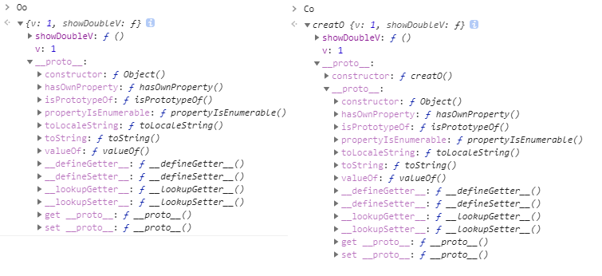
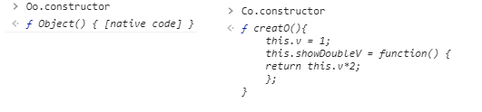
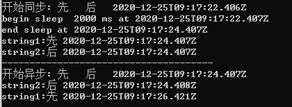
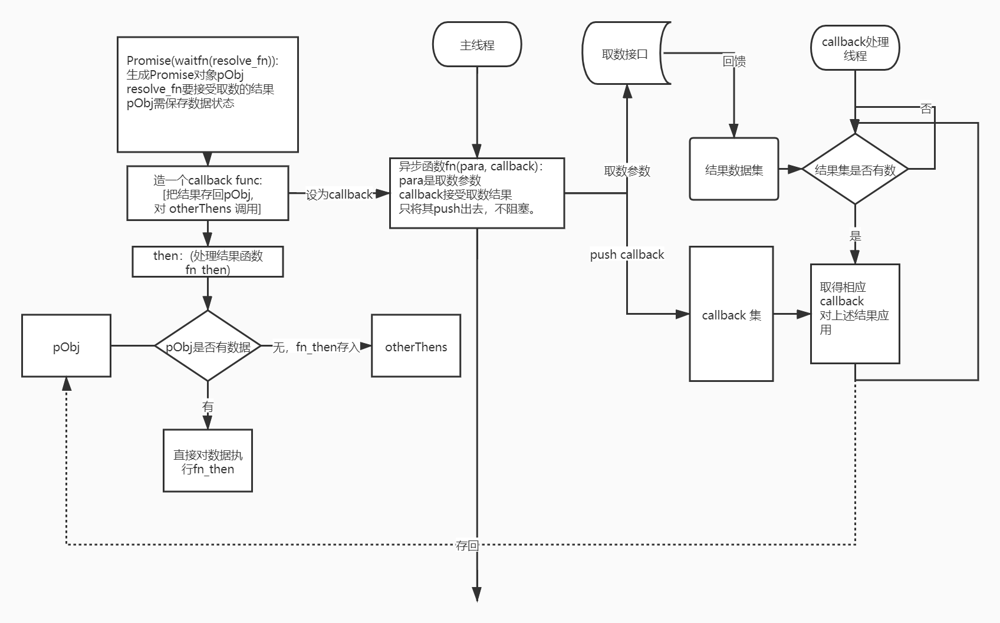

<meta http-equiv='Content-Type' content='text/html; charset=utf-8' />

上一回学习又过了两三年了，综合一些理解思考，再串一遍，加强一下记忆吧。

### 函数传参
这里需要注意的是通过函数传递的参数，会复制一份(值传递)；而通过“闭包”使用的上一级context下的内容，不复制，还是那一份。看下面的例子。
``` javascript
var a = 1;
function changeAFail(a) {
    a = 3;
    return a;
}
console.log('changeAFail returns:',changeAFail(a),'; a is:', a);
// changeAFail returns: 3 ; a is: 1
function changeADone() {
    a = 3;
    return a;
}
console.log('changeADone returns:',changeADone(a),'; a is:', a);
// changeADone returns: 3 ; a is: 3

// 下面用函数"闭包一下呢"
function changeInClosure(a){
    var aa = a;
    var outFuncs ={
	changeAaClosure: function() {
	    aa = 3;
	    return aa;
	},
	changeAaPass: function(aa) {
	    return function() {
		aa = 3;
		return aa;
	    };
	}(aa),// 通过调用传递，形成一个复制
	printAa: function(){
	    return aa;
	}
    };
    return outFuncs;
}

var closure = changeInClosure(1);
console.log('changeAaPass returns:', closure.changeAaPass(), '; aa is:', closure.printAa());
// changeAaPass returns: 3 ; aa is: 1
console.log('changeAaClosure returns:', closure.changeAaClosure(), '; aa is:', closure.printAa());
// changeAaClosure returns: 3 ; aa is: 3
```
需要注意的一点是，如果一个变量是“引用变量”，值传递复制的是“引用”。具体的数据还是原来那一份。
``` javascript
var o = [1];
function changeOWontFail(o) {
    o[0] = 3;
    return o;
}
console.log('changeOWontFail returns:',changeOWontFail(o)[0],'; o is:', o[0]);
// changeOWontFail returns: 3 ; o is: 3
```

### 对象
先需要弄清楚，我们需要的“对象”是什么：其实是一集“数据”和可以访问到这集“数据”的方法的包。所以，下面就是一个“对象”。
``` javascript
var Oo = {
    v : 1,
    showDoubleV: function() {
	return this.v*2;
    }
};
console.log('Oo.v:', Oo.v, ' Oo.showDoubleV:', Oo.showDoubleV());
// Oo.v: 1  Oo.showDoubleV: 2
```
那么，要如果生成一个新的对象呢？在`类->对象`的模式下，一个新对象通过一个类来生成。而在JavaScript中，是通过原型链的方式来操作的。常规的方式是通过new的方式来生成：
``` javascript
function creatO(){
    this.v = 1;
    this.showDoubleV = function() {
	return this.v*2;
    };
}
var Co = new creatO();
console.log('Co.v:', Co.v, ' Co.showDoubleV:', Co.showDoubleV());
// Co.v: 1  Co.showDoubleV: 2
```
上面两个方式，生成的结果都是类似的。

只有constructor不一样。

实际上，用`constructor`来New一个对象的过程在[MDN](https://developer.mozilla.org/zh-CN/docs/Web/JavaScript/Reference/Operators/new)上说得比较清楚：

> new constructor[([arguments])]
> constructor：一个指定对象实例的类型的类或函数。
> arguments：一个用于被 constructor 调用的参数列表。
> new 关键字会进行如下的操作：
> 1. 创建一个空的简单JavaScript对象（即{}）；
> 2. 链接该对象（设置该对象的constructor）到另一个对象 ；
> 3. 将步骤1新创建的对象作为this的上下文 ；
> 4. 如果该函数没有返回对象，则返回this。

另外，有一个"问题"如下 ，大家不爽两个成员函数不是同一个，有浪费。
``` javascript
var Co2 = new creatO();
console.log('Co2.showDoubleV == Co.showDoubleV:', Co2.showDoubleV == Co.showDoubleV);
// Co2.showDoubleV == Co.showDoubleV: false
```
所以用了一种"脏"的办法：
``` javascript
function creatOPoorB(v){
    this.v = v;

}
creatOPoorB.prototype.showDoubleV = function() {
    return this.v*2;
};
var CoB = new creatOPoorB(1);
var CoB2 = new creatOPoorB(2);
console.log('Co2B.v == CoB.v:', CoB2.v == CoB.v);
console.log('Co2B.showDoubleV == CoB.showDoubleV:', CoB2.showDoubleV == CoB.showDoubleV);
// Co2B.v == CoB.v: false
// Co2B.showDoubleV == CoB.showDoubleV: true
```
另外，需要注意JavaScript的对象的方法，通过`this`绑定的方法，有坑如下：
``` javascript
var fOo = Oo.showDoubleV;
var fCo = Co.showDoubleV;
console.log('fOo:',fOo(), 'fCo:',fCo());
console.log('Oo.showDoubleV:',Oo.showDoubleV(), 'Co.showDoubleV:',Co.showDoubleV());
// fOo: NaN fCo: NaN
// Oo.showDoubleV: 2 Co.showDoubleV: 2
```
将一个含`this`的方法赋值给另一个变量来调用的时候，Scope变了，结果也变了。
新的语法下，多了一个`class`的形式，不过也好不到哪去。
```
class OClass{
    constructor(v){
	this.v = v;
    }
    get doubled(){
	return this.v*2;
    }
    get tripled(){
	return this.v*3;
    }
    showDouble(){
	return this.v*2;
    }
}
var classO = new OClass(2);
console.log('classO.v:', classO.v, ' classO.showDouble:', classO.showDouble());
console.log('classO.doubled:', classO.doubled, ' classO.tripled:', classO.tripled);
var fClassO = classO.showDouble;
console.log('fClassO:',fClassO());

// classO.v: 2  classO.showDouble: 4
// classO.doubled: 4  classO.tripled: 6
// d:\sync\funwork\JS\JSGoThrough.js:108
//         return this.v*2;
//                     ^

// TypeError: Cannot read property 'v' of undefined
//     at showDouble (d:\sync\funwork\JS\JSGoThrough.js:108:14)
//     at Object.<anonymous> (d:\sync\funwork\JS\JSGoThrough.js:116:24)
//     at Module._compile (internal/modules/cjs/loader.js:1063:30)
//     at Object.Module._extensions..js (internal/modules/cjs/loader.js:1092:10)
//     at Module.load (internal/modules/cjs/loader.js:928:32)
//     at Function.Module._load (internal/modules/cjs/loader.js:769:14)
//     at Function.executeUserEntryPoint [as runMain] (internal/modules/run_main.js:72:12)
//     at internal/main/run_main_module.js:17:47
```
总的来说，为了解决scope的事，需要显式的bind，基本上可以如下。
``` javascript
var fClassO = classO.showDouble.bind(classO);
```
特别的，如果用New的语法，可以在写方法的时候`bind`好。：
``` javascript
function creatO(){
    this.v = 1;
    this.showDoubleV = function() {
	return this.v*2;
    }.bind(this);
}
```


### 同步异步
首先明确一个问题，程序的目标是完成一系列的“操作”。这可以是通过函数结果的传递来完成的，也可以通过“回调”来完成。
``` javascript
//////传递
function sFuncDouble(a){
    var r = a*2;
    console.log('double:', a, '->', r);
    return r;
}
function sFunc1(a){
    var r = a+1;
    console.log('plus1:', a, '->', r);
    return r;
}
console.log(sFunc1(sFuncDouble(5)));
// double: 5 -> 10
// plus1: 10 -> 11
// 11
//////回调
function aFuncDouble(a,callback) {
    var r = a*2;
    console.log('double:', a, '->', r);    
    callback(r);
}
function aFunc1(a,callback) {
    var r = a+1;
    console.log('plus1:', a, '->', r);    
    callback(r);
}
aFuncDouble(5,(x)=>aFunc1(x,console.log));
// double: 5 -> 10
// plus1: 10 -> 11
// 11
```
上面的区别，并不是JavaScript特有的，下面的python版本也是一样：
``` python
def sFuncDouble(a):
    r = a*2
    print('double:', a, '->', r)
    return r
def sFunc1(a):
    r = a+1
    print('double:', a, '->', r)
    return r
print(sFunc1(sFuncDouble(5)))
# double: 5 -> 10
# double: 10 -> 11
# 11

def aFuncDouble(a,callback):
    r = a*2;
    print('double:', a, '->', r)
    callback(r)
    return
def aFunc1(a,callback):
    r = a+1
    print('plus1:', a, '->', r)
    callback(r)
    return
aFuncDouble(5,lambda x:(aFunc1(x, print)))
# double: 5 -> 10
# double: 10 -> 11
# 11
```
为了熟悉这种模式，不妨来实现一下函数乘法。
``` javascript
///传递
function chainSFunc2(f,g) {
    // (f*g)(x) = g(f(x))正常的函数乘法定义
    return function(x) {
	return g(f(x));
    };
}
function chainSFuncs(funcList) {
    var finalFunc = funcList.reduce(function(f,g) {
	return chainSFunc2(f,g);
    });
    return finalFunc;
}
var chainedSFunc = chainSFuncs([sFuncDouble, sFunc1, sFuncDouble, sFuncDouble]);
console.log(chainedSFunc(5));
// double: 5 -> 10
// plus1: 10 -> 11
// double: 11 -> 22
// double: 22 -> 44
// 44

///回调
function chainAFunc2(f,g) {
    var chaindFunc = function(aForF, callbackForG) {
	f(aForF,function(fRslt) {
	    g(fRslt,callbackForG);
	});
    };
    return chaindFunc;
}
function chainAFuncs(funcList) {
    var finalFunc = funcList.reduce(function(f,g) {
	return chainAFunc2(f,g);
    });
    return finalFunc;
}
var chainedAFunc = chainAFuncs([aFuncDouble, aFunc1, aFuncDouble, aFuncDouble]);
chainedAFunc(5,console.log);
// double: 5 -> 10
// plus1: 10 -> 11
// double: 11 -> 22
// double: 22 -> 44
// 44

```
回调本身，和“异步”并无关系。看下面这一段代码：
``` javascript
function sleep(millis)
{
    var date = new Date();
    var curDate = null;
    do { curDate = new Date(); }
    while(curDate-date < millis);
}
function syncTimeout(callback, millis, ...theargs) {
    console.log('begin sleep ', millis, 'ms at', new Date() );
    sleep(millis);
    console.log('end sleep at', new Date() );    
    callback.apply(null,theargs);
}
//同步
function logSync(string1, string2) {
    console.log('开始同步:',string1,' ',string2, ' ', new Date());
    syncTimeout(function(){console.log("string1:"+string1, new Date());}, 2000);
    console.log("string2:"+string2, new Date());
}
function logAsync(string1, string2) {
    console.log('开始异步:',string1,' ',string2, ' ', new Date());
    setTimeout(function(){console.log("string1:"+string1, new Date());}, 2000);
    console.log("string2:"+string2, new Date());
}

logSync('先','后');
console.log('--------------------------------------');
logAsync('先','后');
```
结果：

上面定义了一个同步的syncTimeout函数，调用等也还都用callback的模式，可以看到同setTimeout的区别。显然，区别来自于setTimeout的本身的异步性。
那么，为什么要用callback的方式写代码呢？基本是因为JavaScript的异步原生函数都是用callback的方式提供接口的，而callback的模式，天然的提供了一个函数运行中实现功能的两条支路：一条当场执行完，另一条交由别人处理。

不妨[实现一下简单的异步逻辑](https://app.yinxiang.com/fx/d14533a2-e044-42c1-8f8c-607c75108b3b)，方便理解。

回调这种模式，在书写的时候，容易落入所谓callback hell。这里面，一部分原因是因为大家都喜欢写匿名函数。这个在用传递的方式写代码时，会干净一点。具体的原因可能是因为传递时更容易调整结果作为下一项调用中的参数的位置，而这在callback的时候，就不那么方便了，需要包一下(上面的代码也可以看出来)。

####  Promise
所以，有了Promise这个模式([MDN真不错](https://developer.mozilla.org/zh-CN/docs/Web/JavaScript/Guide/Using_promises))。
目标是把：
``` javascript
doSomething(function(result) {
  doSomethingElse(result, function(newResult) {
    doThirdThing(newResult, function(finalResult) {
      console.log('Got the final result: ' + finalResult);
    }, failureCallback);
  }, failureCallback);
}, failureCallback);
```
这样的格式变成：
``` javascript
doSomething().then(function(result) {
  return doSomethingElse(result);
})
.then(function(newResult) {
  return doThirdThing(newResult);
})
.then(function(finalResult) {
  console.log('Got the final result: ' + finalResult);
})
.catch(failureCallback);
```
下面试着实现一个简单的`Promise`，只实现`then`的部分，要注意
1. 在`new Promise` 的时候进行`Promise`部分的调用
2. 这个`Promise`可以多次使用，不重复计算
3. `then`后还是一个`Promise`
``` javascript
function numInS(n,s, callback){
    console.log('numInS called with ', n ,' and ', s);
    console.log('sleeping....');    
    setTimeout(function() {
	console.log('sleeped ', s, 's');
	callback(n);
    }, s*1000);
}
```

第一步，来简单的`then`的形式转化：
``` javascript
function PnumInS1(n,s){
    this.then = function(cb){
	console.log('begin then for ', n, ' and ', s);
	numInS(n,s,cb);
    };
};
console.log('======================make Promise======================');
var j = new PnumInS1(2,1);
console.log('======================Call Promise======================');
j.then(console.log);
console.log('======================Call Promise again======================');
j.then(console.log);
```
完全只有形式转化的作用，上面的要求都不满足。接下来实现1和2。

``` javascript
function PnumInS2(n,s){
    this.fufiled = false;
    this.value = null;
    this.cbs = [];
    var self = this;

    console.log('>>>>>>>>>>>>>>Getting result');
    numInS(n,s,function(r) {
	self.fufiled = true;
	self.value = r;
	self.cbs.forEach(function(cb) {
	    cb(r);
	});
    });	    
    
    this.then = function(cb){
	console.log('>>>>>>>>>>>>>>>>>>>>>fulfile status:', self.fufiled);
	if(!self.fufiled){
	    self.cbs.push(cb);
	    console.log('running, append callback');
	    console.log('pending callback number:', self.cbs.length);
	}
	else{
	    console.log('already fufiled');
	    cb(self.value);
	}
    };
}
console.log('======================make Promise======================');
var j2 = new PnumInS2(2,1);
console.log('======================Call Promise======================');
j2.then(function(r) {
    console.log('first then got:',r);   
});
console.log('======================Call Promise again======================');
j2.then(function(r) {
    console.log('second then got:',r);   
});
setTimeout(function() {
    console.log('======================Call Promise 2s later======================');
    j2.then(function(r) {
    console.log('then after 2s got:',r);   
    });    
},2000);
// ======================make Promise======================
// >>>>>>>>>>>>>>Getting result
// numInS called with  2  and  1
// sleeping....
// ======================Call Promise======================
// >>>>>>>>>>>>>>>>>>>>>fulfile status: false
// running, append callback
// pending callback number: 1
// ======================Call Promise again======================
// >>>>>>>>>>>>>>>>>>>>>fulfile status: false
// running, append callback
// pending callback number: 2
// sleeped  1 s
// first then got: 2
// second then got: 2
// ======================Call Promise 2s later======================
// >>>>>>>>>>>>>>>>>>>>>fulfile status: true
// already fufiled
// then after 2s got: 2
```
进一步，完成Promise：
``` javascript
function SimplePromise(waitingFunc){
    // waitingFunc: (moreFunc)=>moreFunc(waitingResult)
    this.fufiled = false;
    this.value = null;
    this.cbs = [];
    var self = this;
    console.log('>>>>>>>>>>>>>>Getting result');
    waitingFunc(function(r) {
	self.fufiled = true;
	self.value = r;
	self.cbs.forEach(function(cb) {
	    console.log('>>>>>>>>>>>>>>>>>>Got result');
	    var cbRslt = cb[0](r);
	    cb[1](cbRslt);
	});
    });
}

SimplePromise.prototype.then = function(thenCb){
    //thenCb: (waitingResult)=>newRslt
    var self = this;
    console.log('>>>>>>>>>>>>>>>>>>>>>fulfile status:', self.fufiled);
    var thenPromise = null;
    if(!self.fufiled){
	console.log('running, append callback');
	thenPromise = new SimplePromise(function(moreFunc) {
	    self.cbs.push([thenCb, moreFunc]);
	});
	console.log('pending callback number:', self.cbs.length);
    }
    else{
	console.log('already fufiled');
	thenPromise = new SimplePromise(function(moreFunc) {

	    var cbRslt = thenCb(self.value);
	    moreFunc(cbRslt);
	});
    }
    return thenPromise;
};

console.log('======================make Promise======================');
var j3 = new SimplePromise(function(moreFunc) {numInS(2,1,moreFunc);});
console.log('======================Call Promise======================');
j3.then(function(r) {
    var rslt = r;
    console.log('first then got:',r, 'return:',rslt);
    return r;
}).then(function(r) {
    var rslt = 2*r;
    console.log('first then then got:',r, 'return:',rslt);
    return rslt;
}).then(function(r) {
    var rslt = 20*r;
    console.log('first then then then got:',r, 'return:',rslt);
    return rslt;
});

console.log('======================Call Promise again======================');
j3.then(function(r) {
    var rslt = r*3;
    console.log('second then got:',r, 'return:',rslt);
    return r;
}).then(function(r) {
    var rslt = r*4;
    console.log('second then then got:',r, 'return:',rslt);
    return rslt;
});

console.log('======================then as Promise======================');
var j3then = j3.then(function(r) {
    var rslt = r*100;
    console.log('this then promise got:',r, 'return:',rslt);
    return rslt;
});
j3then.then(function(r) {
    var rslt = r*4;
    console.log('then from then got:',r, 'return:',rslt);
    return rslt;
});
j3then.then(function(r) {
    var rslt = r*5;
    console.log('then from then again got:',r, 'return:',rslt);
    return rslt;
});
////////////// wait
setTimeout(function() {
    console.log('======================Call Promise 2s later======================');
    j3.then(function(r) {
	console.log('later then after 2s got:',r);
	return r;
    }).then(function(r) {
    var rslt = r*4;
    console.log('later then then got:',r, 'return:',rslt);
    return rslt;
})
    ;    
},2000);

// ======================make Promise======================
// >>>>>>>>>>>>>>Getting result
// numInS called with  2  and  1
// sleeping....
// ======================Call Promise======================
// >>>>>>>>>>>>>>>>>>>>>fulfile status: false
// running, append callback
// >>>>>>>>>>>>>>Getting result
// pending callback number: 1
// >>>>>>>>>>>>>>>>>>>>>fulfile status: false
// running, append callback
// >>>>>>>>>>>>>>Getting result
// pending callback number: 1
// >>>>>>>>>>>>>>>>>>>>>fulfile status: false
// running, append callback
// >>>>>>>>>>>>>>Getting result
// pending callback number: 1
// ======================Call Promise again======================
// >>>>>>>>>>>>>>>>>>>>>fulfile status: false
// running, append callback
// >>>>>>>>>>>>>>Getting result
// pending callback number: 2
// >>>>>>>>>>>>>>>>>>>>>fulfile status: false
// running, append callback
// >>>>>>>>>>>>>>Getting result
// pending callback number: 1
// ======================then as Promise======================
// >>>>>>>>>>>>>>>>>>>>>fulfile status: false
// running, append callback
// >>>>>>>>>>>>>>Getting result
// pending callback number: 3
// >>>>>>>>>>>>>>>>>>>>>fulfile status: false
// running, append callback
// >>>>>>>>>>>>>>Getting result
// pending callback number: 1
// >>>>>>>>>>>>>>>>>>>>>fulfile status: false
// running, append callback
// >>>>>>>>>>>>>>Getting result
// pending callback number: 2
// sleeped  1 s
// >>>>>>>>>>>>>>>>>>Got result
// first then got: 2 return: 2
// >>>>>>>>>>>>>>>>>>Got result
// first then then got: 2 return: 4
// >>>>>>>>>>>>>>>>>>Got result
// first then then then got: 4 return: 80
// >>>>>>>>>>>>>>>>>>Got result
// second then got: 2 return: 6
// >>>>>>>>>>>>>>>>>>Got result
// second then then got: 2 return: 8
// >>>>>>>>>>>>>>>>>>Got result
// this then promise got: 2 return: 200
// >>>>>>>>>>>>>>>>>>Got result
// then from then got: 200 return: 800
// >>>>>>>>>>>>>>>>>>Got result
// then from then again got: 200 return: 1000
// ======================Call Promise 2s later======================
// >>>>>>>>>>>>>>>>>>>>>fulfile status: true
// already fufiled
// >>>>>>>>>>>>>>Getting result
// later then after 2s got: 2
// >>>>>>>>>>>>>>>>>>>>>fulfile status: true
// already fufiled
// >>>>>>>>>>>>>>Getting result
// later then then got: 2 return: 8

```
上面的代码是不是比较晦涩，这就是大家喜欢用匿名函数的坑，下面加强可读的写一遍。

``` javascript
function APromise(waitingFunc){
    // waitingFunc: (resolveFunc) => do something; get waitedRslt; do something with the rslt; resolveFunc(waitedRslt)
    this.fufiled = false;
    this.value = null;
    this.pendingThens = [];
    var self = this;
    function _doToWaitedRslt(waitedRslt) {
	console.log('>>>>>>>>>>>>>>Got result, is:', waitedRslt);
	self.fufiled = true;
	self.value = waitedRslt;
	_resolvePendingThen(waitedRslt);
    }
    function _resolvePendingThen(waitedRslt){
	self.pendingThens.forEach(
	    function(pendingThen) {
		console.log('>>>>>>>>>>>>>>Got result, pass to pendingThen:', waitedRslt);
		var thenWaitedRslt = pendingThen.doToPromiseValueFunc(waitedRslt);
		console.log('>>>>>>>>>>>>>>call next then with:', thenWaitedRslt);
		pendingThen.thenResolveFunc(thenWaitedRslt);
	    }
	);
	// use the waitedRslt to callback then functions;
    }
    console.log('>>>>>>>>>>>>>>Go getting result');
    waitingFunc(_doToWaitedRslt);
    
}

APromise.prototype.then = function(doToPromiseValueFunc) {
    // doToPromiseValueFunc: (this.value)=>otherValue
    var self = this;
    var thenWaitingFunc;
    if (self.fufiled) {
	thenWaitingFunc = function(thenResolveFunc) {
	    var thenWaitedRslt = doToPromiseValueFunc(self.value);
	    console.log('>>>>>>>>>>>>>>Already fufiled, result, is:', self.value, ', call next then with:', thenWaitedRslt);
	    thenResolveFunc(thenWaitedRslt);
	};
    }else {
	thenWaitingFunc = function(thenResolveFunc) {
	    self.pendingThens.push(
		{doToPromiseValueFunc: doToPromiseValueFunc,
		 thenResolveFunc: thenResolveFunc}
	    );
	};
    }
    var thenPromise = new APromise(thenWaitingFunc);
    return thenPromise;
};

console.log('======================make Promise======================');
var j4 = new APromise(function(moreFunc) {numInS(2,1,moreFunc);});
console.log('======================Call Promise======================');
j4.then(function(r) {
    var rslt = r;
    console.log('first then got:',r, 'return:',rslt);
    return r;
}).then(function(r) {
    var rslt = 2*r;
    console.log('first then then got:',r, 'return:',rslt);
    return rslt;
}).then(function(r) {
    var rslt = 20*r;
    console.log('first then then then got:',r, 'return:',rslt);
    return rslt;
});

console.log('======================Call Promise again======================');
j4.then(function(r) {
    var rslt = r*3;
    console.log('second then got:',r, 'return:',rslt);
    return r;
}).then(function(r) {
    var rslt = r*4;
    console.log('second then then got:',r, 'return:',rslt);
    return rslt;
});

console.log('======================then as Promise======================');
var j4then = j4.then(function(r) {
    var rslt = r*100;
    console.log('this then promise got:',r, 'return:',rslt);
    return rslt;
});

j4then.then(function(r) {
    var rslt = r*4;
    console.log('then from then got:',r, 'return:',rslt);
    return rslt;
});
j4then.then(function(r) {
    var rslt = r*5;
    console.log('then from then again got:',r, 'return:',rslt);
    return rslt;
});
////////////// wait
setTimeout(function() {
    console.log('======================Call Promise 2s later======================');
    j4.then(function(r) {
	console.log('later then after 2s got:',r);
	return r;
    }).then(function(r) {
    var rslt = r*4;
    console.log('later then then got:',r, 'return:',rslt);
    return rslt;
})
    ;    
},2000);

// ======================make Promise======================
// >>>>>>>>>>>>>>Go getting result
// numInS called with  2  and  1
// sleeping....
// ======================Call Promise======================
// >>>>>>>>>>>>>>Go getting result
// >>>>>>>>>>>>>>Go getting result
// >>>>>>>>>>>>>>Go getting result
// ======================Call Promise again======================
// >>>>>>>>>>>>>>Go getting result
// >>>>>>>>>>>>>>Go getting result
// ======================then as Promise======================
// >>>>>>>>>>>>>>Go getting result
// >>>>>>>>>>>>>>Go getting result
// >>>>>>>>>>>>>>Go getting result
// sleeped  1 s
// >>>>>>>>>>>>>>Got result, is: 2
// >>>>>>>>>>>>>>Got result, pass to pendingThen: 2
// first then got: 2 return: 2
// >>>>>>>>>>>>>>call next then with: 2
// >>>>>>>>>>>>>>Got result, is: 2
// >>>>>>>>>>>>>>Got result, pass to pendingThen: 2
// first then then got: 2 return: 4
// >>>>>>>>>>>>>>call next then with: 4
// >>>>>>>>>>>>>>Got result, is: 4
// >>>>>>>>>>>>>>Got result, pass to pendingThen: 4
// first then then then got: 4 return: 80
// >>>>>>>>>>>>>>call next then with: 80
// >>>>>>>>>>>>>>Got result, is: 80
// >>>>>>>>>>>>>>Got result, pass to pendingThen: 2
// second then got: 2 return: 6
// >>>>>>>>>>>>>>call next then with: 2
// >>>>>>>>>>>>>>Got result, is: 2
// >>>>>>>>>>>>>>Got result, pass to pendingThen: 2
// second then then got: 2 return: 8
// >>>>>>>>>>>>>>call next then with: 8
// >>>>>>>>>>>>>>Got result, is: 8
// >>>>>>>>>>>>>>Got result, pass to pendingThen: 2
// this then promise got: 2 return: 200
// >>>>>>>>>>>>>>call next then with: 200
// >>>>>>>>>>>>>>Got result, is: 200
// >>>>>>>>>>>>>>Got result, pass to pendingThen: 200
// then from then got: 200 return: 800
// >>>>>>>>>>>>>>call next then with: 800
// >>>>>>>>>>>>>>Got result, is: 800
// >>>>>>>>>>>>>>Got result, pass to pendingThen: 200
// then from then again got: 200 return: 1000
// >>>>>>>>>>>>>>call next then with: 1000
// >>>>>>>>>>>>>>Got result, is: 1000
// ======================Call Promise 2s later======================
// >>>>>>>>>>>>>>Go getting result
// later then after 2s got: 2
// >>>>>>>>>>>>>>Already fufiled, result, is: 2 , call next then with: 2
// >>>>>>>>>>>>>>Got result, is: 2
// >>>>>>>>>>>>>>Go getting result
// later then then got: 2 return: 8
// >>>>>>>>>>>>>>Already fufiled, result, is: 2 , call next then with: 8
// >>>>>>>>>>>>>>Got result, is: 8
```
不妨把`all`也实现一下。
``` javascript

APromise.All = function(promiseList) {
    var fulfilledDict = [];
    var fulfilledN = 0;
    var toFulfillN = promiseList.length;
    var allPromise = new APromise(function(resolve) {
	for(let [i, promise] of promiseList.entries()){
	    promise.then(function(rslt) {
		fulfilledDict[i] =rslt;
		fulfilledN += 1;
		if (fulfilledN == toFulfillN) {
		    resolve(fulfilledDict);
		}
		return 'rslt:'+i.toString()+":"+rslt.toString();
	    });
	}
    });
    return allPromise;
};

console.log('======================make Promise List======================');
var pList = [1,2].map(function(i) {
    return new APromise(function(moreFunc) {
	{numInS(i,1,moreFunc);}
    });
});


console.log('======================Call Promise All======================');
var t = APromise.All(pList)
    .then(function(r) {
    console.log('list result is:', r );
    return r;
    });
```


最后看一点Async的语法，有点意思，也没多大意思。
``` javascript
function resolveAfter2Seconds() {
  return new APromise(resolve => {
    setTimeout(() => {
      resolve('resolved '+new Date().toLocaleString());
    }, 2000);
  });
}

async function asyncCall() {
    console.log('calling ', new Date().toLocaleString());
    var t = resolveAfter2Seconds();
    console.log(t);
    let result = await t;
    const result2 = await resolveAfter2Seconds();
    console.log(result, '--------', new Date().toLocaleString());
    console.log(result, '--------', new Date().toLocaleString());
    console.log(result2, '2--------', new Date().toLocaleString());
    return result2;
 }
// calling  2021/2/3 下午3:12:15
// >>>>>>>>>>>>>>Go getting result
// APromise { fufiled: false, value: null, pendingThens: [] }
// >>>>>>>>>>>>>>Go getting result
// >>>>>>>>>>>>>>Got result, is: resolved 2021/2/3 下午3:12:17
// >>>>>>>>>>>>>>Got result, pass to pendingThen: resolved 2021/2/3 下午3:12:17
// >>>>>>>>>>>>>>call next then with: undefined
// >>>>>>>>>>>>>>Got result, is: undefined
// >>>>>>>>>>>>>>Go getting result
// >>>>>>>>>>>>>>Go getting result
// >>>>>>>>>>>>>>Got result, is: resolved 2021/2/3 下午3:12:19
// >>>>>>>>>>>>>>Got result, pass to pendingThen: resolved 2021/2/3 下午3:12:19
// >>>>>>>>>>>>>>call next then with: undefined
// >>>>>>>>>>>>>>Got result, is: undefined
// resolved 2021/2/3 下午3:12:17 -------- 2021/2/3 下午3:12:19
// resolved 2021/2/3 下午3:12:17 -------- 2021/2/3 下午3:12:19
// resolved 2021/2/3 下午3:12:19 2-------- 2021/2/3 下午3:12:19
```
