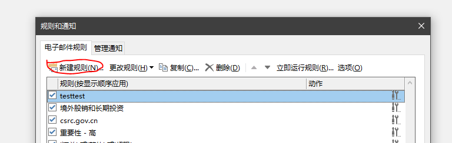
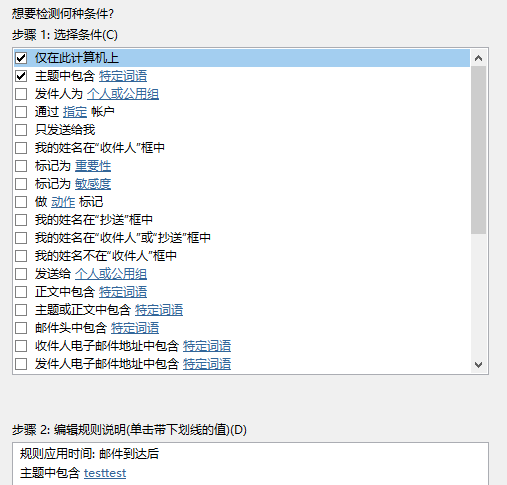
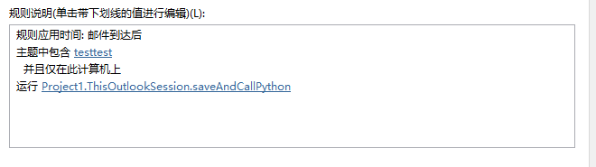

<meta http-equiv='Content-Type' content='text/html; charset=utf-8' />

有的时候，希望对邮件进行一些自动处理。直接用python，你还得自己处理收发件协议。而outlook虽好，可vba不好，下面给一种缝合的办法。

### Outlook的部分
#### 文件夹准备
建一个 `c:\pythonMailProc\`的文件夹
#### VBA准备
你需要一点代码来调用Python，在outlook里Alt+F11打开VBA的编辑器，输入如下代码。这个代码在上面的文件夹中保存了本邮件的`msg`文件，并且对其调用 `python c:\pythonMailProc\dealMail.py`。

``` VBA
Public Sub saveAndCallPython(Item As Outlook.MailItem)
    SaveAndCall Item, "python c:\pythonMailProc\dealMail.py", "c:\pythonMailProc\"

End Sub


Private Sub SaveAndCall(ByVal Item As Object, ByVal ProcName As String, ByVal DirPath As String)
On Error GoTo errorhdl
    Dim sbj As String
    sbj = Item.subject
    Dim fileName As String
    fileName = DirPath & sbj & ".msg"
    fileName = Left(fileName, 2) & Replace(fileName, ":", "_", 3)
    Item.SaveAs fileName
    ' rslt = Shell(ProcName & " """ & fileName & """", vbNormalFocus)
    rslt = Shell(ProcName & " """ & fileName & """", vbHide)
Exit Sub

errorhdl:
If Err.Number <> 0 Then
     Msg = "Error # " & Str(Err.Number) & " was generated by " _
         & Err.Source & Chr(13) & "Error Line: " & Erl & Chr(13) & Err.Description
    MsgBox Msg, , "Error", Err.HelpFile, Err.HelpContext
    End If
    Resume Next

End Sub

End Sub
```

#### Outlook规则的准备
我们需要Outlook在收到满足条件的邮件时触发处理，这个可以通过outlook的规则来实现。
打开

新建一个规则

对收到的邮件应用

条件自己选

比如上面用一个主题含testtest的。然后，重点是对其运行脚本：

选择刚才那个

结果

确保刚才的规则选上了。

保存好就OK了。

### Python的部分
我们要用win32com这个包来直接建立一个outlook的comobject来完成后面的工作，安装用：
``` powershell
pip install -U pypiwin32
```
建一个文件`c:\pythonMailProc\dealMail.py`

``` python
import sys
import win32com.client
# import ipdb; ipdb.set_trace();


MAIL_PROC_LIST = []

outlook = win32com.client.Dispatch("Outlook.Application").GetNamespace("MAPI")
msg_file  = sys.argv[1]
msg_obj = outlook.OpenSharedItem(msg_file)


##### 在这里编写你的处理逻辑函数，并append到 MAIL_PROC_LIST
"""
obj 的属性有：
msg_obj.SenderName
msg_obj.SenderEmailAddress
msg_obj.SentOn
msg_obj.To
msg_obj.CC
msg_obj.BCC
msg_obj.Subject
msg_obj.Body
msg_obj.HTMLBody
msg_obj.Attachments
更多的参见 https://docs.microsoft.com/en-us/office/vba/api/outlook.mailitem
"""
# 这个是例子，打印正文
def log_body(msg_obj):
    print('text body is:')
    print(msg_obj.Body)
    print('html body is:')
    print(msg_obj.HTMLBody)    
    input('End of body, press Enter key to end.')
    
MAIL_PROC_LIST.append(log_body)

###### 处理逻辑结束


#####调用列表中所有的处理过程
for mail_proc in MAIL_PROC_LIST:
    try:
        mail_proc(msg_obj)
    except Exception as e:
        print(e)
del outlook, msg_obj

```
