<meta http-equiv='Content-Type' content='text/html; charset=utf-8' />

在衍生品定价中，$\sigma$是一个很特殊和参数：漂移项可以在测度变化中改变，但$\sigma$是保持不变的。这个不变性是一个很重要的点，使得我们不能随意选择$\sigma$，从而估值是可靠的。
下面参考[知乎上的这篇文章](https://zhuanlan.zhihu.com/p/265727886)。(我看到过在一篇文章中讲得最全的)

### PDE下的解释
比较直接，方程
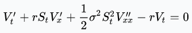
中直接含$\sigma$的项，而这个项的来源是Ito引理。对于Ito过程：

有：
若设函数 $f(t,x)$ 的偏导数 $f_t(t,x),f_x(t,x),f_{xx}(tx)$ 都有定义并且连续，则：
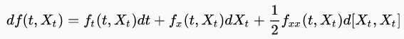
其中，$d[X_t,X_t]$的结果是明确的。(因为我们目前只在现实测度下讨论，一切确定)。

### 鞅定价下的解释
我们先来看这个定价的过程
1. 首先是通过完备市场的无风险资产$B$和标的资产$S$来复制期权。
   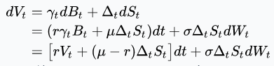
	注意，这里已经用到了*Self-financing*的条件：
	资产组合$\Pi_t = \sum\limits_{i=1}^n\omega_iS_{i,t}$ 是自融资的，如果有 $d\Pi_t = \sum\limits_{i=1}^{n}\omega_idS_{i,t}$。
	这个式子的意思是，组合的净值的变动完全来自于组合内资产的价值的变动，而不会另有流入和流出(可以在组合内不同资产之间转化)。
2. 再取折现：
   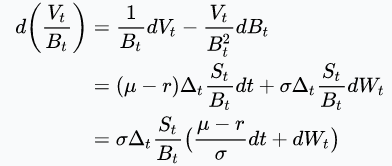
	**Q:** 可是为什么要取折现？
	**A:** 先回到我最喜欢的无风险利率为**0**的情况下来看。这个时候,有$dV_t = \Delta_t dS_t$，对应的是 $dV_t=\sigma \Delta_t dW_t$。可以尝试除$B_t$当成一个将“*无风险利率代换成0*”的手段。
3. 接下来，期待在某一个测度$\tilde{W}$下$(V_t/B_t)$可以是鞅。
   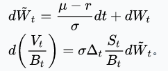
4. 然后，Girsanov 定理给了我们**一个**变换：
令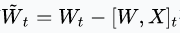和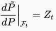
有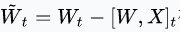在$\tilde{P}$下是布朗运动。更丰富和详细的请见[知乎上这个专栏文章](https://zhuanlan.zhihu.com/p/391237874)。([这整个专栏都很不错](https://www.zhihu.com/column/c_1241781882632843264))

按上面的逻辑完成我们的目标：
* 我们要找到一个$X$，它满足$d [W,X]_t = \frac{r-\mu}{\sigma} dt$。
* 然后利用他通过${\rm exp} (X_t - \frac{1}{2}[X,X]_t)$得到$Z_t$。
* 那么我们只需要以$Z_t$为R-N导数进行一个测度变换，就可以得到一个所需的测度，这个测度下$\frac{V_t}{B_t}$是鞅，即风险中性的测度。

这个流程程似乎很复杂。不过，实际使用时不用这么难：要注意到新测度下$S$的过程为：
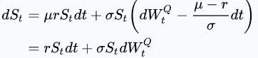
上面的$Q$就是$\tilde{P} $，这就是一个以无风险利率为漂移项的几何布朗运动 *(为什么有这么碰巧的结果，可能有更深的对称性，希望有天我能回来把它补全)* ，只要对这个过程的结果求期望就好。
可以发现，上面的推导过程，对于 Pay Off 的形式其实没有过多的要求，所以有很强的适用性。

回到本文的主题，可以看到，$dW$和$d\tilde{W}$前的系数保持了是一样的。所以$\sigma$是不变的。

**ちょっと待ってください**，这样就行了吗？需要注意，这里我们只拿到**一个**变换，有没有其它“放缩”过的测度变换，也能使$(V_t/B_t)$可是鞅呢？即一个改变布朗运动前的系数$\sigma$的。很显然，根据前一节PDE解释下的结论，应该是不行的。但网下没找到对此的表述，我们自己来证一下。

其实也很直接：布朗运动的二次变差满足$[\tilde{W},\tilde{W}] = T, a.s.$。注意到一条“路径”的二次变差是“事件”的函数(它是布朗运动生成的$\mathscr{F}$上的随机变量)和测度无关。根据**等价测度**变换的定义要求，在新的测度下，原“路径”二次变差为$T$的概率也为1：$[\tilde{W},\tilde{W}] = T, a.s.$。

对于这个问题的直观理解是，在一个标准布朗运动中，$T$时点运动到任一位置都是可以接受的，但是在很多个小时段$\Delta t_i$内，变动不是$\Delta t_i$这种情况是不可接受的，改测度也不行。

**p.s.** 一个可能的疑惑是，一个正态分布$N_1$完全可以在**等价测度**下变换到其宽度2倍的正态分布$N_2$，为什么布朗运动就不行了呢？这个原因是，我们要的不是一个时点的分布，而是无数个时点分布的“乘积”，这个“无穷”的过程，把一些非零测集变成了零测集。
设一个过程在$P$下是$W$，在$Q$下是$2W$。考查一些事件的测度:

$\frac{P(X_T<1)}{Q(X_T<1)} = 0.56$

$\frac{P(X_{T/2}<1/\sqrt{2},X_{T}-X_{T/2}<1/\sqrt{2})}{Q(X_{T/2}<1/\sqrt{2},X_{T}-X_{T/2}<1/\sqrt{2})} = 0.56^2$

……

$\frac{P(X_{T/n}<1/\sqrt{n},...,X_{T}-X_{(n-1)T/n}<1/\sqrt{n})}{Q(X_{T/n}<1/\sqrt{n},...,X_{T}-X_{(n-1)T/n}<1/\sqrt{n})} = 0.56^n\rightarrow 0$。

这说明，这个变换不是**等价测度**的。

### 动态$\Delta$对冲过程
#### 实际业务的组合视角
布朗运动毕竟不现实。真实业务中，我们的观测和对冲过程永远是离散的，那么$\sigma$又是如何作用的呢？在标准的$B-S$的推导中，其实给定了$(t,S)\rightarrow V$的一个函数。对冲的目的，是在一条标的价格路径(注意，在路径上的任一时点，不知道下一时点的价格)上选择对冲的量，使得路径终点的payoff和路径的关系不大。那么，具体应该怎么选择，又有什么结果呢？(哥就是喜欢$r=0$，下面就这样了)。
假设，对冲的策略是隔$\Delta t$时间进行一次。考虑到$\Delta t$之后的价格是
$V_{t +\Delta t} \sim V_t+\theta_t \Delta t + \Delta_{t+\Delta t} (S_{t+\Delta t}-S_{t})+\frac{1}{2}\Gamma_{t+\Delta t} (S_{t+\Delta t}-S_{t})^2$。
* 对冲应该用$\Delta_{t+\Delta t}$(而不一定是$\Delta_{t}$)，这中间有些精细的区别，特别是在剩余时间很短的时候。

那前面的问题就变成，为什么不能任意给个$\sigma$，算出一套$V$来，反正可以$\Delta$对冲。
* 在前式中，注意 $\theta_t \Delta t +\frac{1}{2}\Gamma_{t+\Delta t} (S_{t+\Delta t}-S_{t})^2$这一项，对比$\theta_t \Delta t +\frac{1}{2}\Gamma_{t+\Delta t} S_t\sigma^2\Delta t = 0$的$Parity$，如果$|S_{t+\Delta t}-S_{t}| > \sigma \sqrt{\Delta t}$的话，组合在这一段时点是会赚钱的，反之亦然。如果我们对于$\sigma$的估计和实现的结果比较“一致”，这里“一致”指的是，在一条路径上：$\sum ((S_{t+\Delta t}-S_{t})^2 -\sigma^2 \Delta t) \sim 0$，那么，整体的盈亏会接近$0$。所以如果$\sigma$的估计比实现要大，那么整体会出现盈利，反之亦然。
上述过程中还可以看出，在有限对冲下，对冲频率越低那么运气的成分就越大。另外，一条穿行于高$\Gamma$区的路径上的运气成分也更大。

#### 单纯对冲视角
换个角度，来看一个有点奇怪的问题。1)假设存在两个资产，波动率不一样。那么，同样参数的期权的价值是不一样的。但是，再假设两资产在到期日的收益率是一样的，那么，到业务终了，期权的Payoff是一样的。这样，我们知道，对冲产生的总收益应该是不同的，恰好应该是期权期初价值的区别，这到底是怎么实现的？2)类似可以有另一个问题，假如一个ATM的权，对冲到期末，假设期末价格还是ATM，那么期初期权的价值应该是通过对冲来实现的，可是How？

对于问题2)，可以看看下面的两张图，它们中图的蓝线代表了买入Call在对冲时参数和实现波动率一致时，如何在对冲端赚到原始期权的价值的。
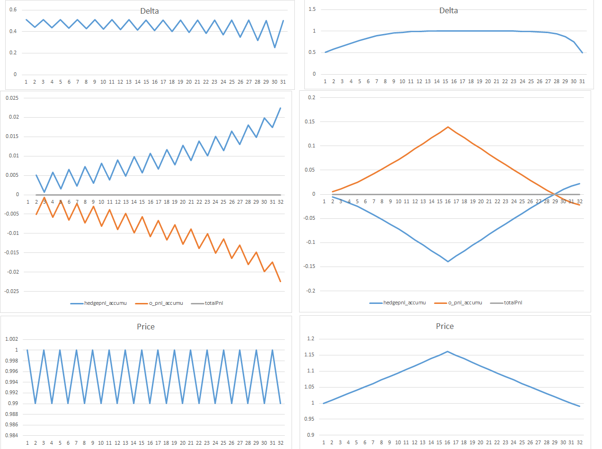
形象的，可以解释为这种情况注定了“反复横跳”(ATM说明要跳回来的)。而“反复”的过程中，存在对冲头寸大小和“下一步”涨跌的正相关，在高仓位的时候多赚了，低仓位的时候少赔些。我们需要“骑乘”$\Gamma$来赚钱。

对于问题1)，下图也有所说明了区别，同上，可以理解为在同“下一步”涨跌正相关的基础上，“$\beta$"不同，以至于赚的不同。
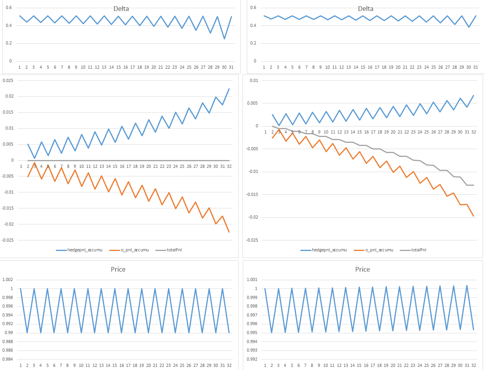

需要注意，有的时候期权的 **Greeks** 处于很高的状态，业务可能被迫选择不完全跟进对冲，这个时候本来需要 **“骑乘”Gamma** 来赚的钱 就赚不到了。

### 需要注意的情况
上面说了这么多，要注意这句话：**漂移项可以在测度变化中改变，但$\sigma$是保持不变的** 。正面来看，漂移项是可以不管的；更重要的是反面 **漂移项是不能管的**。这句话有这么几个含义：
* 不要随便的求**期望**， 你得小心自己是在风险中性测度下。
* 风险中性测度下的漂移只能是无风险利率 $r$。其它的不能使得*贴现后*是鞅。
* 不管真实测度下漂移项是什么，估值都是没有区别的。

这个结论在PDE的视角下是很好解释的，直接看[Wiki上这个证明](https://en.wikipedia.org/wiki/Black%E2%80%93Scholes_equation#Derivation_of_the_Black%E2%80%93Scholes_PDE "wiki证明")就可以了，证明中虽然都是写的 $\mu$，但是改成$\mu(S,t)$一点也不影响证明过程。好吧，在鞅的视角下也好证明，还是看前面的证明就好，还是把$\mu$ 换成 $\mu(S,t)$就行。

举个例子吧：这个结论下，带均值回复属性的过程[Ornstein–Uhlenbeck 过程](https://en.wikipedia.org/wiki/Ornstein%E2%80%93Uhlenbeck_process)，$dx_t = \theta(\mu - x_t)dt + \sigma d W_t$。这个过程在长时间后的分布会收敛为 $\frac{\sigma}{\sqrt{2\theta}} W_1$。很明显，这和不收敛的简单布朗运动是不一样的，显然，对于一个pay off在这两个分布下求的期望是不一样的，需要注意，不能按这个过程的分布来直接求期望估值。因为它不是鞅。

Q：那我们记得有的公式中是有“漂移”项的，是什么呢？又是怎么回事呢？
A：注意，那些项是些 **repo** 或 **devidend** 这样的，这些东西对应的不是“漂移”，而是在标的价格之外的 **现金流**。

Q：有漂移的时候，在真实测度下，我们还是可以求一个“平均”，如果不考虑逐路径的固定return，而是经历很多交易(不能在同一时间段)，大数定理似乎可以给出真实测度的收益的另一个大概值，那么这个值和期权估值的和为什么是有区别的呢？
A：当然，这个结果是很奇怪的。奇怪在于一个确定的 “漂移” 本身其实是“坏”的，不应该存在的————这对应了一个可套利的策略。例如在均值回复的情况下，很容易实施高于回复中心就卖，低于回复中心就买的策略。但是在这么个“坏”存在的基础上，估值是没有问题的。

#### PS. 一个二叉树的小工具。
[期权可视](../att/期权可视.xlsx)

