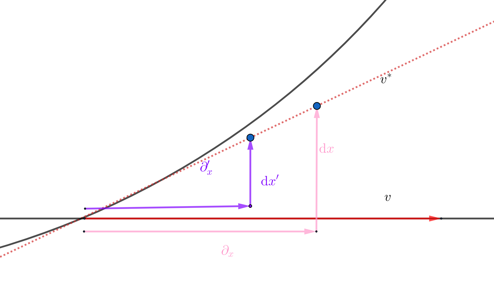
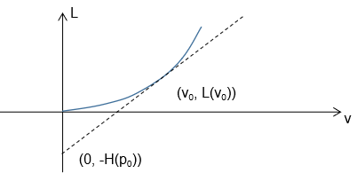

<meta http-equiv='Content-Type' content='text/html; charset=utf-8' />

学分析力学的时候，一直没有明白为什么要引出哈密顿力学，包括这里的勒让德变换是想开什么，也没有清楚以$\dot{q}$为变量和以$p$为变量的方程的意义。现在来理解一下。

### 切空间和余切空间

有一个式子，很熟了：$ \mathrm{d}f = \frac{\partial f}{\partial x^i} \mathrm{d} x^i$，对应也有沿 $\gamma(t)$ 的方向导数 $\frac{f(\gamma(\mathrm{d}t))}{\mathrm{d}t} = \partial_i f \xi^i$。重新理解一下:

1. 其实有了一个双线性映射：$(C^{\infty},\Gamma) \rightarrow R: (f,\gamma) = <f,\gamma> = \xi^i_{\gamma}\partial_i f$。
2. 上式对应了两个“线性空间”，一个的元素是$\gamma$，它的坐标是$\xi_{\gamma}^i$；另一个的元素是$[\tilde{f}]$, 它的坐标是$\partial_i f$($[\tilde{f}]$指拥有同$f$相同的偏导数的函数的集合)
3. 可以看出，自然的，$\partial_i f$ 对坐标的基变换是协变的。那么，为了让映射和坐标的选择无关，也就要求 $\xi^i$ 对坐标基变换是逆变的。把这个特性提出来，就有[那边](./微分几何.md#切向量)定义中要求的变换的关系。

#### 另一种定义

上面这个定义，是直接用到了导数的。然而，有切向量的另一种定义，不直接用导数：
>  $F(M)$ 是微分流形 $M$ 上的所有光滑标量场 $f: M \rightarrow R$ 的集合。
>  $M$ 上的一点 $p$ 处的切向量 $v_p$ 定义为 $v_p: F(M) \rightarrow R$，且 $v_p$满足两个条件：
> 1. 线性：$v_p(\alpha f + \beta g ) = \alpha v_p(f) + \beta v_p(g)$
> 2. 导子：$v_p(fg) = g(p)v_p(f) + f(p)v_p(g)$(也称牛顿-莱布尼兹性质)

但是这很奇怪，导数似乎用到了一个点“周围”的性质，而本定义中，并没有“周围”，为什么呢？

* 根据导子和线性，容易得到常函数的切向量是$0$。
* 证明在某点具有同样导数的函数，其在这一点切向量一样。这可以由两函数相减在一个邻域内为常函数来得到。(这一步出现了“周围”)
* 证明两函数切向量的比值同导数的比值一样。这可以由一个函数乘上他们导数之比减另一个函数得到。

当然，另一个方向，方向导数是个切向量是显然的。

这个基础上，我们还有定义

> **微分:** $\mathrm{d}$ 将一个标量场$f$ 映射为一个余切向量 $(\mathrm{d}f)\vert_p$，使得 $(\mathrm{d}f)\vert_p(v\vert_p) = v\vert_p(f)$。

容易验证微分也符合牛顿-莱布尼兹性质： 
$ \mathrm{d}(fg)(v) = v(fg) = gv(f) + fv(g) = g \mathrm{d}f (v) + f \mathrm{d} g (v) = (g \mathrm{d} f + f \mathrm{d} g)(v)$

> ** 切映射:** 同上面类似，如果 $f: X \rightarrow Y$ 是流形$X$到$Y$的光滑映射。那么有定义：
$$
 \begin{align*}
        \mathrm{d}f_x \colon \mathrm{T}_x X 
        & \longrightarrow \mathrm{T}_{f (x)} Y, \\
        v & \longmapsto \mathrm{d}f_x (v), \\
 \end{align*}
$$
> 对任意$g \in C^{\infty}(Y)$有，$ \mathrm{d}f_x (v) \, (g) = v (g \circ f)$。特别的，当 $Y = R,g(x) = x$时，切映射对应微分。

### 对偶空间

> 如果线性空间到实数的线性函数 $f : V \rightarrow R$ 的集合 $V^{\ast}$ 满足：
> * $\forall \phi, \psi \in V^{\ast}, x \in V: (\phi + \psi)(x) = \phi(x) + \psi(x)$
> * $\forall \phi \in V^{\ast}, \forall \alpha \in R: (\alpha\phi)(x) = \alpha(\phi(x))$
> 
> $V^{\ast}$ 形成一个线性空间，称 $V$ 的对偶空间。

1. 在 $V$ 是有限($n$)维的时候，可以有一组基 $ e_i, i \in \lbrace 1,2,\cdots, n \rbrace $ ， $ \forall f \in V^{\ast} $ 都可表示为 $\lbrace f^i \rbrace: f^i = f(e_i)$，从而 $ V^{\ast} $ 也是 $n$ 维的
2. 容易看出对偶空间是相互的
3. 在选定 $V$ 的一组基 $e_i$ 后，总能对应的在 $ V^{\ast} $ 找到一组 $ e^{\ast j} $ ，使得 $ e^{\ast j}(e_i) = \delta^j_i $ 。$ \forall x, f $ 在这之下的坐标为 $ x^i, f_j^{\ast} $ 有 $ f(x) = x^i f_i^{\ast}$ 。由于同阶的线性空间都是同构的，所以这样可以得到$V$ 到 $V^{\ast}$ 的一个同构。但需要注意，这样做出的同构是随基的选择而变化的。例如，一个二阶线性空间，取基和对偶基 $e_1,e_2$ 和 $e^1,e^2$，在同构上 $e_1+e_2 \rightarrow e^1+e^2$。然而我们要是选基为 $e_1+e_2,e_1-e_2$，那么对偶基为$(e^1+e^2)/2, (e^1-e^2)/2$。也就是说$e_1+e_2 \rightarrow (e^1+e^2)/2$。我们希望有一个和基无关的对偶，在定义了[非退化厄米形式](./张量基础.md#内积)的空间上，这是可以得到的，称为[典范同构](./张量基础.md#典范同构)。

4. 容易验证切空间和余切空间是对偶的，且可以自然的取 $e_i = \partial_i, e^{\ast j} = \pi^j$ 。其中 $\pi^j$ 为投影: $\pi^j(x) = x^j$ 。事实上，可以把 **坐标** 理解为对偶空间中 **函数** 的值。

现在参考这么一个问题：一个切向量在流形上一个点把一个函数映射到一个实数$(v, f) \rightarrow R, v \in TM $, 而一个余切向量也是在一个点把一个切向量映射到一个实数 $(\mathfrak{f}, v) \rightarrow R, v \in TM, \mathfrak{f} \in T^{\ast}M$。这样，一个直觉是 $f, \mathfrak{f}$ 之间应该有一个联系。又有一个直觉 $f$ 的“可选范围”比$\mathfrak{f}$ 要大，所以$\mathfrak{f}$ 应该是$f$的一个等价类。这个等价关系是指 **“差在点的邻域内是常数”**。 

所以，直观的，**切向量是自变量空间的方向箭头，余切向量是自变量$\times$因变量空间的斜面**，如下图所示。易知，在取两个基$\partial_x , \partial_x^{\prime}$下，切向量 $v$ 的变化是和基的 “长度反比的”，而余切向量 $ v^*$ 是用基对应的函数值的变化来表示的，所以和基的“长度正比”的 。

不过还是[这个专栏](https://zhuanlan.zhihu.com/p/629852598) 说得清楚完整，看一下比较舒服。

### 拉格朗日和哈密顿

* 从拉格朗日量来看，它在物理书上被定义为$L = L(q, \dot{q}, t)$。而在我们新的理解下，应该认为这是在一条参数曲线$\gamma(t)$上的结果。$L = L(q(\gamma(t)), \frac{\mathrm{d} q(\gamma(t))}{\mathrm{d} t}, t)$。明显，第二项是切向量，即拉格朗日量是定义在切丛上的。事实上，可以考虑在速度中，把单位由$m$换成$cm$ 的时候，基缩小100倍，对应速度的数值增大100倍，是逆变的，满足切向量的要求。
* 从哈密顿量来看，它被定义为 $H(q, p)$，其中 $p = \frac{\partial L}{\partial \dot{q}}$，在单位由$m$换成$cm$ 的时候，其数值缩小100倍，是协变的，满足余切向量的要求。所以说哈密顿量是定义在余切从上的。可是这是怎么来的呢？
  * 按照上面的对偶空间的语言来看：取一个点的切空间，它的元素是$x = \dot{q}$，这是一个线性空间。取$f=L$，可以得到它的对偶空间的一个元素$\frac{\partial f}{\partial x} = \frac{\partial L}{\partial \dot{q}}$。注意到我们定义了$\frac{\partial L}{\partial \dot{q}} = p$，用 $p$为变量的函数即是在对偶空间上的。

嘿，真的这么容易吗？还是要数学一点。

#### 速度
先看看什么东西是“速度”，过去，我们说起来它就是 $ \frac{\mathrm{d} r}{\mathrm{d} t} $，在无穷小变化的语言下是清楚的，那么在我们说到的切空间中呢？
假设在 $M$ 上有一点$x$, 定义 $D_v f(x) := \frac{\mathrm{d} }{\mathrm{d} t} f(x+tv) = v^i \frac{\partial f}{\partial x^i}(x)$。而我们前面就说过切向量是方向导数：$v(f) := D_v(f)$，这样，我们知道了$v = v^i \partial_i$，是切向量。其中$v_i$ 是坐标, $\partial_i$是基。
那么它和 $ \frac{\mathrm{d} r}{\mathrm{d} t}$ 是怎么联系上的呢？ 上式中，令 $f = x^i: x^i(x) = x^i$ 理解为一个取$i$坐标的函数，得到 $ \frac{\mathrm{d} x^i}{\mathrm{d} t} = v^i$。于是明白。

#### 动量
为什么动量是一个余切向量，比这复杂一些。先从容易的来，先看坐标变换：
如果有一个坐标变换：$q^i \rightarrow q^{j\prime} = f^j(q)$。那么一条参数曲线$\gamma(t)$两个坐标下的速度分别有:

$$
\begin{eqnarray*}
v^i &=& \frac{\mathrm{d} q^i}{\mathrm{d} t} \\
&=& \lim \limits_{\Delta t \to 0}\frac{q^i(\gamma(t+\Delta t)) - q^i(\gamma(t))}{\Delta t} \\
v^{\prime j} &=& \frac{\mathrm{d} q^{\prime j}}{\mathrm{d} t} \\ 
&=& \lim \limits_{\Delta t \to 0}\frac{q^{\prime j}(\gamma(t+\Delta t)) - q^{\prime j}(\gamma(t))}{\Delta t} \\
&=& \frac{\partial f^j(q)}{\partial q_i} \frac{\mathrm{d} q^i}{\mathrm{d} t} = \frac{\partial q^{\prime j}}{\partial q^i} v^i
\end{eqnarray*}
$$

这也和上面一样，得到了速度是切向量，那么动量：

$$
\begin{eqnarray*}
p^{\prime}_j &=& \frac{\partial L}{\partial v^{\prime j}} \\
&=&\frac{\partial L}{\partial v^{i}} \frac{\partial v^i}{\partial v^{\prime j}} =\frac{\partial L}{\partial v^{i}} \frac{\partial q^i}{\partial q^{\prime j}} \\
&=&p_i \frac{\partial q^i}{\partial q^{\prime j}} 
\end{eqnarray*}
$$

是一个余切向量。

然而，用数学的语言呢？我们知道速度是一个切向量，在一个点，$L(v)$ 是速度的一个函数。而$p_i = \frac{\partial L}{\partial v^i}$，按定义，如果$p$是余切向量，那它应该是速度的一个线性函数，怎么看出来是呀？
一个物理量，应该是和坐标的选择无关的，我们需要这样的一个量：$p$，在已定的$L$之下，它实际上可以是切空间上的一个泛函，这个泛函和$L$在局域的性质有关。看如下的一个函数：$f(v) = \lim \limits_{\tau \to 0} \frac{L(u+ \tau v) - L(u)}{\tau}$，可以看到，对于每个固定的$u$，它是$v$的一个线性函数，从而对应一个余切向量。或者说，他不是速度$v$的线性泛函，而是$v$的增量的线性泛函。
再比较数学的说一下：对$TM$上的函数 $L(q,v)$，定义
$$
\begin{eqnarray*}
\mathrm{F}L(q,v,\cdot): T_qM &\to& R \\
w &\to& \mathrm{F}L(q,v,w) = \frac{\mathrm{d} }{\mathrm{d} t}\vert_{t=0} L(v+tw) \tag{1}\\
\mathrm{F}L: TM &\to& T*M \\
(q,v) &\to& (q, \mathrm{F}L(q,v,\cdot)) = (q,p) \\
\end{eqnarray*}
$$
其中 **(1)** 叫做$T_qM$ 上 $v$ 处沿 $w$ 的纤维导数，它对$w$是线性的。
再看一下坐标下的表示：
$$
\begin{eqnarray*}
\frac{\mathrm{d} }{\mathrm{d} t}\vert_{t=0} L(v+tw) &=& \frac{\partial L}{\partial v^i}w^i \tag{2}\\
\end{eqnarray*}
$$
称 $p = \frac{\partial L}{\partial v^i} \mathrm{d}q^i$，这是因为对任意切向量 $w$：
$$
\begin{eqnarray*}
\frac{\partial L}{\partial v^i} \mathrm{d}q^i(w) &=& \frac{\partial L}{\partial v^i} \mathrm{d}q^i(w^j \frac{\partial }{\partial q^j}) \\
&=& \frac{\partial L}{\partial v^i} w^j (\frac{\partial q^i}{\partial q^j}) \\
& = &\frac{\partial L}{\partial v^i}w^i
\end{eqnarray*}
$$
同 **(2)** 式一致，真的是切空间的一个线性函数。

#### 哈密顿量和勒让得变换
现在，回转来看拉格朗日方程在 $L$ 不显含时间的时候有
$$
\begin{eqnarray*}
\frac{\partial L(q,v)}{\partial q} & = & \frac{\mathrm{d} }{\mathrm{d} t}(\frac{\partial L(q,v)}{\partial v})
\end{eqnarray*}
$$
来看这个式子，右边括号中，结果还会是一个$(q, v)$ 的函数，而我们决定把它的值称为 $p$ 了。那么，需要让左边的式子也变成以 $p$ 为变量的。
$$
\begin{eqnarray*}
\frac{\partial L(q,v(p))}{\partial q} = \frac{\mathrm{d} p}{\mathrm{d} t}
\end{eqnarray*}
$$
在下图中，在很一般的条件下，我们可以认为存在一个 $p$ (斜率)的函数 $H(p)$(负截距)。能得到$L$用$H$ 的表达 $L(v) = vp -H(p)$。

这就是勒让得变换，换变量和换函数后有：

$$
\begin{eqnarray*}
\frac{\partial (pv - H(q,p))}{\partial q} &=& \frac{\mathrm{d} p}{\mathrm{d} t} \\
\rightarrow - \frac{\partial H}{\partial q} &=& \frac{\mathrm{d} p}{\mathrm{d} t} 
\end{eqnarray*}
$$
另外，图上还容易看出(切点的属性)：
$$
\begin{eqnarray*}
\frac{\partial H}{\partial p} = v = \frac{\mathrm{d} q}{\mathrm{d} t}
\end{eqnarray*}
$$
这样得到了哈密顿方程。这样的哈密顿量和时间均匀的守恒量一致。
它守恒好理解：$ \frac{\mathrm{d} H}{\mathrm{d} t} = \frac{\partial H}{\partial q} \frac{\mathrm{d} q}{\mathrm{d} t} + \frac{\partial H}{\partial p} \frac{\mathrm{d} p}{\mathrm{d} t} = 0$ (这样 $H$ 含时时也有 $\frac{\partial H}{\partial t} = \frac{\mathrm{d} H}{\mathrm{d} t}$)。但是为什么就这么碰巧就不好理解了。
