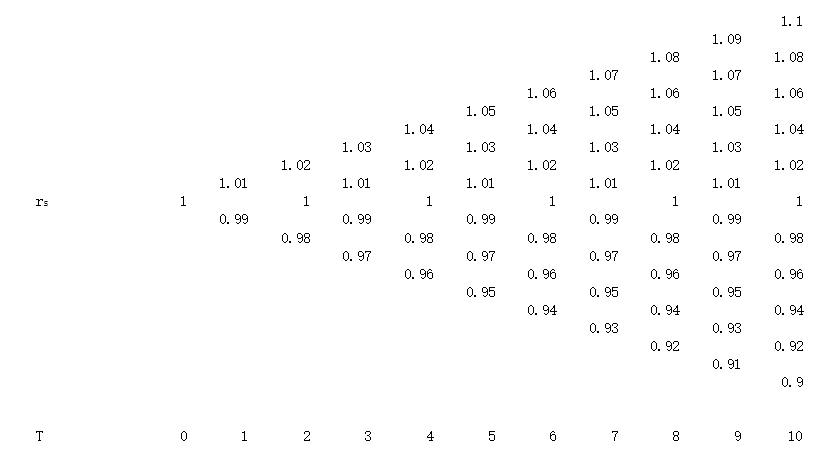
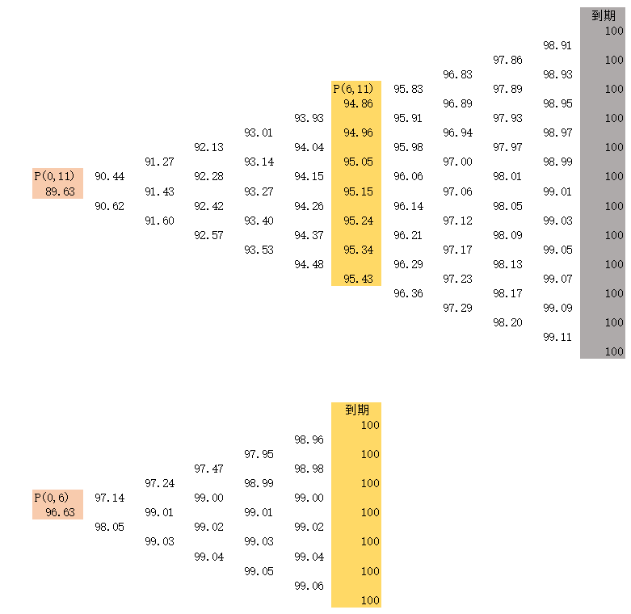
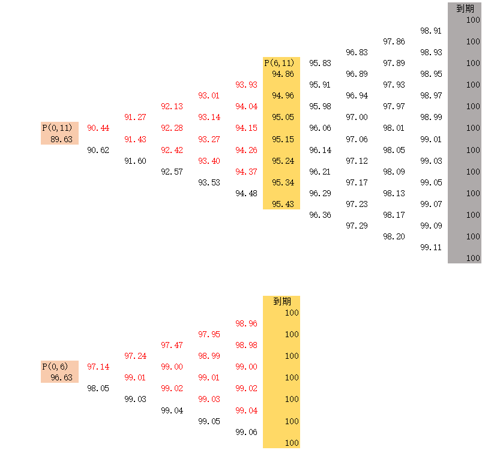

<meta http-equiv='Content-Type' content='text/html; charset=utf-8' />
在此前提到衍生品的时候，对于利率，我们假设的是它是一个时间的函数 $r(t)$ ，是个定值。然而，如果涉及到利率类衍生品，需要它“随机”起来，并不是那么直观的，需要一点分析：不同于股票的价格，自己是一个可交易、可观测变量，我们可对其随机过程进行建模。利率本身不是一个可交易量，我们可以交易的基础其实是未来现金流的现值。

## 利率过程的基础假设

先简单的看一个两步两状态过程。假设有现金流 $1$ 分别发生在时间 $t_1$ 和时间 $t_2, 0<t_1<t_2$，这两笔现金流在 $0$ 时刻有市场价格 $p(0,t_1),p(0,t_2)$。计$\mathscr{r}(d,t)=-\mathrm{ln}(d/t)$($d$ for discount)。我们会分别称$\mathscr{r}(p(0,t_1),t_1),\mathscr{r}(p(0,t_2),t_2)$为即期利率。

市场是会有波动的。那么，我们可以期待 $p(t_1,t_2)$不是一个定值(注意$p(t_1,t_2)$不是指$0$时刻看到的远期价格 which is a 定值，而是指在 $t_1$将看到的$t_2$的现金流的价格。)，而是一个随机变量。那么，再从另一个角度来看$p(0,t_2)$，它应该是$p(t_1,t_2)$的**某种**期望。于是满足:
$$
\begin{eqnarray*}
p(0,t_2) = \mathscr{E}(p(t_1,t_2)p(0,t_1))
\end{eqnarray*}
$$
此处，说明白这个“某种”期望，是指的什么: 什么$\sigma$代数，什么测度？

* 取$\sigma$代数为 adapt to $p(t_1,t_2)$的一个。
* 取指向$\sigma$代数中元素的 arrow security (即 $p(t_1,t_2)$ 落到某元素则支付$1$，其它支付$0$的假想证券)的$0$时刻的价格为$\mathscr{p}$。
* 可以看到(不严谨的说)：
  1. 若每个arrow security持有一份，其payoff就是任何情况下为$1$，所以其总价值应该就是 $p(0,t_1)$。可见 arrow security 的价格除以$p(0,t_1)$，形成一个测度。
  2. 若每个arrow security持有$p(t_1,t_2)$份，其payoff在任何情况下就是和$t_2$时$1$的现金流在$t_1$时的估值一致。于是，上面说的测度就是 the 测度我们求期望有时候要的。
* 注意，这是我们需要的最粗的一个测度，要是有更细的，也是可以的。

上面的过程可以容易的扩展到$p(0,t_n) = \mathscr{E}(\prod\limits_{i=1}^n p(t_{i-1},t_i))$。

下面观察$p(t_1,t_2)$，它应该有什么属性呢？

* 在$t_1 \to t_2$时，它应该趋于$1$，而在$t_1\to 0$时，它应该趋于$p(0,t_2)$，为一个定值。
* 在取消随机性之后，$p(t_1,t_2)$ 是定值，应该回复到利率为时间的函数的经典情况，其中包括要求 $ \lim \limits_{\delta t \to 0} p(t,t+\delta t)/\delta t $ 存在。
* $p(0,t)$和$p(t^{\prime},t^\prime+t)$的差距的分布，应该随$t^{\prime}$的增大而变宽。

结合前面提到的$p(0,t_n)$的式子，可以取$r_s(t) := \lim \limits_{\delta t \to 0} p(t,t+\delta t)/\delta t $

### 利率

由上，我们终于得到了常说的**利率**：
即期利率 $r(t) = \mathscr{r} (p(0,t),t) = \mathscr{r}(\lim \limits_{(t_i-t_{i-1}) \to 0}\mathscr{E}(\prod\limits_i^n p(t_{i-1},t_i)); t_n = t, t)$。从而：
$$
\begin{eqnarray*}
r(t) = \mathscr{r} (\mathscr{E} (e^ {\int \limits_{0}^{t} r_s(s)\mathrm{d}s}),t)
\end{eqnarray*}
$$
远期利率之类的在此基础上可以同原有推导，就不罗嗦了。

#### 短期利率模型

一个最直观的想法就是对$r_s(t)$服从的随机过程来建模，这就是短期利率模型。短期利率模型有Visicek模型，Cox-Ingersoll-Ross模型，Hull-White模型等。这类模型都有一个共同的结构：
$$
\begin{eqnarray*}
\mathrm{d} r_s = M(\mathbf{c},r_s,t)\mathrm{d}t + \sigma(\mathbf{b},r_s,t)\mathrm{d}W
\end{eqnarray*}
$$
甚至是：
$$
\begin{eqnarray*}
\mathrm{d} r_s = M(\mathbf{c}(r_s,t),r_s,t)\mathrm{d}t + \sigma(\mathbf{b}(r_s,t),r_s,t)\mathrm{d}W
\end{eqnarray*}
$$
的形式。
其中，$ \mathbf{c,b}$ 是两组 **参数**。在给定这些参数之后，根据$r_s(0)$的值，整个$r_s$的随机过程就确定下来了。
下面，来观察应用的情况：

* 我们会在某时点$0$，根据可观测的市场情况校准$ \mathbf{c,b}$。
* 根据$ \mathbf{c,b}$确定的随机过程，各种求期望来进行估值。

一个Toy过程如下，可以先给一个无漂移的二叉树：

这个$r_s(t)$不是任何“价格”，无所谓什么“鞅”的。我们尝试看看这下面的债券估值：

容易发现，这会有一个严重的问题。在$0$时点，我们已经校准好了参数$ \mathbf{c,b}$。那么到了时间$1$，$r_s(1)$已经是一个可以观测的确定量，加上参数从而$r_s(1+)$也就是确定的了。进而，可以计算出整个市场的情况。然而，在时间$1$，新的市场会是一个可观测量，同计算值会有矛盾。这使得**短期利率模型不能成为一个实际有用的模型**。简单的如在上例中，如果到了$T=1$的时刻，我们观查到$P(1,11)=90.44$，那就要求有$P(1,6)=97.14$，而这并不一定和$T=1$时的观测一致。

这个问题的出现，也很正常。可观测的空间的大小是$((\mathrm{R})^{\Vert T \Vert})^{\Vert t \Vert}$(其中$T$是现金流的期限空间)，而模型的空间大小是$(\mathrm{R})^{\Vert t \Vert}$，不足以完成表述。

#### 合理的利率模型

分析前面的矛盾，有如下的目标和问题：

* 目标是在每一个时点可以适配当时的市场，但是又可以有一定意义上的预期。
* 问题是模型不能对于“利率期限结构”有确定性的预测。
* 通过$r_s(t)$表达的基本结构是不能丢弃的，因为基础的假设仍然成立的。那么我们需要这个随机过程不能由仅由参数和$r_s$的初值来完全的确定。

这说明$r_s(t)$自身应该不足以表示确定的状态，它对应的filtration不够细，于是，最简单的想法是再把它分细。以$(r_s(t),\mathbf{q})$来表达状态。另外$r_s(t)$不一定要符合一个前述的增量过程，但是又要保持连续。通过参数$\mathbf{q}$应该能覆盖所有可能的利率期限结构。注意到刚才的模型中，其实是可以适应观测点瞬时利率的，那自然的扩展是通过增加远期利率来分细这个filtration。同时，需要再分析是否有什么新的约束。

具体来说，我们要：

* 找到一个模型，能够适配随时观察到的各债券的价格。
* 我们需要的模型，应该是在风险中性测度下的影响关系，目的是在衍生品估值的时候好直接求“期望”。而真实测度下，其实比较随意，因为只要能通过等价测度变到风险中性就行，而这个要求很弱。

最基础的要求是：
$$
\begin{eqnarray*}
p(t,T) &=& p(t,s) \mathscr{E}(p(s,T)) \\
\end{eqnarray*}
$$
于是有
$$
\begin{eqnarray*}
p(t,T) &=& p(t,t+\mathrm{d}t) \mathscr{E}(p(t+\mathrm{d}t,T)) \\
\Rightarrow p(t, T) &=& \mathscr{E}(p(t+\mathrm{d}t,T)(1-r_s(t))\mathrm{d}t)
\end{eqnarray*}
$$
这样：$p(t+\mathrm{d}t,T)(1-r_s(t))\mathrm{d}t$的过程是无漂移的，应该有：
$$
\begin{eqnarray*}
p(t+\mathrm{d}t,T)(1-r_s(t))\mathrm{d}t -p(t,T) &=& p(t,T)\sigma_p(t,T)\mathrm{d}W\\
\Rightarrow \frac{\mathrm{d}p(t,T)}{p(t,T)} &=& r_s(t)\mathrm{d}t+\sigma_p(t,T) \mathrm{d}W
\end{eqnarray*}
$$
这个是显然的哈，看着很熟悉，同股票的形式是一样的。事实上，如果面对的是一个比较长期限的债券的期权，这基本上就够了。然而，这里存在下面两个主要问题：

1. $p$的过程并不完全自由，在$t=T$时，应该收敛到$1$。
2. $p$的值和$r$并不独立(通常有正相关性)。
直接对$p$建模，其实不容易解决上两个问题，特别是第1点。这提示我们还是应该对“利率”的形式来建模。

下面以$f(t,u)$为建模目标，其中$f(t,u)$是在$t$时刻看到的$u$时候的瞬时利率$f(t,u) = - \frac{\partial \ln (p(t,u))}{\partial u}$ (此处和短期利率有一个关键的区别了： **短期利率自身不是一个远期利率，也不能仅通过 $(t,T)$ 之间的某种积分及求期望得到一个远期利率，而$f(t,u)$的积分真的是远期利率，连期望都不用**)。再看这个时候，$p$是怎么来的(对于第二个参数，这是函数，而不是随机变量)：
$$
\begin{eqnarray*}
\ln(p(t,T)) &=& -\int \limits_{t}^{T} f(t,u) \mathrm{d} u \\
\Rightarrow \mathrm{d}\ln(p(t,T))&=& f(t,t) \mathrm{d}t - \int \limits_{t}^{T} \mathrm{d}f(t,u) \mathrm{d}u \\
&=& r_s(t) \mathrm{d}t - \int \limits_{t}^{T} \mathrm{d}f(t,u) \mathrm{d}u
\end{eqnarray*}
$$
到这一步，得到了建模量$f$和观测量$p$的关系。而另一方面，注意到：
$$
\begin{eqnarray*}
\mathrm{d} \ln(p(t,T)) &=& (r_s(t)-\frac{1}{2}\sigma_p^2(t,T))\mathrm{d}t + \sigma_p(t,T) \mathrm{d}W
\end{eqnarray*}
$$
对比得：
$$
\begin{eqnarray*}
-\frac{1}{2}\sigma_p^2(t,T)\mathrm{d}t + \sigma_p(t,T) \mathrm{d}W &=& -\int \limits_{t}^{T} \mathrm{d}f(t,u) \mathrm{d}u
\end{eqnarray*}
$$

到此，必须开始对于$f(t,u)$的行为再做一点假设了。如果对于利率的影响$d$个独立的因素(此处逻辑冠冕堂皇，实际上，是为了拟合的时候有足够的自由度)，好用的假设这$d$个因素分别是布朗运动，有：$\mathrm{d}f(t,u) = \mathbf{\sigma}(t,u) \cdot \mathbf{\mathrm{d} W_{ft}} + \mu(t,u) \mathrm{d}t$
这时有：

$$
\begin{eqnarray*}
-\int \limits_{t}^{T} \mathrm{d}f(t,u) \mathrm{d}u &=& -\int \limits_{t}^{T} \mathbf{\sigma}(t,u) \cdot \mathbf{\mathrm{d} W_{ft}} \mathrm{d}u  -\int \limits_{t}^{T}\mu(t,u) \mathrm{d}t \mathrm{d} u
\end{eqnarray*}
$$
对比系数，有：
$$
\begin{eqnarray*}
\sigma_p(t,T) &=& \vert \int \limits_{t}^{T} \sigma(t,u) \mathrm{d}u \vert \tag{p-f relation}\label{p-f}\\
\frac{1}{2}\sigma_p^2(t,T) &=&\int \limits_{t}^{T}\mu(t,u)  \mathrm{d} u \\
\Rightarrow (\vert \int \limits_{t}^{T} \sigma(t,u) \mathrm{d}u \vert)^2 &=& 2\int \limits_{t}^{T}\mu(t,u) \mathrm{d} u
\end{eqnarray*}
$$

对$T$求导：
$$
\begin{eqnarray*}
\mu(t,T) = \sigma(t,T) \cdot \int\limits_{t}^{T} \sigma(t,u) \mathrm{d}u
\end{eqnarray*}
$$
故得：
$$
\begin{eqnarray*}
\mathrm{d}f(t,T) = (\sigma(t,T) \cdot \int\limits_{t}^{T} \sigma(t,u) \mathrm{d}u) \mathrm{d}t + \sigma(t,T)\cdot \mathbf{\mathrm{d} W}
\end{eqnarray*}
$$
这也就是[HJM](https://en.wikipedia.org/wiki/Heath%E2%80%93Jarrow%E2%80%93Morton_framework)的基本结论。可见：

* 根据\eqref{p-f}，可以根据观测到的价格波动对$\sigma(t,T)$进行校准。
* 由于“因素”的自由性(即 $\mathbf{\mathrm{d}W}$ 可以合法的任意取值)，给定$n$个独立因素，就可以匹配上$n$个点的曲线。或者如果曲线由参数给出，应可以拟合$n$个参数的曲线。
* 注意只有对于$f$的第一个参数有要求，故任意曲线的形态都是被允许的。
* 置$\sigma = 0$，有$f(t,T)$不随$t$变化的，注意这和“固定tenor上的点保持不变”、亦即“ride the curve”策略基准的形式是不一样的，即不允许有“确定的，且时间平移不变的曲线”，这是合理的，因为本质上“ride the curve”是有套利的，是不应该发生的。
* 取$n=1$，$\sigma(t,T) = \sigma$为常函数，有$\mathrm{d}f(t,T) = \sigma^2 (T-t) \mathrm{d}t + \sigma \mathrm{d}W$：是一个有正向漂移，且越远漂移越快的过程。当然，我们也可以调整$\sigma(t,T)$的型式，如$\sigma(t,T) =  (T-t)^{-\gamma}\sigma$，会使得远端的漂移稍慢，但整体会有“近端波动大，漂移小；远端波动小、漂移大”的情况，往往使得曲线越变越陡。(不要害怕，这只是风险中性测度下的东西，不代表真实世界的漂移)。

## 利率作为期权标的的合法性以及估值

先要明确，什么叫 **合法** 。它指的是：若市场的行为符合模型的预期，那么可以通过对于基础资产的交易，完全复制衍生品的payoff。或者说，对于期初净值为$0$的投资者，可以通过融资买入一个衍生品，并融资(投资)于零息票，最后实现$0$的损益(这个定义更干净)。而衍生品的payoff，应该是指的一个函数$E \to \mathrm{R}$，其中$E$ 是$p(t,T)$的有限个观察值的集合。

为此，只需要证明任一arrow security都可以被复制即可。只是，此处需要对于上面的arrow security进行一点扩展：

1. 此处的$\sigma$代数取为 adapt-to 全部$p(t,T)$的。
2. arrow security为指向该$\sigma$代数上的任意事件集的。

**先看估值：**
[前面](#a_p_as_m)前面有过一个结论：arrow security 的价格应该为其指向事件集发生概率乘某一折算率。但是，那里的折算率是一个定值，对应固定期限的$p(0,t)$。而如果该事件集不由同一时刻的价格决定会怎么样呢？

例如：该事件集为 $p(t_1,T_1) = a \cap p(t_2, T_2) = b =: A \cap B$ ? 其中$t_1< t_2$我们知道$\mathrm{P}(A\cap B)$，可是$\mathscr{p}(A \cap B)$应该为多少呢？

可以这么看这个问题，为了实现同一pay off。我们可以先购买一定量的$arrow(A)$再在$t_1$用其pay off 购买一份$arrow(B)$。这样，根据 $\mathrm{P}(A\cap B) = \mathrm{P}(A)\mathrm{P}(B \vert A)$。应该形式上有: $\mathscr{p}(A\cap B) = p(0,t_1)\mathrm{P}(A) \times p(t_1,t_2)\mathrm{P}(B\vert A)$。

然而，考虑到在$0$时点，$p(t_1,t_2)$并非一个确定值且$B$和$p(t_1,t_2)$不独立，本式应该展开为：
$$
\begin{eqnarray*}
\mathscr{p}(A\cap B) = p(0,t_1)\mathrm{P}(A) \times
\mathscr{E}_{p(t_1,t_2)}(p(t_1,t_2)\mathrm{P}(B\vert A,p(t_1,t_2)))
\end{eqnarray*}
$$
好吧，的确复杂，除了蒙卡难道是能做的？不过复杂就不是我们需要在意的事了，数学人还处理具体的计算那就丢人了：)

**再看对冲：**
在上述估值之下，注意到我们的利率模型已经可以完整的给出对于未来的估计，那么上述的“概率”都可以写成$p(0,T)$的“当前观测值”的函数。那么自然的可以进行delta对冲。
