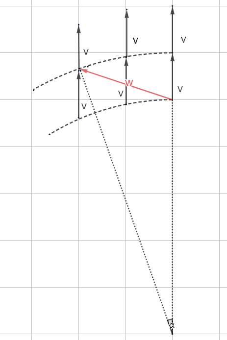

<meta http-equiv='Content-Type' content='text/html; charset=utf-8' />

得安静的理解清楚一下分别都是在干什么。

## 协变导数
为什么叫 **“协变”** 导数呢？那就是有东西是不协变的，谁？直观的来看，最容易给的导数是坐标导数。它的不协变是好看出的：

在直角坐标下，场 $V$ 沿 $W$ 的坐标导数很显然为$0$；但是在图示的极坐标下，显然不为$0$。那么一定不是协变的。原因也很简单，坐标导数这个东西，是同坐标有关的，而我们需要一个同坐标选择无关的东西。在[广义相对论的笔记](广义相对论#协变导数)中

## 李导数

## 两者对比
