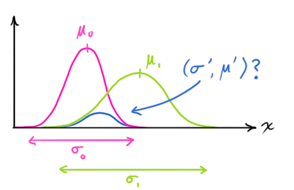
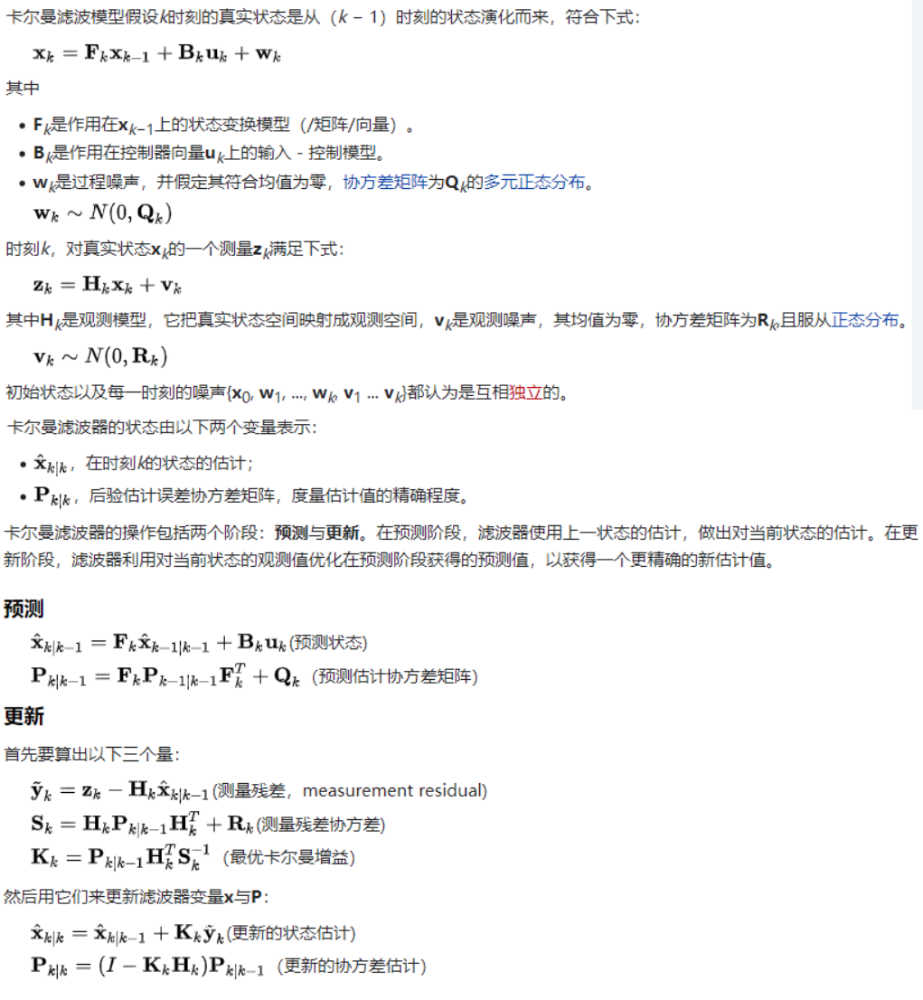

<meta http-equiv='Content-Type' content='text/html; charset=utf-8' />

## 卡尔曼滤波

(奇怪，为什么之前会觉得复杂呢？)
我们先好好表述一下问题，对于后续分析非常有帮助:

先考虑一步，在t 时刻，系统的状态有一个**估计**(*先不要在意是哪来的*)。t到t+1时刻的**演化**(这一一个映射)是已知的，而t+1时，有一个**观测**(观测的**准确度**已知)。那么，如何给t+1时刻的状态一个**新的估计**(*哈，从一步过渡到多步的递推基础有了*)？

接下来，如果这个一步一步是<u>马尔可夫的</u>。那么，我们就得到了一个很好的估计。

那么**新的估计**怎么给呢？我们有：
$P(x | a) = A(x), P(x | b) = B(x)$
其中$x$为状态值，$a$为t的信息和演化的结果。$b$为t+1时刻的观测结果。需要求得：$P(x|a,b)$。
$$
\begin{eqnarray*}
P(x|a,b) &=& \frac{P(x,a,b)}{P(a,b)}\\
&=&\frac{P(x)P(a,b|x)}{P(a,b)}\\
&=& \frac{P(x)P(a|x)P(b|x)}{P(a,b)} \tag{independent}\\
&=&\frac{P(a)P(b)}{P(x)P(a,b)} A(x)B(x)\\
&=&CA(x)B(x) \tag{no prior}
\end{eqnarray*}
$$
这个基础上，如果有$A(x),B(x)$都是正态的$$A(x)=N(x,\mu_a,\sigma_a) , B(x) = N(x,\mu_b,\sigma_b)$$有：
$$
\begin{eqnarray*}
P(x|a,b)&=&N(x,\mu,\sigma)\\
\mu &=& \frac{\sigma_a^2\mu_b+\sigma_b^2\mu_a}{\sigma_a^2+\sigma_b^2}\\
\sigma^2 &= & \frac{\sigma_a^2\sigma_b^2}{\sigma_a^2+\sigma_b^2}\\
\end{eqnarray*}
$$

在这种假设下，一个**估计**总可以用$\mu$和$\sigma$来表示，剩下的就不过是计算了。之后的不敲了，抄一下如下：

> 

有一个好文[how a kalman filter works in pictures.](https://www.bzarg.com/p/how-a-kalman-filter-works-in-pictures/)值得一看。
