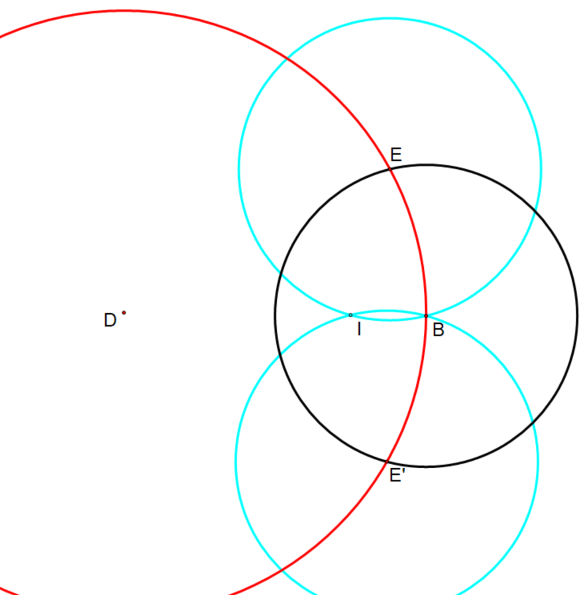
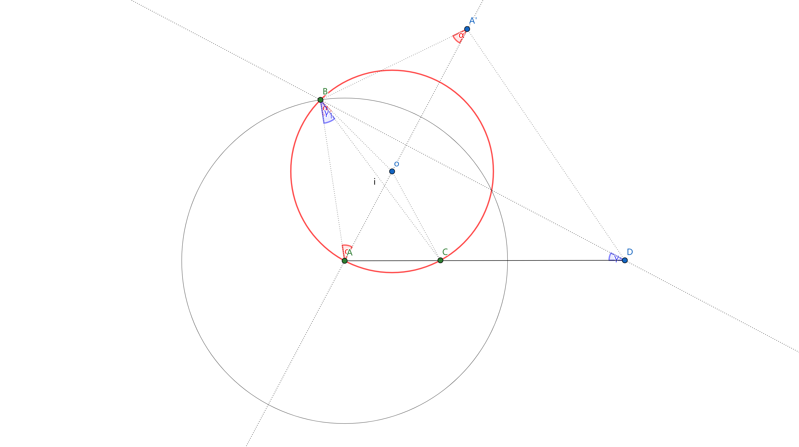
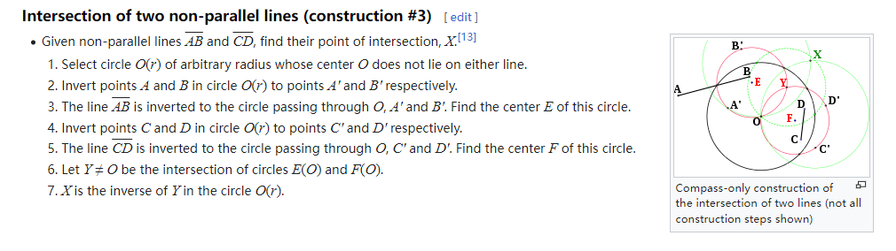

<meta http-equiv='Content-Type' content='text/html; charset=utf-8' />

这个其实是[Mohr Mascheroni定理](https://en.wikipedia.org/wiki/Mohr%E2%80%93Mascheroni_theorem)的一部分。其中这一部分感觉不是直观能想到的，权且记录。

#### 点关于圆的逆

第一步是一个“基本操作”：点关于圆的逆，即下图中，对于半径为$r$ 的 $\odot B$，在$BI$上找点$D$，使得 $r^2 = BI\times BD$。

在上图中，做$\odot D(B)$ 交 $\odot B(r)$ 于 $E, E^{\prime}$。做$\odot E(B), \odot E^{\prime}(B)$，交于另一点$I$。易见$\bigtriangleup BEI \sim \bigtriangleup BDE$得证。

#### 找圆心
如下图，在圆上已知$ABC$三点，下面的操作为：
* 做$\odot A(B)$
* 做$C$关于$\odot A(B)$的逆$D$
* 做$A$关于$BD$的对称点$A^{\prime}$
* 做$A^{\prime}$关于$\odot A(B)$的逆$o$，即为所求。

**证明：**
* 由 $A, A^{\prime}$对称， $\angle A^{\prime} = \angle BAA^{\prime}$
* 由 $o, A^{\prime}$关于$\odot A(B)$互逆， $\angle A^{\prime} = \angle ABo$
* 故 $\angle ABo = \angle BAo$，$Bo = Ao$
* 由 $o, A^{\prime}; C,D$ 分别关于$\odot A(B)$互逆，得$Ao \times AA^{\prime} = AC \times AD$，得$\bigtriangleup Aoc \sim \bigtriangleup ADA^{\prime}$。
* 有$\angle oCA = \angle DA^{\prime}A = \angle oAC$，故 $Ao = Co$
* **Q.E.D**

话说，再看下面做两条线的交点的方法。

其实，应该注意到，上面“关于圆的逆”，也称关于圆的“反演变换”，[有一系列有意思的性质：](https://zhuanlan.zhihu.com/p/670419123)

* 反演变换可逆：由反演的定义可知，当 $A^{\prime}$ 是 $A$ 的反点时，点 $A$ 也是 $A^{\prime}$ 的反点；

* 位于反演圆上的点，保持在原处；位于反演圆内的点，变换为反演圆外的点；位于反演圆外的点，变换为反演圆内的点。

* 过反演中心的直线反演后为自身（不包含反演中心），不过反演中心的直线，反演后为过反演中心的圆。

* 经过反演中心的圆经反演后为不经过反演中心的直线，并且反演中心与原像圆心构成的直线与反形垂直；不过反演中心的圆，反演后仍为一个圆，且与原来的圆关于反演中心位似。

* 两条直线或曲线的夹角大小在反演变换下是不变的。

* 如果反演圆的中心恰好是两相切圆的切点，则这两相切圆经反演后的像为两平行直线。

