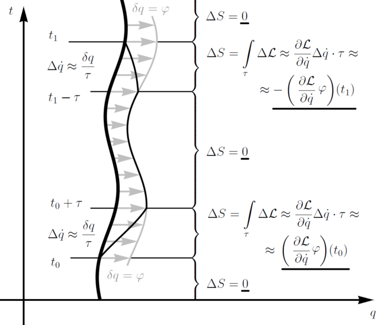

<meta http-equiv='Content-Type' content='text/html; charset=utf-8' />

这一点，集成者就是**诺特定理**，在鞠国兴的朗道力学解读中(P44)表述是：
> 对于任何一种在时空坐标连续变换下系统的作用量的不变性都存在相应的运动积分

这一句话，其实充满了定义。把这些定义搞清楚，才算是搞明白。

* **运动积分：** $q_i, \dot{q_i}$的某函数$C(q_i, \dot{q_i})$在运动的路径上不随时间变化，则称$C$为运动积分。
*  **一种坐标连续变换**：
	$$
	\begin{eqnarray*}
	t &\rightarrow&\bar{t} &=& t + \epsilon_{\alpha}\tau_{\alpha}(t, q(t)) \tag{a}\\
	q_i&\rightarrow &\bar{q_i} &=&q_i + \epsilon_{\alpha} \eta_{i\alpha}(t, q(t))  \tag{b}
	\end{eqnarray*}
	$$
	其中指标$i$区分的是不同的广义坐标，指标$\alpha$区分的是不同的**对称变换**。
*  **不变性(也称对称性)**:
	$$
	\begin{eqnarray*}
	&\bar{S} = \int_{\bar{t_1}}^{\bar{t_2}} \bar{L}(\bar{q(t)},\dot{\bar{q(t)}},\bar{t}) d\bar{t} = \int_{t_1}^{t_2}L(q(t),\dot{q(t)}, t) dt=S \\
	&\bar{L}(\bar{q(t)},\dot{\bar{q(t)}},\bar{t}) \frac{d \bar{t}}{dt} = L(q(t),\dot{q(t)},t) \tag{1}
	\end{eqnarray*}
	$$
	为了保持变换前后一致的拉格朗日方程，要求：
	$$
	\begin{eqnarray*}
	\bar{L}(q,\dot{q},t) = L(q,\dot{q},t) + \frac{d}{dt}\Lambda(q,t) \tag{2}
	\end{eqnarray*}
	$$
	
通过**(2)**代入**(1)**，并且利用**(a)**和**(b)**展开到一阶，经过一堆整理，可得到运动积分：
$$
\begin{eqnarray*}
I_{\alpha}(q,t) &=& \eta_{i\alpha}p_i - E \tau_{\alpha} + \Pi_{\alpha} \\
where ~~\Pi_{\alpha} &=& \frac{\partial \Lambda}{\partial t}\tau_{\alpha} + \frac{\partial \Lambda}{\partial q_i}\eta_{i\alpha}
\end{eqnarray*}
$$
这就是**诺特定理**。

不过在[wikipedia](https://en.wikipedia.org/wiki/Noether%27s_theorem)上有更多的说明，比如一个更完善的表述：
> 对于每个局部作用下的可微对称性，存在一个对应的守恒流

和一个直观的理解：

* 考虑一个1维的真实运动，粗实线为其路径，也就有其$S$变分为0。
* 对其做一个变分，到细实线，它有三类部分：
	1. 和粗实线重合的部分，其对于原路径$\Delta S$是0。
	2. 和图中箭头指向的灰线部分重合的部分，由于箭头变换$\phi$是一个**对称性**的变换，也有$\Delta S$是0。
	3. 连接粗实线和灰线的两段，其$\Delta S$ 之和应该为0。看前一段，应该有：
		$$
		\begin{eqnarray*}
		\Delta S &=& \int_{\tau} \Delta L \\
		& \approx & \frac{\partial L}{\partial \dot q} \frac{\delta q}{\tau} \tau + \frac{\partial L}{\partial q} \frac{\delta q}{2} \tau \tag{*}\\
		& \approx & (\frac{\partial L}{\partial \dot{q}} \phi)(t_0)
		\end{eqnarray*}
		$$
		其中**(*)**是只保留$\tau$的零阶小。对后一段同样操作，能得到：$(\frac{\partial L}{\partial \dot{q}} \phi)(t_0) =(\frac{\partial L}{\partial \dot{q}} \phi)(t_1)$。
	
	4. 扩展为高维，只需要简单的线性加就好了。
	5. 扩展为加上对于时间的**对称变换**，假设其为$t \rightarrow t+T$，会得到$T(L- \frac{\partial L}{\partial \dot{q_r}}\dot{q_r})$保持不变。其中第一部分来自于时间的伸缩，第二部分同前面一样来自于斜率的变化(注意时间的变化同时影响每一维的斜率)。
* 进一步扩展到不是粒子的轨迹$q(t)$，而是一个场$\psi(q_r, t)$:
	1. 那么$S= \int_{\Omega} l(\psi, \partial_{\mu}\psi, r) dr^n$。其中$\mu$已经包含了时间维度。   
	2. 上面的推导过程中把区间$[t_0, t_1]$换成一个区域$U$。
	3. $t_0,t_1$换成边界$\partial U$。
