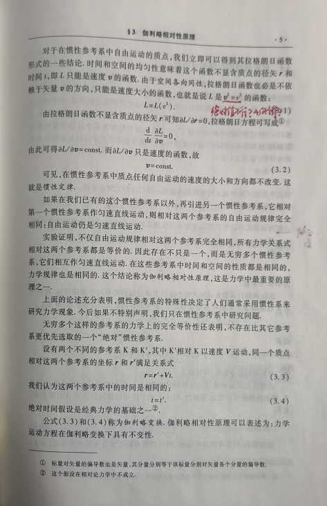
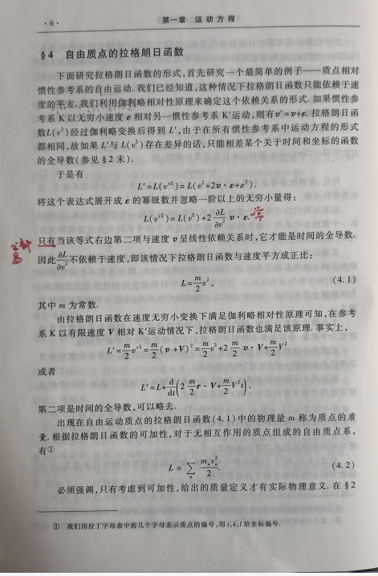
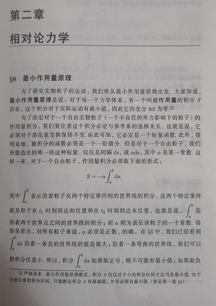
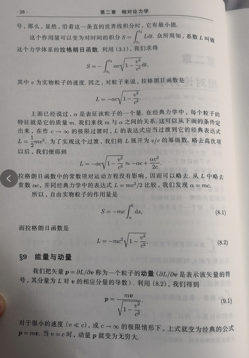
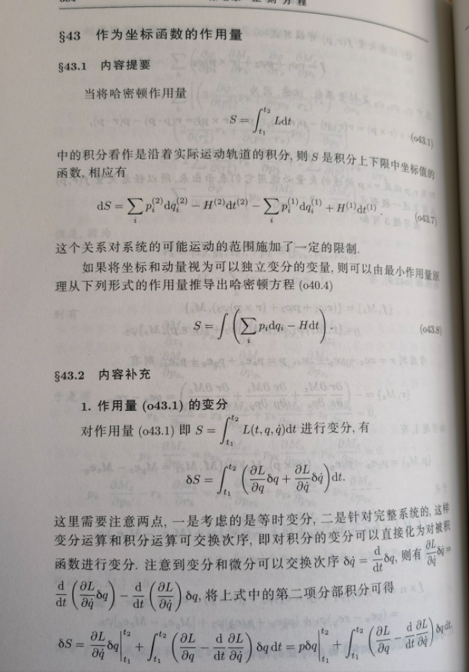
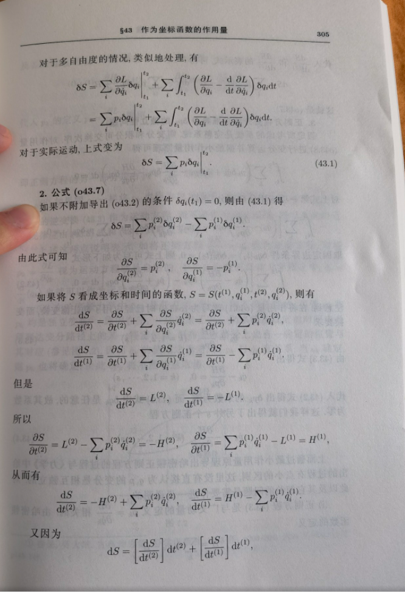

<meta http-equiv='Content-Type' content='text/html; charset=utf-8' />

有意思有意思，当年上学的时候为什么不用朗道呢？居然深刻到物理定律不仅是“实验结果是这样”，而是“只能是这样”。

------
其实先要理解清楚几个概念：

* 运动的解

> 在一个参考系中的一个函数$q(t)$。
> **还看到一个说法，应该更清楚：研究的对象不是$q(t)$，而是$q(\gamma(t))$。其中$\gamma$是路径，$t$是在这条路径上的一个参数。**

* 运动方程

> 在一个参考系中的一个方程 $F(q(t))=0$ ( $F$ 是 $q(t)$ 的泛函)。这个方程在给定的边界条件下可以得到 $q(t)$。

* 运动方程的不变性

> 在两个参考系中 $R, R^{\prime}$ 中，存在一个映射 $$(q,t)_R \leftarrow (q^{\prime}, t^{\prime})_{R^{\prime}}$$ 有在 $R$ 系中方程可以表示为：

$$
\begin{eqnarray*}
F(q(t))&=&0 \\
\rightarrow F(q_{q^{\prime},t^{\prime}}(t_{q^{\prime},t^{\prime}}))&=&0\\
\rightarrow F^{\prime}(q^{\prime}(t^{\prime}))&=&0\\
\end{eqnarray*}
$$

> 而"不变性"的要求是，在$R^{\prime}$系中，运动方程也有同样的形式，即$F(q^{\prime}(t^{\prime}))=0$，这要求$F = F^{\prime}$。

### 经典力学

* 经典力学下的作用量$S = \int \mathrm{d}s = \int L(q, v) \mathrm{d}t$。之所以认为有这种形式是因为在伽利略变换下$t$是绝对的。
* 作用量在真实运动下取极小值即为运动方程，那么$L(q,v)$可以被确定到一个什么程度呢？可以看出，作用量如果加上一个$t$的函数$g(t)$，那么会由于运动的端点不变，这一项对运动方程没有贡献。那这对应$L_2(q,v) = L(q,v) + \frac{\mathrm{d}g}{\mathrm{d}t}$。
* 各向同性要求$L$是速度大小的函数，所以是$v^2$的函数，会有问题为什么不是_绝对值或4次方_。然而事实上，不论是_绝对值_还是_4次方_都还是$v^2$的函数。这里的平方项不是“随便”选的，而是来自于平直空间的自然**距离**中来的 —— 因为平直空间的距离是2-范数，而之所以是2-范数，可能和2-范数空间有最小的$\pi$有关。
* 令$v^2=k$，在$v^{\prime} = v+\epsilon$时，有$k^{\prime} = k+2\epsilon \sqrt{k}$，有$L^{\prime}= L(k^{\prime}) = L(k) + 2 \frac{\partial L}{\partial k}\epsilon \sqrt{k} = L(k) + 2 \frac{\partial L}{\partial v^2}\epsilon v$。固要求第二项是**全导数**。这里的**全导数**是指：存在一个形如$f(q(t),t)=g(t)$的函数，它的导数是：$\frac{\mathrm{d}f}{\mathrm{d}t} = \frac{\partial f}{\partial q} v + \frac{\partial f}{\partial t}$。对比有：$ 2 \frac{\partial L}{\partial v^2}\epsilon = \frac{\partial f}{\partial q} $，我们知道它们只能是一个常数，得到(4.1)。

### 相对论力学

相对论之下，就很骚气了，看流程:

* 存在一个信号的最高速度$c$，在参考系变化下不变。对于通过这种信号连接的**事件**在任一个参考系都有$c\delta t-\delta r =c\delta t^{\prime}-\delta r^{\prime} =0$。
* 如果有两个事件，在一个参考系有$c\delta t-\delta r = s$，这代表在一个事件通过$c$连接到另一个坐标点后，又过了$s/c$。或者记：$\delta t = \delta t_0 +\frac{s}{c}$，其中$c\delta t_0-\delta r=0$。在另一个系中有$\delta t^{\prime} = \delta t^{\prime}_0 +\frac{s^{\prime}}{c}$。显然有$s=0 \rightarrow s^{\prime}=0,  s>0 \rightarrow s^{\prime}>0$。设$s= g(s^{\prime})$，又由对称性有$s^{\prime} = g(s)$, 固有$s = s^{\prime}$。在参考系变换下不变。
* 作用量仍然是$S = \int \mathrm{d}s$的形式。可是，由于$t$不再是对于参考系变换不变的，故在寻找不变量时，不能剥离$t$。$S$应该是标量函数。作用量应有的性质：
  * 在同一时空点，应该为0，故在$\Delta s$为0的时候应该为0；
  * 由于是洛伦兹不变性，应该有$\mathrm{d}s = f(\mathrm{d}s)$；
  * $S$应该是沿世界线可加的。
* 故只剩下$\mathrm{d}S = -\alpha \mathrm{d}s$($\alpha$为正，要有最小值)，而$\mathrm{d}s$又是粒子的固有时为$c\sqrt{1-\frac{v^2}{c^2}}\mathrm{d}t$，这就得到了拉格朗日函数。对比低速极限  $\alpha = mc$。

这还不算什么，有意思的是，可以直接推出**麦克斯韦方程**组来：

* 假设有一个场，称为**势**，分量$A^i$，以 -$\frac{e}{c}\int A^i\mathrm{d}x_i$ 进入作用量。之所以这样，是为了得到一个标量，才能是作用量(写得早了点，在整理完[切向量和余切向量](./切空间.md)之后，我会更习惯-$\frac{e}{c}\int A_i\mathrm{d}x^i$ 的形式，分明切和余切)。

#### 3维推导

* 令$A^i = (\phi, \vec{A})$， 拉格朗日量为 $L = -mc^2 \sqrt{1-\frac{v^2}{c^2}} + \frac{e}{c}\vec{A}\cdot\vec{v} - e\phi$。
* 带入拉格朗日方程，$\frac{\mathrm{d}}{\mathrm{d}t}(\frac{\partial L}{\partial v}) -\frac{\partial L}{\partial r} = 0$：
$$
\begin{eqnarray*}
\frac{\partial L}{\partial r} & = & \frac{e}{c} \mathrm{grad} (A\cdot v) - e~\mathrm{grad}~\phi  \\
\mathrm{grad}(a\cdot b) &= &(a\cdot \nabla)b+(b\cdot \nabla)a + b\times rot~a+a\times rot~b\\
\frac{\partial L}{\partial r} & = & e(\frac{1}{c}((v \cdot \nabla)A + v \times rot ~A ) - \mathrm{grad}~\phi) \\
\frac{\mathrm{d}}{\mathrm{d}t}(\frac{\partial L}{\partial v}) &=& \frac{\mathrm{d}}{\mathrm{d}t}(p + \frac{e}{c}A)\\
\frac{\mathrm{d}A}{\mathrm{d}t} &=&\frac{\partial A}{\partial t} + (v \cdot \nabla) A\\
\rightarrow \frac{\mathrm{d}p}{\mathrm{d}t} &=&e(-\frac{1}{c}\frac{\partial A}{\partial t} - \mathrm{grad}~\phi + \frac{1}{c}v \times \mathrm{rot} ~A)
\end{eqnarray*}
$$
最后一个式子左边是**动量的变化率**，所以右边是**力**。其中第1、2项和速度无关，把$E = -\frac{1}{c}\frac{\partial A}{\partial t} - \mathrm{grad}~\phi$称为**电场**，$H =\mathrm{rot}~A$称为**磁场**。
* 可以感受到，**电场和磁场**决定了运动，而不是**势**，也就是说，不同的势可能对应同一个场。那么势可以确定到哪个程度呢？只要有一个函数$f(r,t)$，$A^{\prime} = A + \mathrm{grad}~ f, ~ \phi^{\prime} = \phi-\frac{1}{c}\frac{\partial f}{\partial t} $就可以，这称为**规范不变性**。
  * 这时候，总可以选择一个规范，使得$\frac{\partial  A^k}{\partial x^k} = 0$，或者3-维形式$\frac{1}{c}\frac{\partial \phi}{\partial t} + \mathrm{div}~\vec{A} = 0$。这称为**洛仑兹规范**。

#### 4维推导

* 但是上面这个过程用到 $A^i=(\phi,\vec{A})$，有一点倒退的感觉，需要尝试直接用4维的方式搞定，直接上。

 $$
 \begin{eqnarray*}
\delta S &=&\delta \int (-mc\mathrm{d}s -\frac{e}{c}A_i\mathrm{d}x^i) = 0 \tag{0}\\
with: ~\mathrm{d}s& =& \sqrt{\mathrm{d}x_i\mathrm{d}x^i}\\
\rightarrow \delta S &=& -\int (mc\frac{\mathrm{d}x_id\delta x^i}{\mathrm{d}s}+\frac{e}{c}A_id\delta x^i+\frac{e}{c}\delta A_i \mathrm{d}x^i) = 0  \tag{1}\\
use: ~ u_i &=& \frac{\mathrm{d}x_i}{\mathrm{d}s}\\
\rightarrow \delta S &=& \int (mc\mathrm{d}u_i\delta x^i+\frac{e}{c}\delta x^i dA_i - \frac{e}{c}\delta A_i \mathrm{d}x^i ) - (mcu_i + \frac{e}{c}A_i) \delta x^i = 0 \\
at~two~ends:~0&=&  (mcu_i + \frac{e}{c}A_i) \delta x^i \\
note: ~\delta A_i &=& \frac{\partial A_i}{\partial x^k}\delta x^k\\
d A_i &=& \frac{\partial A_i}{\partial x^k}d x^k\\
\mathrm{d}u_i &=& \frac {\mathrm{d}u_i}{\mathrm{d}s}\mathrm{d}s \\
\mathrm{d}x^i &=& u_i \mathrm{d}s \\
\rightarrow 0&=&\int [mc\frac{\mathrm{d}u_i}{\mathrm{d}s}-\frac{e}{c}(\frac{\partial A_k}{\partial x^i}-\frac{\partial A_i}{\partial x^k})u^k]\delta x^i \mathrm{d}s \tag{2}\\
thus: ~0&=&mc\frac{\mathrm{d}u_i}{\mathrm{d}s}-\frac{e}{c}(\frac{\partial A_k}{\partial x^i}-\frac{\partial A_i}{\partial x^k})u^k  \tag{3}\\
mc\frac{\mathrm{d}u^i}{\mathrm{d}s}&=& \frac{e}{c}F^{ik}u_k \tag{*} \\
where: ~ F_{ik} &=& \frac{\partial A_k}{\partial x^i}-\frac{\partial A_i}{\partial x^k} \\
&=& \left[ \begin{matrix} 
0 & E_x & E_y & E_z \\ 
-E_x & 0 & -H_z & H_y\\
-E_y & H_z& 0 & -H_x\\
-E_z & -H_y & H_x &0
\end{matrix}\right] \tag{F}
\end{eqnarray*}
 $$

* **注意**：4维的推导过程，没有在意真的是**4**维，可以更多，也没有强行用到**叉乘得一个矢量**这样的有些刻意的结果。

----

* **第一对 Maxwell 方程**很好得，纯数学关系：
 1. 对$E$求旋度，且考虑散度的旋度是0，有$\mathrm{rot}~ E = -\frac{1}{c}\frac{\partial H}{\partial t}$。
 2. 对$H$求散度，且考虑旋度的散度为0，有$\mathrm{div}~H = 0$。
* 要注意到，第一对方程只包含了场应该满足的条件，但对于场的产生原理没有任何说法。要对作用量补一项$S_f$，这一项是场自己的特性。这是因为在前述的方程中，场只是一个既有的事物，如果不进入作用量，根本无从得到它的方程。$S_f$应该：
  * 由场唯一决定。
  * 场有叠加性$\rightarrow$场方程为线性微分方程$\rightarrow$由于场方程应该由作用量的变分得到，$S_f$应该是场的二次式。
  * 它应该在洛伦兹变换下不变。
  * 所以它应该有$F^{ij}F_{ij}d\Omega$的形式。
* 总的作用量变成：$S=-\sum\int mc \mathrm{d}s -\sum\int \frac{e}{c}A_k\mathrm{d}x^k-\frac{1}{16\pi c }\int F_{ik}F^{ik}d\Omega$。第二项可以化为$\frac{1}{c^2}\int A_ij^i d\Omega$。
* 求场方程时，第一项认为是确定的，变分为0(嘿嘿嘿，又来了变分为0，这个要求直接带出了各种守恒呀)。对第二、三项变分，展开为$A$，分部积分并注意无穷远为0。终于得到：$\int(\frac{j^i}{c}+\frac{1}{4\pi}\frac{\partial F^{ik}}{\partial x^k})\delta A_i d\Omega = 0$。
* 有 $\frac{\partial F^{ik}}{\partial x^k} = -\frac{4\pi}{c}j^i$，这就是**第二对Maxwell方程**，带入分量可以得到经典的两个式子：
$$
\begin{eqnarray*}
\mathrm{div}~ E &=& 4\pi \rho \tag{i=0}\\
\mathrm{rot}~H &=& \frac{1}{c}\frac{\partial E}{\partial t} + \frac{4\pi}{c}j \tag{i=1,2,3}
\end{eqnarray*}
$$

##### 外微分形式

注意看上面的 **(F)** 式，应该有一种感受，电场和磁场不都是矢量吗？怎么这个形式下，是一个二阶张量的分量了呢？而且重复出现两次，不美呀。哟，还有反对称。要么，磁场和电场不是矢量，而是[2-形式](./张量基础.md#n形式)？

考虑四维空间$(x,y,z,t)$一个2-形式：

$$
\begin{align} F&=E_x\mathrm{d}t\wedge\mathrm{d}x+E_y\mathrm{d}t\wedge\mathrm{d}y+E_z\mathrm{d}t\wedge\mathrm{d}z\\ &+B_x \mathrm{d}y\wedge\mathrm{d}z + B_y \mathrm{d}z\wedge\mathrm{d}x + B_z\mathrm{d}x\wedge\mathrm{d}y \end{align}
$$

这个符号标记就有点那个意思了。再补一个1-形式的东西：

$$
J=-\rho\mathrm{d}t+J_x\mathrm{d}x+J_y\mathrm{d}y+J_z\mathrm{d}z
$$

补一个度规，让我们好做[Hodge对偶](./张量基础.md#hodge对偶)，就是闵可夫斯基度规：

$$
\begin{eqnarray*}
&\langle \mathrm{d}t\mid\mathrm{d}t\rangle=-1 \\
&\langle \mathrm{d}x\mid\mathrm{d}x\rangle=\langle \mathrm{d}y\mid\mathrm{d}y\rangle=\langle \mathrm{d}z\mid\mathrm{d}z\rangle=1 \\
&\langle \mathrm{d}t\mid\mathrm{d}x\rangle=\langle \mathrm{d}t\mid\mathrm{d}y\rangle=\langle \mathrm{d}t\mid\mathrm{d}z\rangle=0 \\
&\langle \mathrm{d}x\mid\mathrm{d}y\rangle=\langle \mathrm{d}y\mid\mathrm{d}z\rangle=\langle \mathrm{d}z\mid\mathrm{d}x\rangle=0
\end{eqnarray*}
$$

诱导到外积上的内积。之后，Maxwell方程可以有一个两方程的简洁形式：

$$
\left\{\quad \begin{align} \mathrm{d}F&=0\\ \star\,\mathrm{d}\star F &= J \end{align} \right.
$$

这个还是多了，第一个式子，如果 $F$ 是一个势场的外微分，应该是恒成立的。而这是真的，上面的第一个式子使得可以有：$F = \mathrm{d}A$，从而有：
$$
\star\,\mathrm{d}\star (\mathrm{d} A) = J
$$

-----

* 联合Maxwell方程中的带旋度的两式，分别乘$E,H$相加有：$\frac{\partial}{\partial t}(\frac{E^2+H^2}{8\pi})=-\vec{j}\cdot\vec{E}-\mathrm{div}~\vec{S}$。其中$\vec{S}=\frac{c}{4\pi}\vec{E}\times\vec{H}$为坡印亭矢量，为能流密度。$W=\frac{E^2+H^2}{8\pi}$是能量密度。
* 但是还是用4-维的方式来一遍：对任意$S=\int\Lambda(q,\frac{\partial q}{\partial x_i})d\Omega$，用求拉格朗日方程的方式，可以得到$\frac{\partial}{\partial x^i}\frac{\partial \Lambda}{\partial q_{,i}}-\frac{\partial \Lambda}{\partial q} = 0$。注意$\Lambda$是拉格朗日量密度。
* 代入$\frac{\partial \Lambda}{\partial x^i} = \frac{\partial \Lambda}{\partial q}\frac{\partial q}{\partial x^i} + \frac{\partial \Lambda}{\partial q_{,k}}\frac{\partial q_{,k}}{\partial x^i}$，有$\frac{\partial \Lambda}{\partial x^i}  = \frac{\partial}{\partial x^k}(q_{,i}\frac{\partial \Lambda}{\partial q_{,k}})$。
* 又由于$\frac{\partial \Lambda}{\partial x^i} = \delta^k_i \frac{\partial \Lambda}{\partial x^k}$ 且令$T_i^k = q_{,i}\frac{\partial \Lambda}{\partial q_{,k}} - \delta_i^k \Lambda$，有$\frac{\partial T_i^k}{\partial x^k} = 0$。
* 四散度是0，说明三维积分是守恒的，即$P^i = \frac{1}{c}\int T^{ik} d S_k$是守恒的。注意$P^0=\frac{1}{c}\int T^{0k} \mathrm{d}s_k =\frac{1}{c} \int T^{00} dV$，且$T^{00} = \dot{q}\frac{\partial \Lambda}{\partial \dot{q}} - \Lambda$。这个是哈密顿量的公式，所以$T^{00}$就是能量密度。$T^{ik}$称能动量张量。空间的旋转对称性要求它是对称张量。(_对称性的要求另说_)
* 显然$T^{ik}$有$0i$分量$(i=1,2,3)$对应动量密度，而$i0$分量对应能流密度。由对称张量的特性知它们是一样的。
$$
\begin{eqnarray*}
T^{ik} =& \left[ \begin{matrix}
W & S_x/c & S_y/c & S_z/c \\
S_x/c & -\sigma_{xx} & -\sigma_{xy} & -\sigma_{xz} \\
S_x/c & -\sigma_{yx} & -\sigma_{yy} & -\sigma_{yz} \\
S_x/c & -\sigma_{zx} & -\sigma_{zy} & -\sigma_{zz}
\end{matrix}\right]
\end{eqnarray*}
$$
* 稍微理解一下这个张量，对应到经典的条件下，$W$ 是质量密度，第0行的其它位置是质量乘速度分量，对应动量密度；第0列的其它位置还是质量乘速度分量，它的另一个解释是流过的质量，也即流密度。而 $\sigma_{ij}$ 的含义是再乘上速度分量，形成并矢，代表动量流密度。可是为什么叫_应力张量_呢？可以注意到，动量流的量纲就是力密度；并且，对于流上的一点，流过其的动量就是冲量，也即力对于时间的积分。这就是**应力张量**的得名。
* 代入电磁场的作用量$\Lambda = -\frac{1}{16\pi}F_{kl}F^{kl}$，有$T^{ik} = \frac{1}{4\pi}(-F^{il}F^k_l + \frac{1}{4}g^{ik}F_{lm}F^{lm})$

### 电荷的场

* 匀速运动电荷的场很简单：
  * 在电荷静止参考系中，矢势为0，标势为$e/R$。可以得到电场，磁场为0。
  * 进行一次洛仑兹变换就可以了：
$$
\begin{eqnarray*}
&\phi = \frac{\phi^{\prime} + V A_x^{\prime}/c}{\sqrt{1-V^2/c^2}}, ~A_x=\frac{A_x^{\prime}+V\phi^{\prime}/c}{\sqrt{1-V^2/C^2}},~A_y=A_y^{\prime},~A_z=A_z^{\prime}\\
&E_x = E_x^{\prime}, ~E_y = \frac{E_y^{\prime} + VH_z^{\prime}/c}{\sqrt{1-V^2/c^2}},~E_z = \frac{E_z^{\prime} - VH_y^{\prime}/c}{\sqrt{1-V^2/c^2}}\\
&H_x = H_x^{\prime}, ~H_y = \frac{H_y^{\prime} - VE_z^{\prime}/c}{\sqrt{1-V^2/c^2}},~H_yz= \frac{H_z^{\prime} + VE_y^{\prime}/c}{\sqrt{1-V^2/c^2}}
\end{eqnarray*}
$$ 

* 推迟势：
推导“推迟”势的最好的办法是不把它当“推迟”，具体不要把时间特殊的对待，用4维的方程。它其实是一个线性方程，可以用叠加原理。发现特解是$ \frac{\chi (t-\frac{R}{c})}{R} $的形式，结论有：
$$
\begin{eqnarray*}
\phi &=& \int \frac{\rho_{t-R/c}}{R}dV + \phi_0\\
\vec{A} &=& \frac{1}{c}\int \frac{\vec{j}_{t-R/c}}{R}dV + A_0\\
\end{eqnarray*}
$$
  * 对于点电荷(李纳-维谢尔势)：
$$
\begin{eqnarray*}
A^i = e\frac{u^i}{R_ku^k}, ~R^k = [c(t-t^{\prime}), \vec{r}-\vec{r^{\prime}}]\\
or ~ \phi = \frac{e}{(R-\vec{v}\cdot\vec{R}/c)} , ~ \vec{A}= \frac{e\vec{v}}{c(R-\vec{v}\cdot\vec{R}/c)}
\end{eqnarray*}
$$
  * 对于远处：
$$
\begin{eqnarray*}
\vec{H} = \frac{1}{c}\dot{\vec{A}}\times\vec{n},~\vec{E} = \frac{1}{c}(\dot{\vec{A}}\times\vec{n})\times\vec{n}
\end{eqnarray*}
$$
  * 偶级辐射(显然，得有加速度才有)：
$$
\begin{eqnarray*}
&\vec{A} = \frac{1}{cR_0}\dot{\vec{d}} \\
&\vec{H} = \frac{1}{c^2R_0} \ddot{\vec{d}} \times \vec{n},~\vec{E} = \frac{1}{c^2R_0} (\ddot{\vec{d}} \times \vec{n})\times \vec{n} \\
& I = \frac{2e^2 w^2}{3c^3}
\end{eqnarray*}
$$
 其中$I$是总辐射， $w$是电荷的加速度。看到辐射是加速度的平方。这是一个很有用的结论。例如，可以推出自由电荷的电磁散射截面同频率无关，因为其加速度同频率无关(频率越大振幅越小)，而强束缚电子的受迫振动电磁散射截面正比于频率的4次方(固有频率远大于受迫频率时，时刻处于束缚场的准平衡态，振幅同频率无关，则有加速度正比于频率的平方，从而受迫辐射频率的4次方)。

#### 补充：标量场
说完了电磁场，再回头来看一下对于电磁场的引入。基本的原理是：我们需要物理规律，这个规律不应该有人为性，和“坐标”的具体选择应该无关(应该是流形的属性，而不是特定的坐标卡的性质)。那么，进入物理方程的应该是 **张量**。所以作用量应该是个标量。
这个逻辑下，会意识到$A_i$是一个$1$阶的张量，这并不是最简单的，更简单的是一个$0$阶张量场：**标量场**。对应的作用量$S = -mc \int e^{\phi(x)} \mathrm{d}x$。之所以用$e^{\phi (x)}$ 而不是 $\phi(x)$，是因为不希望存在间隔不为$0$，而作用量为$0$的情况。

经过*简单*的推导，可以得到在标量场下的运动方程：
$$
\begin{eqnarray*}
\frac{d^2x_{\mu}}{d\tau ^{2}}+\frac{\partial \phi}{\partial x^{\nu}}\frac{dx_{\mu}}{d\tau}\frac{dx^{\nu}}{d\tau}+c^2\frac{\partial \phi}{\partial x^{\mu}}=0
\end{eqnarray*}
$$

### Notes

* $p = \frac{\partial L}{\partial \dot{q}}$
* $H = p\dot{q}-L$
* 协变和反变：
  * Q：为什么协变分量$(A^0,A^1,A^2,A^3)$的逆变分量是$(A_0,-A_1,-A_2,-A_3)$？A：因为洛伦兹变换的逆变换就长这样。
  * Q：4-维公式的推导过程怎么保障的洛伦兹不变性？第一点是要求作用量是4-标量，运动方程为作用量对坐标(含时间坐标)的微分方程，故可以保障。
* 4-速度 $u^i=\frac{\mathrm{d}x^i}{\mathrm{d}s} = \frac{1}{\sqrt{1-\frac{v^2}{c^2}}}(1,\frac{\vec{v}}{c})$ 是无量纲的
* $\frac{\mathrm{d}u_i}{\mathrm{d}s} = 0$，4-速度守恒
* 能动量
  * 经典：$\frac{\partial S}{\partial q} = p, \frac{\partial S}{\partial t} = -H$。
 
  * 相对论：$p_i=-\frac{\partial S}{\partial x^i} = (\frac{E}{c},-\vec{p})$，这也可以由$p_i = m c u _i$得到。
 
 
其逻辑是有点晦涩的，主要的问题是将$S$看成是坐标和时间的函数$S(q,t)$，怎么理解呢？这就又有点物理学家乱用符号的问题了。原来我们说的$S$是路径的一个泛函，这时路径并不一定是真实路径。而这里，指的是在固定起点 $(q_0,t_0)$ 和终点$(q,t)$的情况下，真实的路径是确定的，对应一个具体的作用量值$\mathbb{S}$，应该写为$\mathbb{S}(q_0,t_0,q,t)$。我们可以从另一个角度分析，看下图：

$OB$和$OC$是两条真实路径终点差距$\delta q$，我们需要求$\delta S = S_{OB}-S_{OC}$。
	1. 在$OC$上距$C$时间$\Delta t$处取一点$A$，连接$AB$
	2. 由于$OB$是真实路径，变分为$0$。有$S_{OAB} = S_{OB}$，所以$\delta S = S_{AB}-S_{AC}$
	3. 看到$AB,AC$只有$\dot{q}$有差距，得$\delta S = \frac{\partial L}{\partial \dot{q}} \frac{\delta q}{\Delta t} \Delta t = p \delta q$
所以有 $ \frac{\partial S}{\partial q} = p$。用同样的方式可以得到$ \frac{\partial S}{\partial t} = L - p\dot{q} = H$

* 转为哈密顿方程的目的是把二次方程化为一次方程。
* 在能量守恒下$S_0 = \int p_i\mathrm{d}q_i$ 取极值 (莫培督原理)。
