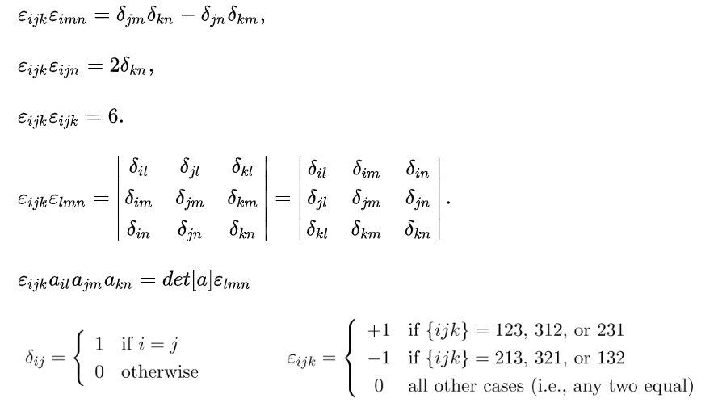
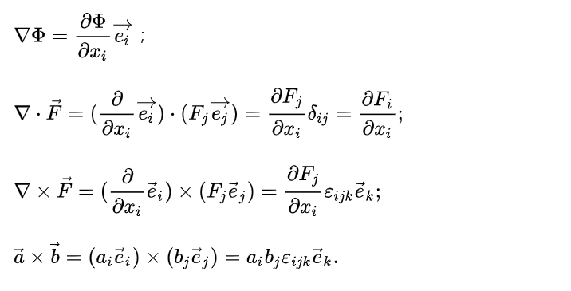
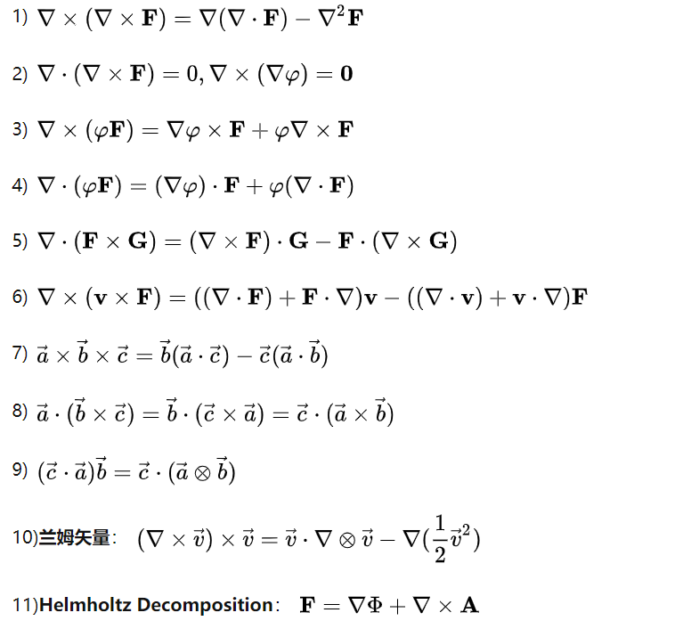

<meta http-equiv='Content-Type' content='text/html; charset=utf-8' />

参考[知乎这个回答](https://www.zhihu.com/question/20695804/answer/264610759)和[这个专栏](https://zhuanlan.zhihu.com/p/55143294)。我们下面要讨论的是：在坐标系选择(有的时候称坐标变换)下，量的变换规则。

### 协变(covariant)和逆变(contravariant)

如果同一个小位移$\delta$，在两个坐标系$e$和$e^{\prime}$下的表示有：

$$
\begin{eqnarray*}
\mathrm{d}x &=& [\mathrm{d}x^i]^T \\
\mathrm{d}x^{\prime} &=&  [\mathrm{d}x^{\prime j}]^T
\end{eqnarray*}
$$

将$x$看成$x^{\prime}$的函数，形式上总有：
$$
\begin{eqnarray*}
\mathrm{d}x^i &=& \sum \limits_j \frac{\partial x^i}{\partial x^{\prime j}} \mathrm{d}x^{\prime j} \\
\mathrm{d}x^i&=& S_j^i \mathrm{d}x^{\prime j} \tag{contra}\\
S_j^i  &\equiv& \frac{\partial x^i}{\partial x^{\prime j}}\tag{*}
\end{eqnarray*}
$$
之后，我们总用$S_j^i$这个记号。
对于梯度算符，$\nabla$：
$$
\begin{eqnarray*}
\nabla &=& [\partial_i]^T \\
\nabla^{\prime} &=& [\partial^{\prime}_i]^T \\
\end{eqnarray*}
$$
有：
$$
\begin{eqnarray*}
\partial^{\prime}_j &=& S_j^i\partial_i \tag{co}\  \\
\partial_i &=&(S^{-1})_i^j\partial^{\prime}_j
\end{eqnarray*}
$$
注意到上面把有的指标放在上标，有的放在下标。放在上标的是逆变的，放在下标的是协变的。
上面，我们还没有说清什么是“坐标变换”，给定义如下：
> 一个向量$x$，在不同的两组基$e_i, e^{\prime}_j$下的一个表示有，$x=x^ie_i = x^{\prime j} e^{\prime}_j$。如果$e_i = S_i^j e^{\prime}_j$有$x^{\prime j} = S_i^j x^i$。

据此，我们定义：
> 一个指标对象$T_{i_1...i_s}^{j_1...j_r}$称为一个$(r,s)$形张量，如果在基向量变换$e_i = S_i^j e_j^{\prime}$下，有

$$
\begin{eqnarray*}
T_{i_1...i_s}^{\prime j_1...j_r}
= S_{k1}^{j_1}...
S_{k_r}^{j_r}
(S^{-1})_{i_1}^{l_1}...
(S^{-1})_{i_s}^{l_s}
T_{l_1...l_s}^{k_1...k_r}
\end{eqnarray*}
$$

其中$s$称协变序数，指$T'_i = (S^{-1})^j_iT_j$ 同基变换 $e'_i = (S^{-1})^j_ie_j$一致。$r$称逆变序数。**协变**这个词是指这个量的**值**的变化规律和坐标基的变化规律是一致的。切向量是逆变的，余切向量是协变的。或者，更准确的来说是：“一个空间的基矢又叫协变基矢, 对偶基矢又叫逆变基矢, 矢量的分量叫逆变分量, 对偶矢量的分量叫协变分量。 按照分量变换规律, 有些地方矢量被叫做逆变矢量, 对偶矢量叫协变矢量。”

### 基本属性

1. 同阶的张量之和还是同阶的张量
2. 能写成张量缩并式的各项，都是张量
3. 一个协变指标和一个逆变指标才可以缩并

#### 特殊的张量
>
> 在**正交变换下**，$\delta_i^j$*像*是$(1,1)$ 阶张量， $\delta_{ij}$*像*是$(0,2)$ 阶张量，$\delta^{ij}$*像*是$(2,0)$ 阶张量。

下面证一下：
$$
\begin{eqnarray*}
x^{\prime j} &=& S_i^j x^i \\
\delta_{ij}^{\prime} x^{\prime i} x^{\prime j} &=& r^{\prime 2} \\
\delta_{ij}^{\prime} S_k^i x^k S_l^j x^l &=& r^{\prime 2}
\end{eqnarray*}
$$
考虑到正交变换有$r = r^{\prime}$，有$\delta_{ij}^{\prime} S_k^i x^k S_l^j x^l = r^{\prime 2} \rightarrow \delta_{kl} = S_k^iS_l^j\delta_{ij}^{\prime}$。故$\delta_{ij}$像是$(0,2)$阶。
$$
\begin{eqnarray*}
e_i &=& S_i^j e^{\prime}_j \\
\delta^{ij} e_i e_j &=& n\\
\delta^{ij} S^k_i e^{\prime}_k S_j^l e^{\prime}_l &=& n
\end{eqnarray*}
$$
正交变换有$n=n^{\prime}$(维数)，同上有$\delta^{ij}$像是$(2,0)$阶。

$$
\begin{eqnarray*}
\delta_{i}^{j} x^i e_j &=& x^ie_i \\
\delta_{i}^{j} S^k_j e^{\prime}_k (S^{-1})_l^i x^{\prime l} &=& (S^{-1})_l^ix^{\prime l} S_i^ke^{\prime}_k\\
&=&x^{\prime i} e^{\prime}_i \\
\rightarrow \delta_i^jS_j^k(S^{-1})_l^i&=&\delta^{\prime k}_l
\end{eqnarray*}
$$

> Levi_Civita 张量：

$$
\epsilon_{ij}^k = \left\{
\begin{eqnarray*}
0,& i,j,k有相等的 \\
1,& (i,j,k)是(1,2,3)的偶排列\\
-1,&(i,j,k)是(1,2,3)的奇排列
\end{eqnarray*}
\right.
$$

### 转动惯量

为什么转动惯量是张量呢？我们记其分量为$I_i^j$(这么记的合法性是下面要证的)。

$$
\begin{eqnarray*}
I_i^j &=& \sum m( r^2\delta_i^j - \delta_{ik}x^kx^j)
\end{eqnarray*}
$$

一方面看，$m$是标量，$r^2$在正交变换下不变，其它项目都是张量，所以$I_i^j$是$(1,1)$型张量没有问题。

另一方面看，有关系$M^j = I_i^j \omega^i$。其中角速度$\omega^i$是$(1,0)$型的，$M^j$也是$(1,0)$型的，故$I_i^j$是$(1,1)$型的。

它的矩阵表述是正交阵 ，故可在正交变换下对角化。 这也就是为什么一定有惯量主轴。

### 比较数学的语言

还是参考[这个专栏](https://zhuanlan.zhihu.com/p/629852598)，比较数学的阐述了张量是什么，上面的东西的内涵就更清楚一些了。([还有这个](https://zhuanlan.zhihu.com/p/508715535))

* 首先，张量这个东西应该是 **空间** 的性质，不要和 **坐标** 的选择有关。
* 然后，我们要弄清楚这个 **量** 是哪个 **集合** 的元素。这样知道它到底是个什么东西。

下面开始：

* **多重线性映射:** $f: V_1\times V_2 \times \cdots V_n \rightarrow W$，$f(v_1,\cdots,\lambda a + \mu b,\cdots,v_n) = \lambda f(v_1,\cdots, a ,\cdots,v_n) + \mu f(v_1,\cdots, b ,\cdots,v_n)$。

* **张量积:** 任意多重线性映射 $f: V \times W \rightarrow R$，都存在空间 $V \otimes W$， 映射 $ g: V\times W \rightarrow V\otimes W$ 和线性映射 $h: V\otimes W \rightarrow R$。使得 $f = g \circ h$。$\mathrm{Rank}(V \otimes W) = \mathrm{Rank}(V) \times \mathrm{Rank}(W)$，基为$ e_{v_i}\otimes e_{w_j}$的形式，$e_{v_i}，e_{w_j}$ 分别是 $V，W$ 的基。可以看一下张量积和直积的区别：
  * 一个二维空间$U$和一个一维空间$V$的直积是一个三维空间，对应的元素为两空间中元素的笛卡尔积：$U,V \rightarrow U\times V: (a e_1 + b e_2)\times c e_3:= a e_1 +b e_2 + c e_3$。
  * 一个二维空间$U$和一个一维空间$V$的张量积是一个二维空间，对应的元素为：$U,V \rightarrow U\otimes V: (a e_1 + b e_2) \otimes c e_3:= ac(e_1\otimes e_3)+bc(e_2 \otimes e_3)  $。

* **张量:** 一个向量空间$V$和他的对偶空间$V^{\ast}$进行若干次张量积得到：$\overbrace {V \otimes \cdots \otimes V}^{n} \otimes \overbrace{V^{\ast} \otimes \cdots \otimes V^{\ast}}^{m}$，其中的元素称为$(n,m)$型张量。另外也可以定义$(n,m)$型张量为多重线性映射$f: \overbrace {V ^{\ast}\times \cdots \times V^{\ast}}^{n} \times \overbrace{V \times \cdots \times V}^{m} \rightarrow R$。(所以二阶张量有矩阵表示。另外，注意一下顺序)

* **张量场:** 上面的向量空间和对偶空间分别为切空间和余切空间的时候，可以形成一个张量从，张量从的截影是张量场。

* **内积:** 如果一个双线性映射$V\times V \rightarrow C$，写成$\langle \cdot \vert \cdot \rangle$，满足：
  1. $\langle x \vert \lambda a +\mu b \rangle = \lambda \langle x \vert a \rangle + \mu \langle x \vert b \rangle$
  2. $\langle x \vert y \rangle = \langle y \vert x \rangle^{\dagger}$
  
  叫 **厄米形式**。 再加上：
  * 对于 $x \ne 0 \in V$，都存在 $y \in V$，使得 $\langle x \vert y \rangle \ne 0$。叫非退化厄米形式。
  * 对于 $\forall v\in V$，都有 $\langle v \vert v\rangle > 0$。叫内积。

*  **典范同构:** 考虑一个映射 $V \rightarrow V^{\ast}: x \rightarrow \langle x \vert \cdot \rangle$ 形成一个同基的选择无关的同构。而这个过程在的内积或非退化厄米形式对应一个$(0,2)$阶的张量，称为**度规张量**。

* **交替多重线性映射:** 在多重线性映射上加上交换反号：$f(v_1,\cdots, v_i,\cdots,v_j,\cdots,v_n) = -f(v_1, \cdots, v_j, \cdots, v_i, \cdots, v_n)$。需要注意，这个映射的要求其实比普通的多重线性映射不一样，只以二重为例吧：
  * 二重线性映射: $U,V \rightarrow R : (u,v) \rightarrow f(u,v)$，其中第一个参数 $u$ 只能取自 $U$, 第二个参数 $v$ 也只能取自$V$。无从 *“交换”* 两个参数。
  * 交替二重线性映射: $V,V \rightarrow R : (u,v) \rightarrow f(u,v)$，其中 $u,v$都取自 $V$，故而可以有 $f(u,v)$ 和 $f(v,u)$ 的比较。

* **外积:** 张量积的多重线性映射换成交替多重线性映射，就可以得到外积。任意多重线性映射 $f: V^n \rightarrow R$，都存在空间 $\wedge^n V$， 映射 $ g: V^n \rightarrow \wedge^n V$ 和线性映射 $h: \wedge^n V \rightarrow R$。使得 $f = g \circ h$。
  * 显然，外积是一种张量积，所以张量的性质都有。特别的，这是一个 **反对称** 的张量。
  * $\mathrm{Rank}(\wedge^n V) = C_m^n$，其中$m$ 是$V$的维数，这就触发我们注意到一个问题：$C_m^n = C_n^{m-n}$，说明这里可能有同构，而其中典范的，这就是 **Hodge对偶**，后面会提到。

* **$n$-形式:** 也叫$n$阶微分形式，指流形$M$ 上一点的余切空间的$n$阶外积 $\bigwedge^n (T^{\ast}_pM)$中的一个元素。或者说是一个$(T_pM)^n \rightarrow R$的映射。

* **外微分:** 类似[微分](./切空间.md#微分)，它是一个映射$\mathrm{d} : \bigwedge^n (T_p^{\ast}M) \rightarrow \bigwedge^{n+1} (T_p^{\ast}M)$。使得：

 $$
 \begin{eqnarray*}
 \varphi&=&\sum_{I}f_I\mathrm{d}x^{I}=\sum_{(i_1,\cdots,i_n)}f_{(i_1,\cdots,i_n)}\mathrm{d}x^{i_1}\wedge\cdots\wedge\mathrm{d}x^{i_n} \\
 \rightarrow \mathrm{d}\varphi&=&\sum_{I}\sum_{i}\frac{\partial f_I}{\partial x^i}\mathrm{d}x^i\wedge \mathrm{d}x^I
 \end{eqnarray*}
 $$
  有一个常用的结论，$ \mathrm{d}(\mathrm{d} \omega) = 0, \omega \in \bigwedge^n (T_p^{\ast}M)$，证明也很简单：
$$
\begin{eqnarray*}
\mathrm{d}\omega &=& \partial_i f_I \mathrm{d}x^i \wedge \mathrm{d} x^I \\
\mathrm{d}(\mathrm{d} \omega) &=& \mathrm{d}(\partial_i f_I) \wedge \mathrm{d}x^i \wedge \mathrm{d} x^I \\
&=& (\partial_j \partial_i f_I)\mathrm{d} x^j \wedge \mathrm{d} x^i \wedge \mathrm{d} x^I
\end{eqnarray*}
$$
  考虑$\partial_j \partial_i = \partial_j \partial_i,  \mathrm{d} x^j \wedge \mathrm{d} x^i = -\mathrm{d} x^i \wedge \mathrm{d} x^j$，得证。
  
  也可以有另一组定义：

  1. 一个零阶微分形式（标量场）$f$ 的外微分定义为它的微分$\mathrm{d} f$
  2. 一个零阶微分形式（标量场）$f$ 的二阶外微分$\mathrm{d}(\mathrm{d} f) = 0$
  3. 对于任意两个 $n$ 阶微分形式 $\alpha,\beta$，都有$\mathrm{d}(\alpha \wedge \beta) = \mathrm{d} \alpha \wedge \beta + (-1)^n \alpha \wedge \mathrm{d}\beta$。

到此，有一个需要注意的点：为什么外微分要定义在余切空间的外积上，而不是切空间上？参考[这个回答](https://www.zhihu.com/question/606023410/answer/3077040575)。假设存在一个定义在标量场到余切从的"微分"映射
$$
\begin{eqnarray*}
\mathrm{b}&:& \mathbb{O}(M) \to TM \\
\mathrm{b}f &:=& \gamma(f)^i \partial x_i
\end{eqnarray*}
$$
两个映射$\phi_1,\phi_2: M \to M$，对于 $\phi^{\ast}f = f\circ \phi$，应该有
$$
\begin{eqnarray*}
\phi^{\ast}(\mathrm{b}f) = \mathrm{b}(\phi^{\ast} f) = \mathrm{b} f \circ \phi
\end{eqnarray*}
$$
那么
$$
\begin{eqnarray*}
\phi_1^{\ast}\phi_2^{\ast}(\mathrm{b}f) = \mathrm{b} f \circ \phi_2 \phi_1 = (\phi_2\phi_1)^{\ast} \mathrm{b}f
\end{eqnarray*}
$$
这是反变的。然而，一个映射又直接诱导一个切向量的推前映射，那是协变的。所以这个定义是不好的。

* **Hodge对偶:** 要典范，参考上面的过程，需要有一个非退化厄米形式，或者说要有一个双线性映射：$\wedge^k V \times \wedge^k V \rightarrow R$。注意，我们已经有$V \times V \rightarrow R$ 这个内积，在此基础上构造一个新的内积：
  * 对于 $\alpha = \alpha_1\wedge\alpha_2\wedge\cdots\wedge\alpha_k, \beta = \beta_1\wedge\beta_2\wedge\cdots\wedge\beta_k \in \wedge^k V$，注意反对称的性质，可以令：

 $$
 \langle\alpha\mid\beta\rangle= \begin{vmatrix} \langle\alpha_1\mid\beta_1\rangle & \cdots & \langle\alpha_1\mid\beta_k\rangle \\ \vdots & \ddots & \vdots \\ \langle\alpha_k\mid\beta_1\rangle & \cdots & \langle\alpha_k\mid\beta_k\rangle \end{vmatrix}
 $$
 这个东西看着复杂，但实际上，我们还是来看看单位正交基就好。简记基$e_{a_1a_2\cdots a_i} = e_{a_1}\wedge e_{a_2}\wedge\cdots \wedge e_{a_i}$。发现这组基仍然是正交的。

* 下面，定义$\beta$ 的 Hodge 对偶为$\star\beta$ 使得 $\alpha \wedge (\star\beta)=\langle\alpha\mid\beta\rangle \,\omega$。其中$\omega = \bigwedge \limits_{i=1} ^ m e_i$。配合单位正交基来看，其实也很简单了，就是把每个基对偶到一个同它自己外积补全$\bigwedge \limits_{i=1} ^ m e_i$的基上。

* **常见量:** 下面列举一下梯度、散度和旋度。
  * 梯度：
  $$
  \begin{align} \nabla:\,\mathcal{F}_M&\rightarrow \Gamma(TM)\\ f&\mapsto(\mathrm{d}f)^{\sharp} \end{align}
  $$
  * 散度：
  $$
  \begin{align} (\nabla\cdot):\Gamma(TM)&\rightarrow \mathcal{F}_M \\ F&\mapsto\star \mathrm{d}\star(F^{\flat}) \end{align}
  $$
  其中$F$是一个切向量场。
  * 旋度：
  $$
  \begin{align} (\nabla\times):\, \Gamma(TM)&\rightarrow  \Gamma\left(\bigwedge^{n-2} (TM)\right)\\   F&\mapsto(\star \mathrm{d} (F^{\flat}))^{\sharp} \end{align}
  $$

#### 微分形式的积分

需要补完的一块拼图是积分。因为这里我们已经抛弃了$ \mathrm{d}x$ 代表 $x$ 上的微元这种认知方式。
先看我们要积的是什么东西？是一个微分形式$\omega$。如下定义积分：
$$
\begin{eqnarray*}
\int \limits_{c} \omega &=& \sum \limits_{i} c_i \int \limits_{\sigma_i} \omega \\
\int \limits_{\sigma} \omega &=& \int \limits_{\phi[D]} \omega := \int \limits_D \phi^{\ast} \omega\\
\phi&:&[0,1]^{m} \to M;\\
\sigma &=& \mathrm{Im}(\phi)
\end{eqnarray*}
$$
其中$\phi^{\ast}$是一个拉回映射。$\sigma$ 称为一个$m$维胞腔。注意，对于$m$维胞腔，能积的也只能是一个 **$m$** 形式。
定义其边界为：
$$
\begin{eqnarray*}
\partial \sigma :=  \sum \limits_{i=0}^{m}(-1)^i [\phi(x_0,\cdots,x_{i-1},1,x_{i+1},\cdots,x_{m}) - \phi(x_1,\cdots,x_{i-1},0,x_{i+1},\cdots,x_{m})]
\end{eqnarray*}
$$
是一个$m-1$维胞链。这时有**斯托克斯定理：** 对一个$m+1$维胞链$c$和$m$阶微分形式$\alpha$，有：
$$
\begin{eqnarray*}
\int \limits_{c}\mathrm{d}\alpha = \int \limits_{\partial c} \alpha
\end{eqnarray*}
$$

### 公式们

* 基本式
 
* 矢量分析
 定义式
 
 重要等式
 
 *上面的Helmholtz 分解也说明了电场和磁场的来源*
