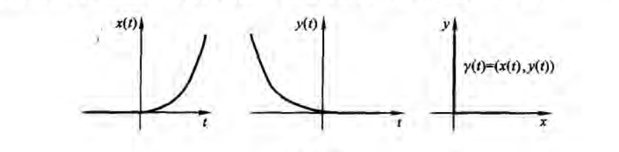

<meta http-equiv='Content-Type' content='text/html; charset=utf-8' />

*注，原则上本文都用爱因斯坦求和约定*

## 曲线 ##

### 坐标系 ###

> **坐标系：** 若函数组$x^i(y^1, \cdots, y^n)$给出了$R^n$中的区域$C$(以$y$标计)到欧氏空间$R_l^n$中某区域$A$的双向连续的单射，则称该函数组为$C$上的连续坐标系。
> **正则坐标系：** 上述函数组的Jaccobi行列式如果对每一点$P$都不为0，则称正则坐标系。
> **局部坐标系：** 假设光滑函数组$\{x^i(P) \}$具有性质：这组函数的Jacobi行列式$J(f), \{f(P)={x^i({P})}\} $在区域$C$不为0，那么每一点$P$存在这样的开邻域，在些邻域中$x^i(P)$给出了正则坐标系 。

注意，局部和正则坐标系的定义，只差了一个双射的要求。但是在局域，他是能够形成一个双射的。

### 曲线 ###

> **曲线长：** 以参数式给出曲线$\gamma(t)$，即一组$n$个光滑函数$x^i(t)$。曲线长定义为$l (\gamma) \big|_a^b = \int_a^b \sqrt{\langle \dot{\gamma (t)}, \dot{\gamma(t)} \rangle} =\int_a^b \sqrt{  \frac{d x^i}{d t}\frac{d x^i}{d t}} dt$

注意，这里虽然用了$t$为参数，可是在换参$t = t(\tau)$下，曲线长也不变。也要注意，有”转折“的曲线，也可能是光滑的。例如下图：

> **曲线交角：** 两条曲线$\gamma_1(t), \gamma_2(\tau)$，在同一点$P=\gamma_1(a)=\gamma_2(b)$处，若速度向量$\dot{\gamma_1(a)},\dot{\gamma_2(b)}$都不为0，那么称$\phi = cos^{-1}(\frac{\langle \dot{\gamma_1 (a)}, \dot{\gamma_2 (b)} \rangle}{|\dot{\gamma_1(a)}| \cdot |\dot{\gamma_2(b)}|}) \tag{0}$为两曲线在$P$点的交角

显然，也和参数的选择无关。

> **曲线坐标下的曲线长：** $l (\gamma) \big|_a^b = \int_a^b \sqrt{\langle \dot{\gamma (t)}, \dot{\gamma(t)} \rangle} = \int_a^b \sqrt{ g_{mp} \frac{d z^m}{d t}\frac{d z^p}{d t}} dt \tag{1}$其中$g_{mp} = \frac{\partial x^i}{\partial z^m}\frac{\partial  x^i}{\partial z^p}$。

又显然，$g_{mp}$是一个张量，对称。而且，它代表坐标曲线的切向量的数量积。

> **黎曼度量：** 如果欧氏空间每个正则坐标系$z$中定义了一组光滑函数$g_{mp}(z)$,满足：
> 1. 它是对称的
> 2.  $g_{mp}(z)$的矩阵$G(z)$是非退化和正定的
> 3. 在坐标变换$z\rightarrow y$时，$G(y) = d\psi G(z) (d\psi)^T$。其中$d \psi$是Jacobi阵$d \psi_{y,z}$

> 就说我们给出了欧氏空间的黎曼度量，对应定义曲线长度还是 **(1)** 式，交角还是 **(0)** 式
> **不定度量：** 如果在黎曼度量中，放弃第2条，则称不定度量，$R^n_s$。其中$s$是$G(z$的负惯性指数

可以感受到，我们已经在开始摆脱欧氏度量的路上了。同时易得$\langle \zeta, \eta \rangle_g = g_{ij}\zeta^i\eta^j$给出了光滑的依赖于 **点** (不依赖曲线坐标和曲线参数的)二次型，其中$ \zeta, \eta$是切向量。

> **欧氏度量：** 如果存在一个坐标系，在这个系下黎曼度量$G$可以变成单位阵，则说这个黎曼度量是欧氏的

看，反过来了吧。

> **共形度量：** 如果一个欧氏空间区域$C$中的曲线坐标$(z_1,\cdots,z_n)$ 下的黎曼度量$g_{ij}(z) = \lambda(z)g^e_{ij}(z)$，$\lambda(z)$是光滑的，而$g^e_{ij}(z)$是$(z_1,\cdots,z_n)$下的欧氏度量的分量。称$g_{ij}$是共形的
> **保角：** 如果$g_{ij}(z)$和$q_{ij}(z)$是欧氏空间区域$C$中曲线坐标$(z_1,\cdots,z_n)$下的两个度量，且$g_{ij} = \lambda(z) q_{ij}$。那么这两个度量下曲线的交角是一样的

这可能就是 **“共形”** 二字的原因。

## 流形 ##

>**流形：** 若度量空间$M$的每一点$P$都包含于同胚于$R^n$的某一区域$V$的领域$U$。则称$M$为n维流形
>**图册：** 覆盖$M$的一组开集$U_i$，和映射$\phi_i: U_i\rightarrow V_i \subset R^n$，共同称为图册，其中和每对$U,\phi$称为图
>**光滑同胚：** 若光滑流形的映射$f: M_1 \rightarrow M_2$，对任意点$P_0 \in M_1$的邻域中的任何图$(x^i)$，和像$Q_0 \in M_2$的邻域中的任何图$(y^j)$，要是$f$的向量函数表示是$C^r$类光滑的，则称映射$f$为$C^r$类光滑映射。若$f: M_1 \rightarrow M_2$是微分同胚，则称$M_1,M_2$微分同胚

* 若$f: M_1 \rightarrow M_2$ 是光滑同胚，则 ${\rm dim}M_1={\rm dim}M_2$。
* 光滑流形$M$中存在这样的图册$\{U_i\}$，其中每一个$U_i$都和$R^n$微分同胚。
* 若$M$是光滑的紧致流形，$\{U_{\alpha}\}$是图册，则存在属于它的$1$的光滑分解：$0\le\psi_{\alpha} \le 1, \sum \psi_{\alpha} = 1, {\rm supp}\psi_{a} \subset U_{\alpha}$。
* 设$f: R^n\rightarrow R^k$ 是$C^{\infty}$类光滑，$M_c$是方程组$f(x)=c$的解集，若$f$的Jacobi阵的秩在每一点都取最大秩(即 ${\rm rank}df(P_0)=k$)，则$M_c$是$n-k$维流形。同时，在每一点$P_0\in M_c$的邻域中，可以取外围欧氏空间的某$n-k$个笛卡尔坐标作为其局部坐标。这个定理有一个$k=1$的特例，要求变为$f$的梯度在每一点都不为$0$。

## 切向量 ##

> **切向量：** 对参数化的曲线 $x(t)$，有 $\frac{dx}{dt}(t_0)$为其在$P_0$点的切向量
> **切向量(一般化)：** $n$ 维光滑流形 $M$ 上的任一点$P_0$，使每个局部坐标系$x_{\alpha}^i$都对为应一组数$\xi_{\alpha}^i$，若每一对局部坐标系$\alpha,\beta$满足：
	$$
	\begin{equation}
	\xi_{\alpha}^k = \frac{\partial x_{\alpha}^k}{\partial x_{\beta}^l}(P_0)\xi_{\beta}^l
	\end{equation}
	$$
> 称此对应$M$上点$P_0$的切向量，数$\xi_{\alpha}^i$为$x_{\alpha}$下的坐标。
> **切空间：** $M$ 上的任一点$P_0$的所有切向量的集合称为$M$在$P_0$点的切空间。

* 切空间中的数乘和加法不依赖于坐标系的选择

> **函数的方向导数：** 设$P_0 \in M, \xi \in T_{p_0} (M)$，$\gamma(t)$是过$p_0$的光滑曲线，$\gamma(t_0) = P_0$ 并且它在$P_0$的切向量为$\xi$。设$f$是$M$上的光滑函数，称 **数** ：$\frac{d}{dt}f(\gamma(t)) |_{t=t_0} = \xi(f)$ 为 $f$沿$\xi$的导数。

$$
\xi(f) = \frac{\partial f}{\partial x^i}(\vec{x_0})\xi^i
$$

* $\xi(f)$ 和坐标的选择无关
