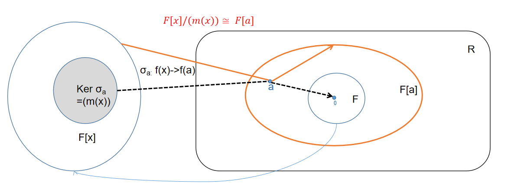

<meta http-equiv='Content-Type' content='text/html; charset=utf-8' />
断断续续看过一点，还是得记录一下，有的结论不那么直观的。

## 群

* 记$\mathbb{Z}_m^{\ast}$为模$m$的剩余环中的可逆元的集合，其中$\bar{a}\in \mathbb{Z}_m^{\ast}$当且仅当$a,m$互素(易证)，那么$\mathbb{Z}_m^{\ast}$是一个阿贝尔群。
* 有限域$F$的所有非零元的集合$F^{\ast}$对于乘法成为一个循环群。
* 如果$m = m_1 m_2, (m_1, m_2) =1 $有$\phi(m) = \phi(m_1)\phi(m_2)$。其中$\phi(m)$是欧拉函数，代表不大于$m$且和$m$互质的数的个数。
* 如果$a \in G$，$a$的阶数为$n$，有$\forall k$: $\vert a^k \vert = \frac{n}{(n,k)}$。
* 如果$a,b \in G,~ ab=ba,~\vert a \vert = m,\vert b \vert= n,~(m,n) = 1$， 则$\vert ab \vert = mn$。
* 有限阿贝尔群中必有一个元素的阶是其它元素的阶的倍数。事实上，有一个元素的阶是所有元素阶中最大的，那么其它元素的阶都是这个阶的因数(可以构造阶为公倍数的元素)。
* 有限阿贝尔群$G$，如果对于任意正整数$m$，$x^m = e$的解都不超过$m$，那么$G$是循环群(阶最大的那个元素$q$一定是生成元，因为若它的阶是$s$，它的次方的那$s$个元素都是$x^s = e$的解。若还有其它的元素，那它的阶一定是$s$的约数，从而它也是一个解，不满足要求。这说明$q$的次方覆盖了所有元素，$q$是生成元)。
* 质数阶群一定是循环群。有限域的非零元对于乘法构成一个循环群。
* 任意一个$m$阶循环群都同构于$(\mathbb{Z}_m,+)$
* 有限阶循环群的子群一定是循环群，且每个阶数的子群只有一个。
* $H,K$是$G$的子群，则$HK$ 是 $G$ 的子群当且仅当$HK=KH$。“当”是可以逐一验证的。“仅当”的证明为$\forall hk \in HK,~hk = (h_1,k_1)^{-1} = k_1^{-1}h_1^{-1} \in KH$；而且$\forall kh \in KH,~ k\in HK, h \in HK, \rightarrow kh \in HK$。
* $H,K$是$G$的子群，则$H\times K \cong G$ 当且仅当:
  * $G=HK$ (书上这一条应该只对于 $\sigma: (h,k)\rightarrow hk$有效。反例：$(0,2Z),(2Z,0)$都是$(Z,Z)$的子群，$(0,2Z)\times(2Z,0) = (2Z,2Z) \ne (Z,Z),~ (2Z,2Z) \cong (Z,Z)$
  * $H \cap K = \lbrace e\rbrace$ (单射要求)
  * $\forall h\in H, k\in K$ 都有 $ hk=kh$ ($hk = (eh)(ke) \sim (e,h)(k,e) = (k,h) = (k,e)(e,h) \sim (ke)(eh) = kh$ )
* 对于群$G$的子群$H$，任意$a \in G$，有$aHa^{-1}$是$G$的一个子群，称**共轭子群**。
* 对于群$G$的子群$H$，$N_G(H) := \lbrace a\in G \vert aHa^{-1} = H\rbrace$，称为**正规化子群**，有$N_G(H) \lt G, H \triangleleft N_G(H)$。
* 对于一个群同态，$a (\mathrm{Ker}\sigma) =(\mathrm{Ker}\sigma) a $。
* **群同态基本定理：** $\sigma$ 是$G \to \tilde G$ 的一个同态，有$\mathrm{Ker} \sigma $是$G$的一个正规子群，且$G/\mathrm{Ker} \sigma \cong \mathrm{Im} \sigma$。
* 注意$G$的正规子群的正规子群不一定是$G$的正规子群，也就是说没有传递性。
* **第一群同构定理：** 对于群$G$，$H\lt G, N \triangleleft G$，有：
  * $HN\lt G$,
  * $H\cap N \triangleleft H, ~ H/H\cap N \cong HN/N$

  
  可以用这么个例子来感受：$G$是二维坐标系，运算是向量加法。$N,H$ 分别是 $x,y$ 轴整点。$K$是坐标整点，$L$是原点。$K/N$ 的元素是平行于 $x$ 的整点集，$H/L \cong H$ 是$y$ 轴上的整点。可以这样感受：$H \cap N \to H$的生成方式和$N \to HN$的方式是一致的。
  
* **第二群同构定理：** 对于群$G$如果有$H,N \triangleleft G,~ N \subset H$，有：
  * $ H/N \triangleleft G/N$
  * $(G/N)/(H/N) \cong G/H$。
  
  它的意思是，在求商群的时候，可以先模去一个共同的核。事实上，$N = \lbrace e\rbrace$的时候，该式子会回归平凡。
  

### 可解群

* **希望找到对哪些正规子群的商群是阿贝尔的**。令$\sigma$是到这个正规子群的同态，群$\mathrm{Im} \sigma$ 是 Abel 的 $\Leftrightarrow \lbrace xyx^{-1}y^{-1}\vert x,y \in G\rbrace \subseteq \mathrm{Ker}\sigma$。其中$xyx^{-1}y^{-1}$称做 **换位子**。换位子 **自己不成为一个群**，称其生成的子群为**换位子群**或者 **导群**(当然，有一个一开始会有的问题是：导群会不会是平凡的？然而很简单的例可以说明不是的。考虑可逆方阵的乘法群，它不是Abel的，导群不只有$E$，但又是行列式为$1$的，故不是全集)，记为$G^{\prime}$。而且有：
  * $G^{\prime} \subseteq \mathrm{Ker} \sigma$
  * $G^{\prime} \triangleleft G$，这个的证明除了书上的那个，还可以：$\forall g \in G, g (aba^{-1}b^{-1})g^{-1} = gag^{-1}gbgg^{-1}a^{-1}gg^{-1}b^{-1}g^{-1} = (gag^{-1})(gbg)(gag^{-1})^{-1}(gbg)^{-1} \in G^(\prime)$
  * $G/G^{\prime}$ 是 Abel 的
  * 若$N\triangleleft G$。 有$G/N$是阿贝尔的 $\Leftrightarrow G^{\prime} \subseteq N$。即$G$的所有阿贝尔商群中 $G/G^{\prime}$是最大的。

  这其实是一个很有意思的做法，破坏阿贝尔的是$ab \ne ba \to aba^{-1}b^{-1} \ne e$。那么把它们收集起来做成一个“核”，也就是定义这一堆东西是“同一的”，模之剩下的就是阿贝尔的了。

* 记$G^{n+1} = G^{n\prime}$，如果存在$G^{k} = \lbrace e\rbrace$，称$G$是 **可解**的。
* $G$ 可解 $\Leftrightarrow$ 当且仅当存在 $G \triangleright G_1 \triangleright G_2 \triangleright \cdots \triangleright G_s = {e}$，且$Gn / G{n+1}$ 是阿贝尔群。
* 可解群的子群和群同态的像都是可解的。可以推得，可解群的商群都是可解群。其中用到的一个重要结论是 **“导群的像是像的导群:$\sigma(G^{(n)}) = (\sigma(G))^{(n)}$”**。
* 如果$N \triangleleft G$，且$N, G/N$ 都可解，那么$G$ 可解(显然可以先解到$N$，再解到$\lbrace e\rbrace$)。
* Able群$G$是单群，当且仅当$G$是素数阶循环群。
* 非Abel群如果是单群，则不可解。非Abel群可解，则不是单群。*事实上，非Abel群可解是指可以通过一串的 Abel 商群(从而有中间的正规子群)收到 $\lbrace e \rbrace$，但单群禁止了这些中间正规子群的存在*。
* 定义**次正规子群列：** $G \triangleright G1 \triangleright G2 \triangleright \cdots \triangleright G_s = {e}$；如果每个$G_n/G_{n+1}$都是单群，则称为**合成群列**
* 每个有限群都有至少一个合成群列。
* 有限群可解当且仅当存在一个递降的子群列，每相邻项的商群都是素数阶循环群。这是因为：
  * 充分性因为素数阶循环群是Abel的。
  * 必要性因为有合成群列，而这个群列中的是子群，所以可解，相邻的商群也可解；又商群是单群，单且可解故是Abel群。单且Abel，故只能是素数阶的循环群。
* **$\mathrm{Jordan-H\ddot{o}lder}$ 定理：** 有限群$G$的任意两个无重复项的合成群列有同样的长度，且其因子群能用某种方法配对，使得对应的因子群是同构的。
  证明用到归纳法，主要思路看看长度$2$的情况：如果$G \triangleright G_1 \triangleright \lbrace e\rbrace; G \triangleright H_1 \triangleright \cdots$。那么如果$G_1 \ne H_1$有：
  * $G_1H_1 = G$，因为这是$G$的一个大于$G_1$的正规子群，而$G/G_1$是单群，那么它只能是$G$。
  * $G_1 \cap H_1 = \lbrace e\rbrace$，这是因为 $G_1 \cap H_1 \triangleleft G_1$，而$G_1$是单群，它只能是$\lbrace e\rbrace$
  * 由第一群同构定理 $G_1H_1/G_1 = H_1/(G_1 \cap H_1) \to G/G_1 = H_1$

### 作用和轨道

* **群在集合上的作用：** $G \times \Omega \to \Omega; (g,x) \mapsto g \circ x$ 满足 $(gh) \circ x = g\circ(h\circ x); e\circ x = x$。对于任意$g$，它的作用$\phi(g)$是$\Omega$ 到自身的一个双射，所以$\phi(g) \in S_{\Omega}$，特别的$\phi$是$G$到$S_{\Omega}$的一个群同态。反之，一个$G$到$S_{\Omega}$的群同态可以给出一个作用 。

* **群同态和作用** 
  * 一个同态 $\sigma: G \rightarrow H, \sigma(g) = h$，可以对应一个作用：$g\circ h = \sigma(g)h$。
  * 如果群$G$是阿贝尔的，那么它的一个作用，对于一个元素$x$，可生成一个轨道$G(x)$。这时可以在轨道上诱导一个运算$\cdot: (g_1 \circ x) \cdot (g_2\circ x) := (g_1g_2) \circ x$(由阿贝尔性，可以推出:$g \circ x = g^{\prime} \circ x \Rightarrow g \circ y = g^{\prime} \circ y$，进一步推出这个定义是好的)。此时$(G(x),\cdot)$做成一个群，$g \rightarrow g(x)$ 也形成一个同态。

#### 群在自身的作用
$G \times G \to G$
* 左平移：$(g,x) \mapsto gx$。
* 左商集上的左平移：$G\times (G/H)_l \to (G/H)_l; (g,xH)\mapsto gxH$；类似的会有右商集上的右平移。
* 共轭：$(g,x) \mapsto gxg^{-1}$。共轭作用的核$\mathrm{Z}(G)$称群$G$的 **中心**。它是由和$G$中每个元素可交换的元素组成的集合。
 共轭形成$G \to S_G$的一个同态$\sigma$，$\mathrm{Ker}(\sigma) = \mathrm{Z}(G)$，$\mathrm{Inn}(G) := \mathrm{Im}{\sigma}$，其元素是$G$的一个自同构(注意，平移不构成自同构)，并构成一个群。$\mathrm{Inn}(G) \triangleleft \mathrm{Aut}(G)$。其中$\mathrm{Aut}(G)$是自同构群。$\mathrm{Inn}(G) \cong G/\mathrm{Z}(G)$。

#### 轨道
任取$x \in \Omega$，定义$G(x) := \lbrace a\circ x \vert a\in G\rbrace$，称$x$的$G-$轨道。这对$\Omega$形成一个划分。

形象的看一下什么是“轨道”，如果我们先不看 $\Omega$，而只是取一个元素，开始用群$G$来“作用”它，满足上面对于作用的定义，这其实会生成一个集合$\Omega_x$。由于“作用”的要求，我们知道$\Omega_x$中的任何一个元素，都可以通过和$G$的作用来覆盖$\Omega_x$，同时也出不了它。同样，再取一个$\Omega_x$之外的元素，又能生成一个集合。那这样的一个个集合是不重合的，而且它们和$G$的关系是各自独立的。于是，与此相关的大部分的研究都是逐集合、亦即“轨道”分别进行的，而不是整体性的。

* **稳定子群：** $G_x := \lbrace g\in G \vert g\circ x = x\rbrace$，$G_x \lt  G$。而且有$aG_x = bG_x \Leftrightarrow a\circ x = b\circ x$。
* **轨道-稳定子定理：** $\vert G(x) \vert = [G:G_x]$。

* 群$G$在$\Omega := \lbrace H \vert H \lt  G \rbrace$ 上的作用$a \circ H := aHa^{-1}, a\in G$称为共轭作用。这个作用下$H$的$G-$轨道是$H$的所有共轭子群的集合，对应的**稳定子群**是**正规化子群**$N_G(H)$。有共轭子群的个数为$[G: N_G(H)]$。
* 设群$G$在$\Omega$上有一个作用，则同一$G-$轨道上的点的稳定子群彼此共轭，从而这些稳定子群的基数相同。$y=a\circ x \Leftrightarrow G_y = aG_xa^{-1}$。这有一个有意思的推论：一条$G-$轨道里所有元素的稳定子群的阶之和就是$\vert G \vert$。

* **群元素的不动点集：** $F(g) := \lbrace  x\in \Omega \vert g\circ x = x \rbrace$；**群的不动点集：** $\Omega_0 :=\lbrace x \in \Omega \vert G(x) = \lbrace x\rbrace\rbrace$。
* **Burnside 引理：** $G-$轨道的条数$r$为：$r = \frac{1}{\vert G \vert} \sum \limits_{g\in G} \vert F(g)\vert$。
* 若$G$的阶是素数$p$的幂，则称$G$是$p-$群。若 $p-$群在有限集合$\Omega$上有一个作用，有$\Omega_0\equiv\Omega (\mathrm{mod}~ p)$。$p-$群的中心是非平凡的。
* **Sylow 第一定理：** 设$G$的阶$n = p^l m, (m,p)=1 $，则有任意对$1 \le k \le l$，$G$都有$p^k$阶的子群。
  证明思路为：
  * 取$G$的所有$p^k$阶子集$A_i$的集合$\Omega$，$g\circ A_i := gA_i$是$G$在$\Omega$上的一个作用。而$\vert\Omega\vert$因数中$p$的次数恰为$l-k$，故总存在$A_j$的轨道长$\vert G(A_j)\vert$的$p$次数不超过$l-k$。对应有，$\vert G_{A_j} \vert$的$p$的次数不小于$k$。
  * 另一方面，考虑满足$gA_j = A_j$的$g$。$ga \in A_j ,\forall a \in A_j$，所以这样的$g$不超过$\vert A_j \vert = p^k$个。也就是说$\vert G_{A_j} \le p^k$。
  * 于是$G_{A_j}$就是一个$p^k$阶的子群。

  称$k$最大的$p^k$阶子群$P$为$ \mathrm{Sylow} ~ p-$ 子群。

* **Sylow 第二定理：** 条件同上，有$G$的任一$p^k$阶子群$H$一定包含于$G$的某个确定的$\mathrm{Sylow} ~ p-$子群$P$的共轭子群中；$G$的任意两个$\mathrm{Sylow} ~ p-$子群共轭。
  证明思路为：只需证明$\exists a \in G, \forall h \in H, s.t. ha\in aP $，也就是 $haP = aP$。
  * 视 $h\circ (aP) := h(aP)$为$H$ 在$G/P$上的作用。那就是要找的$a$使得$aP$是$H$的一个不动点。
  * 而由于$H$是$p-$群，$\vert \Omega_0 \vert \equiv \vert G/P \vert \ne 0 (\mathrm{mod}~ p)$，知$\Omega_0$不是空的。那我们就能找到这样的不动点。
  
  有一个直接的推论是$\mathrm{Sylow} ~ p-$是正规子群当且仅当只有一个$\mathrm{Sylow} ~ p-$子群。

* **Sylow 第三定理：** 条件同上，$\mathrm{Sylow} ~ p-$子群的个数$r$ 满足 $r \equiv 1 (\mathrm{mod}~p), r\vert m$。
  证明思路为考虑全部$\mathrm{Sylow} ~ p-$子群$P_i$的集合$\Omega$，取$P \in \Omega$，考虑$P$ 在$\Omega$上的共轭作用$a\circ P_i = aP_ia^{-1}, a \in P$。
  * 考虑$\Omega_0$，可推得$Q \in \Omega_0 \Leftrightarrow aQa^{-1} = Q, \forall a\in P \Leftrightarrow P \subseteq N_G(Q)$
  * 这样$P,Q$都是$N_G(Q)$的$\mathrm{Sylow} ~ p-$子群，又$Q\triangleleft N_G(Q)$，根据前一个推论有$P=Q, \Omega_0 = \lbrace P \rbrace,\vert\Omega_0\vert = 1$。
  * [又有](#共轭子群个数) $r = [G:N_G(P)] \Rightarrow r \vert \vert G \vert \Rightarrow r \vert p^lm$ 结合上一步的结论 $\Rightarrow r\vert m$。

* 对于阿贝尔 $p-$群 $P$，$\vert P\vert = p^l$，有
  $$
  \begin{eqnarray*}
  P \cong (\mathbb{Z}_{p^{k_1}},+) \oplus (\mathbb{Z}_{p^{k_2}},+) \oplus \cdots \oplus (\mathbb{Z}_{p^{k_r}},+)
  \end{eqnarray*}
  $$
  其中 $ \sum k_i = l$。
  证明思路是找到一个$a_1$使得$P = \lt a_1 \gt P_1 , \lt a_1 \gt \cap P_1 = \lbrace e \rbrace$
  * 在所有的**极小生成元集合**的所有**关系**($x_1^{j_1}x_2^{j_2}\cdots x_r^{j_r} = e$)中，找到一个最小的正幂指数$m_1$, $x_1^{m_1}x_2^{j_2}\cdots x_r^{j_r} = e$，由最小性可得$m_1$是所有$j_i$的因数。
  * 可以构造一个$a_1$其阶是$m_1$，用来替代该极小生成元集合中的$x_1$：$a_1 = x_1x_2^{q_2}x_3^{q_3}\cdots x_r^{q_r}, q_i = j_i/m_1$。
  * 还是由最小性，可以得$\lt a_1\gt  \cap \lt x_2,x_3,\cdots,x_r\gt  = \lbrace e \rbrace$。
* 进一步，对于任有限阿贝尔群$G$，$\vert G \vert = p_1^{l_1}p_2^{l_2}\cdots p_s^{l_s}$，有：

$$
\begin{eqnarray*}
G &\cong& (\mathbb{Z}_{p_1^{k_{11}}},+) \oplus (\mathbb{Z}_{p_1^{k_{12}}},+) \oplus \cdots \oplus (\mathbb{Z}_{p_1^{k_{1r_1}}},+) \\
&\oplus & \cdots \\
&\oplus &G (\mathbb{Z}_{p_s^{k_{s1}}},+) \oplus (\mathbb{Z}_{p_s^{k_{s2}}},+) \oplus \cdots \oplus (\mathbb{Z}_{p_s^{k_{sr_s}}},+) \\
\end{eqnarray*}
$$
  这些 $p_i^{k_{rs_i}}$ 的集合称为$G$的 **初等因子**。

* 一个阿贝尔群的初等因子是唯一的，两个有限阿贝尔群同构当且仅当它们的初等因子相同。证明思路可以考虑两组极小生成元，易得到他们的最大阶数应该是相同的。模去最大阶元素生成的群之后的群应该又是同构的，故可以递推。(BTW，丘维声的书上的证明比这个长，不知道是不是我漏了什么？)

## 环

* **环：** $\lt R,+,\times\gt $定义为$(R,+)$是阿贝尔群，$(R,\times)$是半群，且对$+,\times$有分配律成立。
* **理想：** $\lt R,+,\times\gt $的一个子环$I$，满足$a\in I, r\in R \Rightarrow ra \in I, ar\in I$。称$I$是$ R$的一个 **理想**。
* 在有单位元的交换环$R$中，任意$ Ra := \lbrace ra \vert r\in R \rbrace$是一个理想。
* **环同态基本定理：** 环$R$ 到$\tilde{R}$ 的同态$\sigma$有：$ \mathrm{Ker} \sigma$ 是 $R$ 的一个理想，且$R/\mathrm{Ker} \sigma \cong \mathrm{Im}\sigma$。
* **第一环同构定理：** 对于环$R$，理想$I$，子环$H$有：
  * $I+H$ 是子环
  * $I \cap H$是理想，且有$H/H\cap I \cong H+I / I$
* **第二环同构定理：** 对于环$R$，理想$I,J$ 且$ I \subseteq J$，有 $J/I$ 是$R/I$ 的一个理想，且有同构：$(R/I)/(J/I) \cong R/J$。

上面这两，和群同构定理很像，就是理想替代了正规子群的位置。实际上，对于$+$，由于是阿贝尔的，各种要求都容易满足，主要要靠理想来保障运算的封闭性。

* 定义环的子集的运算：

$$
\begin{eqnarray*}
A + B &:=& \lbrace a+b \vert a\in A, b\in B \rbrace \\
AB &:=& \lbrace \sum \limits_{i=1}^{n} a_ib_i \vert a_i \in A, b_i \in B\rbrace
\end{eqnarray*}
$$

* 如果$I,J$是理想，有$IJ \subseteq I\cap J \subseteq I+J$且$IJ,I+J$都是理想。
* 有：

$$
\begin{eqnarray*}
I+J &=& J+I \\
I+(J+K) &=& (I+J)+K \\
I(JK) &=& (IJ)K \\
I(J+K) &=& IJ + IK \\
(I+J)K &=& IK + JK
\end{eqnarray*}
$$

* 定义环上的互质：$I,J$是$R$的理想，如果$I+J = R$，那么称$I,J$互素。
* $R$有单位元，$I,J,K$都是理想，$I,J$都和$K$互素，那么$IJ$和$K$互素。
* $R$有单位元且交换，$I,J$是理想有$I,J$互素$\Rightarrow IJ = I\cap J$。
* 或$R$有单位元，且理想$I_1, I_2, \cdots, I_s$两两互素，则有环同构：$R/I_1\cap I_2 \cap \cdots \cap I_s \cong R/I_1 \oplus R/I_2 \oplus \cdots \oplus R/I_s$。
证明思路是令

$$
\begin{eqnarray*}
\sigma: R &\to& R/I_1 \oplus R/I_2 \oplus \cdots \oplus R/I_s \\
x &\mapsto& (x+I_1, x+I_2, \cdots, x+I_s)
\end{eqnarray*}
$$
可得它是一个环同态，$ \mathrm{Ker} \sigma = R/I_1\cap I_2 \cap \cdots \cap I_s$。同时，由互素可以推得这是一个满同态(能够找到$e_j \in I_1I_2\cdots I_{j-1}I_{j+1}\cdots I_s, e_j \equiv 1 (\mathrm{mod}~ I_j)$)。

* **整环：** $R$有单位元且交换，且没有非零的零因子。
* **生成：** 一个集合$S$，包含$S$的所有理想的交，称为$S$生成的理想。
* **主理想：** 由一个元素生成的理想。对于交换环$R$，对任意$a\in R$，有$aR$是$a$生成的主理想。
* **素理想：** $R$的一个理想$P \ne R$，满足 $ab \in P \Rightarrow a\in P \lor a \in Q$。
* **极大理想：** $R$的一个理想$M \ne R$，满足包含$R$的理想只有$R$和$M$。
* 如果$R$是有单位元$1(\ne 0)$的交换环，$P$是$R$的理想，那么：$R/P$是整环 $\Leftrightarrow P$ 是素理想。证明过程要注意到 $P$ 是$R/P$的零元。
* 如果$R$是有单位元$1(\ne 0)$的交换环，$I$是$R$的理想，那么：$R/I$是域 $\Leftrightarrow I$ 是极大理想。证明过程要注意域没有非平凡的理想。联合上一条，由于域是整环，所以极大理想是素理想。当然也可以直接证：
  * 如果理想$I$不素，存在$a,b \notin I;~ ab=i \in I$。令$J = aR$也是一个理想，$K = I+J$ 是真包含$I$的理想。下面证明$K \ne R$。
  * 否则，假设$K = R, 1 \in K$。先证$1 \notin J$，否则存在$a^{-1}, ab \in I \rightarrow a^{-1}ab \in I \rightarrow b\in I$，矛盾。再看$1 \in K  \rightarrow \exists x \in R, i^{\prime} \in I ~ s.t. ~ ax + y = 1$。那么 $ abx + by = b \rightarrow ix + b i^{\prime} = b \rightarrow b \in I$，矛盾。
  * 于是$I$不是极大的。
* 域$F$上的一元多项式环$F[x]$的每一个理想都是主理想，其中非$(0)$的都可以由首$1$多项式生成。对于次数大于$0$的多项式$p(x)$，有$p(x)$不可约$\Leftrightarrow (p(x))$是极大理想。进一步得到，如果$M$是$F[X]$的一个理想，$F[x]/M$是域 $\Leftrightarrow M = (p(x))$，$p(x)$不可约。
* **因子：** 若 $ R$是整环，$ a,b \in R$，若存在 $c \in R$ 使得 $a = bc$，称$b$是$a$的因子、$a$是$b$的倍元，记为$b \vert a$。要是$a\vert b$且$b\vert a$，称$a,b$相伴，记$a\sim b$。可逆元是所有元素的因子。可逆元和相伴元素称平凡因子。
* **可约：** 只有平凡因子的元称*不可约*，否则称可约。
* **素元：** 满足$ a\vert bc \rightarrow a\vert b \lor a\vert c $ 的 $a$称素元，整环中的素元都是不可约元。$a$是素元等价于$(a)$是素理想。
* **公因子：** $ c \vert a, ~ c\vert \Rightarrow $ 称$c$是$a,b$的公因子，如果存在$d$对$a,b$的任一公因子$c$都有$c\vert d$，那么称$d$为$a,b$的最大公因子，计为$(a,b)$。如果整环$R$的每一对元素都有最大公因子，那么有任意$a,b,c \in R \Rightarrow (cb,ca) = c(a,b)$

* **欧几里得整环：** 如果一个整环$R$存在$\delta: R \backslash \lbrace 0 \rbrace \to \mathbb{N} ~ s.t. \forall a,b \in R, \exists h,r \in R$满足：
$$
\begin{eqnarray*}
a = hb + r, r = 0 \lor r\ne 0 \land \delta(r) < \delta(b)
\end{eqnarray*}
$$
称其为欧几里得整环。它的每一个理想都是主理想。

* **主理想整环：** 如果一个整环的每一个理想都是主理想，则称其为主理想整环。对主理想整环有：
  * $a$不可约$\Leftrightarrow (a)$是非零极大理想。
  * 不可约元一定是素元。

* **高斯整环：** 如果整环的每一个非零且不可逆元$a$满足：
  * $a$可分解为有限个不可约元的乘。
  * 这个分解在相伴的意义下是唯一的。

  也称**唯一因子分解整环**。

* 整环是高斯的一个充分条件是：
  * 因子链条件：如果序列$a_1, a_2, a_3, \cdots$满足$a_i$是$a_{i-1}$的真因子，那么这个序列是有限的。
  * 每一个不可约元都是素元。

* 高斯整环的每一对元素都有最大公因子，这个可以通过分解因数求最大公因数的方法直接证明。
* 主理想整环都是高斯整环。

* **一个高斯整环$R$和他的分式域$F$，有$R[x]$ 中有次数大于$0$的本原多项式$g(x)$ 在$F(x)$中不可约 $\Leftrightarrow g(x)$ 在$R[x]$中不可约**。证明过程有好几个中间结论：
  * $f(x) = \frac{d}{c} g(x), d,c \in R$，其中$g(x)$是$R[x]$中的本原多项式(可以把不属于$R$的系数 **提出来**)，且在$R[x]$中相伴的意义下$g(x)$是$f(x)$唯一决定的。证明可以令$d$为$f(x)$的系数的分母的一个最小公倍数(通分)。然后证在相伴下唯一，这又要用到：
	* $R[x]$中的两个**本原**多项式$g(x),h(x)$在$R[x]$中相伴$\Leftrightarrow$它们在$F[x]$中相伴。这个要进一步用到：
		* $R[x]$中的$f(x) = d f_1(x)$，其中$f_1(x)$是本原的，在相伴的意义下是存在而且唯一的。
  * $R[x]$中的本原多项式的乘积仍然是本原多项式。证明用可设$h(x) = f(x)g(x)$不本原，那么$h(x)$的系数有某个不可约的因子$p$，考虑$f(x),g(x)$ 分别存在某个系数$a_l,b_k$，他们不是$p$的倍数，但更低次项的系数是$p$的倍数。考查积中$l+k$次项的系数，知它应该不是$p$的系数，矛盾。
  * $R[x]$中一个次数大于$0$的本原多项式$g(x)$在$F(x)$中可约$\Leftrightarrow g(x)$可分解成两个次数较低的本原多项式的积。证明：
$$
\begin{eqnarray*}
g(x) &=& g_1(x)g_2(x) ~~& g_1(x),g_2(x) \in F(x) \\
&=& \alpha_1\alpha_2 h_1(x)h_2(x)~~ &h_1(x),h_2(x) \in R(x)
\end{eqnarray*}
$$
	从而$h_1(x)h_2(x)$在$R[x]$是本原的且和$g(x)$在$F[x]$中相伴，于是也在$R[x]$中相伴。不妨设$g(x) = uh_1(x)h_2(x)$， $u$是$R[x]$的可逆元，从而可分为$uh_1(x),h_2(x)$。
	具体到我们习惯的有理多项式上的结论：一个整系数多项式在整数上可约$\Leftrightarrow$在有理数上可约。逻辑就是整系数可以提出一个整数，剩一个本原多项式；如果它是在有理数上可约的，那么可以把约得到两个分多项式的“分数”系数提出来，留下两个本原的，而这两个本原多项式的积也是本原的；而分出本原多项式的方法是唯一的，从而那两个“分数”的积是整数，简单的乘到某一个分多项式上就可以了。
  
## 域

* 定义为：一个有单位元$e$的交换环，如果其每个非零元都是可逆元，则其是域。
* 域没有非平凡的理想。
* 若$p$是质数，$\mathbb{Z}_p$ 是域。

### 多项式
* 域上可以建立多项式的概念，而且，如果$a$是多项式的根，那么有$x-a$是多项式的一个因子。
* 如果$F_q$是含$q$个元素的有限域，$F_q[x]$ 的$n$次不可约多项式$m(x) = \sum \limits_{i = 0}^{n} a_i x^i$。那么$F_q[x]/(m(x))$是含$q^n$个元素的域。且每个元素有形式$ \sum \limits_{i = 0}^{n} c_i u^i$，其中 $u = x+(m(x)), c_i \in F_q$。特别的，有$m(u) = 0$(这是$F_q[x]/(m(x))$中的$0$)。证明过程用到

$$
\begin{eqnarray*}
\sigma: b \to b+(m(x))
\end{eqnarray*}
$$
是$F_q[x]$ 到$F_q[x]/(m(x))$的一个环同构。并注意到在 $F_q[x]/(m(x))$ 中 $cx^k + (m(x)) = (c + (m(x)))(x+(m(x)))^k$。显然$F_q[x]/(m(x))$ 的$1$元是$1+(m(x))$。$m(u)$展开得$m(u) = m(x) + (m(x)) = (m(x)) = 0$。
该结论可以扩展到无限域。

* 设$R,\tilde{R}$都是环，$\tilde{R_1}$ 是$\tilde{R}$的子环，且$R \cong \tilde{R_1}$。那么称$\tilde{R}$是$R$的扩环。如果$F,K$都是域，$K_1$ 是$K$的子**环**，且$F $和$K_1$ **环**同构。那么称$K$是$F$的扩域。
* 如果$\tilde{R}$是$R$的一个扩环且是交换环，又有$\tilde{a} \in \tilde{R}$，称$\tilde{R}$中包含$R \cup \lbrace \tilde{a} \rbrace $ 的所有子环的交记为$R[\tilde{a}]$，称为$R$添加$\tilde{a}$得到的子环。易得它有形式$ R[\tilde{a}] =\lbrace \sum \limits_{i=0}^{n} a_i \tilde{a}^i \vert a_i \in R, n \in \mathbb{N} \rbrace $(一个多项式作用于$\tilde{a}$的结果)。

* **多项式扩域：** 前面出现了两种增大一个环的方法。一个是加入一个元，另一个是在多项式环中模去一个多项式，让人会想到其中存在联系。如果$F$是一个域：

$$
\begin{eqnarray*}
\sigma_{\tilde{a}}: F[x] &\to& \tilde{R} \\
f(x) = \sum \limits_{i=0}^{n} a_i x^i &\mapsto& \sum \limits_{i=0}^{n} a_i \tilde{a}^i =: f(\tilde{a})\\
F[x] / \mathrm{Ker}\sigma_{\tilde{a}} &\cong& F[\tilde{a}]
\end{eqnarray*}
$$

  所以有：$f(x) \in \mathrm{Ker}\sigma_{\tilde{a}} \Leftrightarrow f(\tilde{a}) = 0$，也就是说：
$$
\begin{eqnarray*}
\mathrm{Ker}\sigma_{\tilde{a}} = \lbrace f(x) \in F[x] \vert \tilde{a} \mathrm{ ~is ~a ~root ~of} f(x) \rbrace
\end{eqnarray*}
$$
  因为$F[x]$的理想都是主理想，而$ \mathrm{Ker}\sigma_\tilde{a}$是理想，它只能是$(0)$或者$(m(x))$(一个首$1$多项式)。

* 如果$\mathrm{Ker}\sigma_\tilde{a} = (0)$，也就是说$\tilde{a}$不是任何非零多项式的根，称$\tilde{a}$是$F$上的 **超越元**，$F[\tilde{a}] \cong F[x]$ 不是域。可以这样理解$F[\tilde{a}] \cong F[x]$：满射是显然的，而如果存在 $f_1, f_2 \in F[x]$使得$f_1(\tilde{a}) = f_2(\tilde{a})$，那么 $f_0 = f_1-f_2 \in F[x]$，而$\tilde{a}$是$f_0$的根。
* 如果$\mathrm{Ker}\sigma_\tilde{a} = (m(x))$，那称$\tilde{a}$是$F$上的代数元。$m(x)$称$\tilde{a}$在$F$上的 **极小多项式**，它是使得$F[x]$中以$\tilde{a}$为根的次数最低的首$1$多项式。

  对于上面，总结一下：在一个整环$\tilde{R}$的子域$F$上，加入一个元$\tilde{a}$进行扩环，有三种情况：

  1. $\tilde{a} \in F$，那就没有扩；
  2. $\tilde{a} \notin F$，但是$F$上某些多项式的根，那么$F[x]$作用到$\tilde{a}$结果**是一个域**，恰为$F$添加$\tilde{a}$得到的子环$F[\tilde{a}]$，也同构于$F[x]/(m(x))$，其中$m(x)$是以$\tilde{a}$为根最小的一个，$F[\tilde{a}]$此时记为$F(\tilde{a})$
  3. $\tilde{a}$不是$F$上任一多项式的根，那么$F[x]$作用到$\tilde{a}$上是各不相同的，$F[\tilde{a}]$不是域。

* **分圆域：** 取$\mathbb{Q}$，以及$n$次单位根$\xi_n = e^{i \frac{2\pi}{n}}$。有$\mathbb{Q}[\xi_n]$是一个域，它应该对应一个$\mathbb{Q}[(m_{\xi_n}(x))]$。可以证明，可取：$m_{\xi_n}(x)) = \prod \limits_{(n,d) = 1} (x - \xi_n^d) =: \Phi_n(x)$，称为分圆多项式。有性质：
  * 首$1$的
  * 既约的
  * 对称的，即：$x^{\phi(n)}\Phi_n(\frac{1}{x}) =  \Phi_n(x)$

