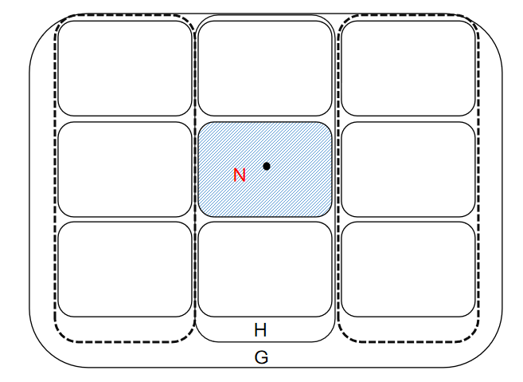
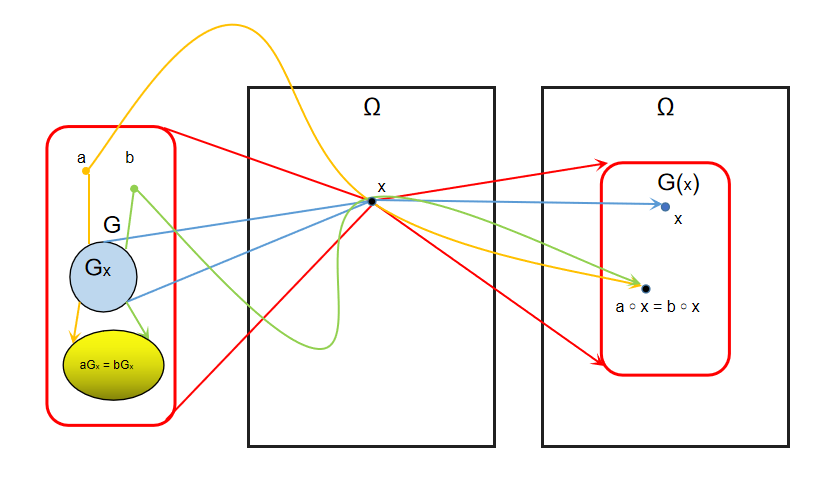
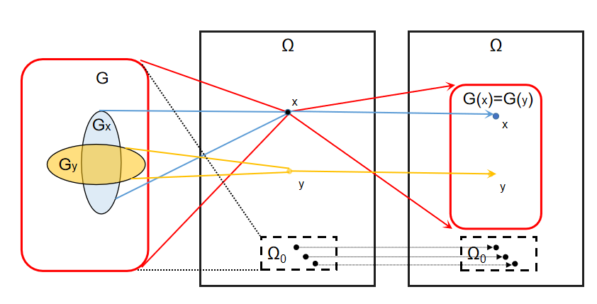

<meta http-equiv='Content-Type' content='text/html; charset=utf-8' />
断断续续看过一点，还是得记录一下，有的结论不那么直观的。

## 群
* 群同态$\sigma(G) \to \tilde{G}$ 的同态核是$G$的正规子群。
* 记$\mathbb{Z}_m^{\ast}$为模$m$的剩余环中的可逆元的集合，其中$\bar{a}\in \mathbb{Z}_m^{\ast}$当且仅当$a,m$互素(易证)，那么$\mathbb{Z}_m^{\ast}$是一个阿贝尔群。
* 有限域$F$的所有非零元的集合$F^{\ast}$对于乘法成为一个循环群。
* 如果$m = m_1 m_2, (m_1, m_2) =1 $有$\phi(m) = \phi(m_1)\phi(m_2)$。其中$\phi(m)$是欧拉函数，代表不大于$m$且和$m$互质的数的个数。
* 如果$a \in G$，$a$的阶数为$n$，有$\forall k$: $\vert a^k \vert = \frac{n}{(n,k)}$。
* 如果$a,b \in G,~ ab=ba,~\vert a \vert = m,\vert b \vert= n,~(m,n) = 1$， 则$\vert ab \vert = mn$。
* 有限阿贝尔群中必有一个元素的阶是其它元素的阶的倍数。事实上，有一个元素的阶是所有元素阶中最大的，那么其它元素的阶都是这个阶的因数(可以构造阶为公倍数的元素)。
* 有限阿贝尔群$G$，如果对于任意正整数$m$，$x^m = e$的解都不超过$m$，那么$G$是循环群(阶最大的那个一定是生成元)。
* 质数阶群一定是循环群。有限域的非零元对于乘法构成一个循环群。
* 任意一个$m$阶循环群都同构于$(\mathbb{Z}_m,+)$
* 有限阶循环群的子群一定是循环群，且每个阶数的子群只有一个。
* $H,K$是$G$的子群，则$HK$ 是 $G$ 的子群当且仅当$HK=KH$。
* $H,K$是$G$的子群，则$H\times K \cong G$ 当且仅当 
  * $G=HK$
  * $H \cap K = \lbrace e\rbrace$
  * $\forall h\in H, k\in K$ 都有 $ hk=kh$
* 对于群$G$的子群$H$，任意$a \in G$，有$aHa^{-1}$是$G$的一个子群，称**共轭子群**。
* 对于群$G$的子群$H$，$N_G(H) := \lbrace a\in G \vert aHa^{-1} = H\rbrace$，称为**正规化子群**，有$N_G(H) < G, H \triangleleft N_G(H)$。
* 对于一个群同态，$a (\mathrm{Ker}\sigma) =(\mathrm{Ker}\sigma) a $
* **群同态基本定理：** $\sigma$ 是$G \to \tilde G$ 的一个同态，有$\mathrm{Ker} \sigma $是$G$的一个正规子群，且$G/\mathrm{Ker} \sigma \cong \mathrm{Im} \sigma$。
* 注意$G$的正规子群的正规子群不一定是$G$的正规子群，也就是说没有传递性。
* **第一群同构定理：** 对于群$G$，$H<G, N \triangleleft G$，有：
  1. $HN<G$, 
  2. $H\cap N \triangleleft H, ~ H/H\cap N \cong HN/N$

  这个的意思是：如果有一个**正规子群** $N$，那么另一个**子群** $H$ 作用到它上面能得到一个 **子群** $K$。 $N$和$H$的交是这个子群$K$的**正规子群**，由此会生成一个商群；这个商群和另一个商群$HN/N$同构。
  
  可以用这么个例子来感受：$G$是二维坐标系，运算是向量加法。$N,H$ 分别是 $x,y$ 轴整点。$K$是坐标整点，$L$是原点。$K/N$ 的元素是平行于 $x$ 的整点集，$H/L \cong H$ 是$y$ 轴上的整点。可以这样感受：$H \cap N \to H$的生成方式和$N \to HN$的方式是一致的。
  
* **第二群同构定理：** 对于群$G$如果有$H,N \triangleleft G,~ N \subset H$，有：
  * $ H/N \triangleleft G/N$
  * $(G/N)/(H/N) \cong G/H$。
  
  它的意思是，在求商群的时候，可以先模去一个共同的核。事实上，$N = \lbrace e\rbrace$的时候，该式子会回归平凡。
  

### 可解群
* **希望找到对哪些正规子群的商群是阿贝尔的**。令$\sigma$是到这个正规子群的同态，群$\mathrm{Im} \sigma$ 是 Abel 的 $\Leftrightarrow \lbrace xyx^{-1}y^{-1}\vert x,y \in G\rbrace \subseteq \mathrm{Ker}\sigma$。其中$xyx^{-1}y^{-1}$称做 **换位子**。换位子 **自己不成为一个群**，称其生成的子群为**换位子群**或者 **导群**(当然，有一个一开始会有的问题是导群会不会是平凡的，然而很简单的例可以说明不是的。考虑可逆方阵的乘法群，它不是Abel的，导群不只有$E$，但又是行列式为$1$的，故不是全集)，记为$G^{\prime}$。而且有：
  * $G^{\prime} \subseteq \mathrm{Ker} \sigma$
  * $G^{\prime} \triangleleft G$
  * $G/G^{\prime}$ 是 Abel 的
  * 若$N\triangleleft G$。 有$G/N$是阿贝尔的 $\Leftrightarrow G^{\prime} \subseteq N$。即$G$的所有阿贝尔商群中 $G/G^{\prime}$是最大的。

  这其实是一个很有意思的做法，破坏阿贝尔的是$ab \ne ba \to aba^{-1}b^{-1} \ne e$。那么把它们收集起来做成一个“核”，也就是定义这一堆东西是“同一的”，模之剩下的就是阿贝尔的了。

* 记$G^{n+1} = G^{n\prime}$，如果存在$G^{k} = \lbrace e\rbrace$，称$G$是 **可解**的。
* $G$ 可解 $\Leftrightarrow$ 当且仅当存在 $G \triangleright G_1 \triangleright G_2 \triangleright \cdots \triangleright G_s = {e}$，且$G_n / G_{n+1}$ 是阿贝尔群。
* 可解群的子群和群同态的像都是可解的。可以推得，可解群的商群都是可解群。其中用到的一个重要结论是 **“导群的像是像的导群:$\sigma(G^{(n)}) = (\sigma(G))^{(n)}$”**。
* 如果$N \triangleleft G$，且$N, G/N$ 都可解，那么$G$ 可解(显然可以先解到$N$，再解到$\lbrace e\rbrace$)。
* Able群$G$是单群，当且仅当$G$是素数阶循环群。
* 非Abel群如果是单群，则不可解。非Abel群可解，则不是单群。
* 定义**次正规子群列：** $G \triangleright G_1 \triangleright G_2 \triangleright \cdots \triangleright G_s = {e}$；如果每个$G_n/G_{n+1}$都是单群，则称为**合成群列**
* 每个有限群都有至少一个合成群列。
* 有限群可解当且仅当存在一个递降的子群列，每相邻项的商群都是素数阶循环群。这是因为：
  * 充分性因为素数阶循环群是Abel的。
  * 必要性因为有合成群列，而这个群列中的是子群，所以可解，相邻的商群也可解；又商群是单群，单且可解故是Abel群。单且Abel，故只能是素数阶的循环群。
* **$\mathrm{Jordan-H\ddot{o}lder}$ 定理：** 有限群$G$的任意两个无重复项的合成群列有同样的长度，且其因子群能用某种方法配对，使得对应的因子群是同构的。
  证明用到归纳法，主要思路看看长度$2$的情况：如果$G \triangleright G_1 \triangleright \lbrace e\rbrace; G \triangleright H_1 \triangleright \cdots$。那么如果$G_1 \ne H_1$有：
  * $G_1H_1 = G$，因为这是$G$的一个大于$G_1$的正规子群，而$G/G_1$是单群，那么它只能是$G$。
  * $G_1 \cap H_1 = \lbrace e\rbrace$，这是因为 $G_1 \cap H_1 \triangleleft G_1$，而$G_1$是单群，它只能是$\lbrace e\rbrace$
  * 由第一群同构定理 $G_1H_1/G_1 = H_1/(G_1 \cap H_1) \to G/G_1 = H_1$

### 作用和轨道
* **群在集合上的作用：** $G \times \Omega \to \Omega; (g,x) \mapsto g \circ x$ 满足 $(gh) \circ x = g\circ(h\circ x); e\circ x = x$。
* **群在自身的作用：** $G \times G \to G$
  * 左平移：$(g,x) \mapsto gx$。
  * 左商集上的左平移：$G\times (G/H)_l \to (G/H)_l; (g,xH)\mapsto gxH$；类似的会有右商集上的右平移。
  * 共轭：$(g,x) \mapsto gxg^{-1}$。共轭作用的核$\mathrm{Z}(G)$称群$G$的 **中心**。它是由和$G$中每个元素可交换的元素组成的集合。
	共轭形成$G \to S_G$的一个同态$\sigma$，$\mathrm{Ker}(\sigma) = \mathrm{Z}(G)$，$\mathrm{Inn}(G) := \mathrm{Im}{\sigma}$，其元素是$G$的一个自同构，并构成一个群。$\mathrm{Inn}(G) \triangleleft \mathrm{Aut}(G)$。其中$\mathrm{Aut}(G)$是自同构群。$\mathrm{Inn}(G) \cong G/\mathrm{Z}(G)$。
* **轨道：** 任取$x \in \Omega$，定义$G(x) := \lbrace a\circ x \vert a\in G\rbrace$，称$x$的$G-$轨道。这对$\Omega$形成一个划分。
* **稳定子群：** $G_x := \lbrace g\in G \vert g\circ x = x\rbrace$，$G_x < G$。而且有$aG_x = bG_x \Leftrightarrow a\circ x = b\circ x$。
* **轨道-稳定子定理：** $\vert G(x) \vert = [G:G_x]$。

* 群$G$在$\Omega := \lbrace H \vert H < G \rbrace$ 上的作用$aH := aHa^{-1}, a\in G$称为共轭作用。这个作用下$H$的$G-$轨道是$H$的所有共轭子群的集合，对应的**稳定子群**是**正规化子群**$N_G(H)$。有共轭子群的个数为$[G: N_G(H)]$。
* 设群$G$在$\Omega$上有一个作用，则同一$G-$轨道上的点的稳定子群彼此共轭，从而这些稳定子群的基数相同。$y=a\circ x \Leftrightarrow G_y = aG_xa^{-1}$。这有一个有意思的推论：一条$G-$轨道里所有元素的稳定子群的阶之和就是$\vert G \vert$。

* **群元素的不动点集：** $F(g) := \lbrace  x\in \Omega \vert g\circ x = x \rbrace$；**群的不动点集：** $\Omega_0 :=\lbrace x \in \Omega \vert G(x) = \lbrace x\rbrace\rbrace$。
* **Burnside 引理：** $G-$轨道的条数$r$为：$r = \frac{1}{\vert G \vert} \sum \limits_{g\in G} \vert F(g)\vert$。
* 若$G$的阶是素数$p$的幂，则称$G$是$p-$群。若 $p-$群在有限集合$\Omega$上有一个作用，有$\Omega_0\equiv\Omega (\mathrm{mod}~ p)$。$p-$群的中心是非平凡的。
* **Sylow 第一定理：** 设$G$的阶$n = p^l m, (m,p)=1 $，则有任意对$1 \le k \le l$，$G$都有$p^k$阶的子群。
  证明思路为：
  * 取$G$的所有$p^k$阶子集$A_i$的集合$\Omega$，$g\circ A_i := gA_i$是$G$在$\Omega$上的一个作用。而$\vert\Omega\vert$因数中$p$的次数恰为$l-k$，故总存在$A_j$的轨道长$\vert G(A_j)\vert$的$p$次数不超过$l-k$。对应有，$\vert G_{A_j} \vert$的$p$的次数不小于$k$。
  * 另一方面，考虑满足$gA_j = A_j$的$g$。$ga \in A_j ,\forall a \in A_j$，所以这样的$g$不超过$\vert A_j \vert = p^k$个。也就是说$\vert G_{A_j} \le p^k$。
  * 于是$G_{A_j}$就是一个$p^k$阶的子群。

  称$k$最大的$p^k$阶子群$P$为$ \mathrm{Sylow} ~ p-$ 子群。

* **Sylow 第二定理：** 条件同上，有$G$的任一$p^k$阶子群$H$一定包含于$G$的某个$\mathrm{Sylow} ~ p-$子群中；$G$的任意两个$\mathrm{Sylow} ~ p-$子群共轭。
  证明思路为：只需证明$\exists a \in G, \forall h \in H, s.t. ha\in aP $，也就是 $haP = aP$。
  * 视 $h\circ (aP) := h(aP)$为$H$ 在$G/P$上的作用。那就是要找的$a$使得$aP$是$H$的一个不动点。
  * 而由于$H$是$p-$群，$\vert \Omega_0 \vert \equiv \vert G/P \vert \ne 0 (\mathrm{mod}~ p)$，知$\Omega_0$不是空的。那我们就能找到这样的不动点。
  
  有一个直接的推论是$\mathrm{Sylow} ~ p-$是正规子群当且仅当只有一个$\mathrm{Sylow} ~ p-$子群。

* **Sylow 第三定理：** 条件同上，$\mathrm{Sylow} ~ p-$子群$r$ 满足 $r \equiv 1 (\mathrm{mod}~p), r\vert m$。
  证明思路为考虑全部$\mathrm{Sylow} ~ p-$子群$P_i$的集合$\Omega$，取$P \in \Omega$，考虑$P$ 在$\Omega$上的共轭作用$a\circ P_i = aP_ia^{-1}, a \in P$。
  * 考虑$\Omega_0$，可推得$Q \in \Omega_0 \Leftrightarrow aQa^{-1} = Q, \forall a\in P \Leftrightarrow P \subseteq N_G(Q)$
  * 这样$P,Q$都是$N_G(Q)$的$\mathrm{Sylow} ~ p-$子群，又$Q\triangleleft N_G(Q)$，根据前一个推论有$P=Q, \Omega_0 = {P},\vert\Omega_0\vert = 1$。
  * 又有 $r = [G:N_G(P)] \Rightarrow r \vert \vert G \vert \Rightarrow r \vert p^lm$ 结合上一步的结论 $\Rightarrow r\vert m$。

* 对于阿贝尔 $p-$群 $P$，$\vert P\vert = p^l$，有$P \cong (\mathbb{Z}_{p^{k_1}},+) \oplus (\mathbb{Z}_{p^{k_2}},+) \oplus \cdots \oplus (\mathbb{Z}_{p^{k_r}},+)$, 其中 $ \sum k_i = l$。
  证明思路是找到一个$a_1$使得$P = <a_1>P_1 , <a_1> \cap P_1 = \lbrace e \rbrace$ 
  * 在所有的**极小生成元集合**的所有**关系**($x_1^{j_1}x_2^{j_2}\cdots x_r^{j_r} = e$)中，找到一个最小的正幂指数$m_1$, $$x_1^{m_1}x_2^{j_2}\cdots x_r^{j_r} = e$$，由最小性可得$m_1$是所有$j_i$的因数。
  * 可以构造一个$a_1$其阶是$m_1$，用来替代该极小生成元集合中的$x_1$：$a_1 = x_1x_2^{q_2}x_3^{q_3}\cdots x_r^{q_r}, q_i = j_i/m_1$。
  * 还是由最小性，可以得$<a_1> \cap <x_2,x_3,\cdots,x_r> = \lbrace e \rbrace$。
* 进一步，对于任有限群$G$，$\vert G \vert = p_1^{l_1}p_2^{l_2}\cdots p_s^{l_s}$，有：
$$
\begin{eqnarray*}
G &\cong& (\mathbb{Z}_{p_1^{k_{11}}},+) \oplus (\mathbb{Z}_{p_1^{k_{12}}},+) \oplus \cdots \oplus (\mathbb{Z}_{p_1^{k_{1r_1}}},+) \\
&\oplus & \cdots \\
&\oplus &G (\mathbb{Z}_{p_s^{k_{s1}}},+) \oplus (\mathbb{Z}_{p_s^{k_{s2}}},+) \oplus \cdots \oplus (\mathbb{Z}_{p_s^{k_{sr_s}}},+) \\
\end{eqnarray*}
$$
  这些 $p_i^{k_{rs_i}}$ 的集合称为$G$的 **初等因子**。
* 一个阿贝尔群的初等因子是唯一的，两个有限阿贝尔群同构当且仅当它们的初等因子相同。证明思路可以考虑两组极小生成元，易得到他们的最大阶数应该是相同的。模去最大阶元素生成的群之后的群应该又是同构的，故可以递推。(BTW，丘维声的书上的证明比这个长，不知道是不是我漏了什么？)

## 域
* 定义为：一个有单位元$e$的交换环，如果其每个非零元都是可逆元，则其是域。
* 若$p$是质数，$\mathbb{Z}_p$ 是域。
* 域上可以建立多项式的概念，而且，如果$a$是多项式的根，那么有$x-a$是项式的一个因子。
