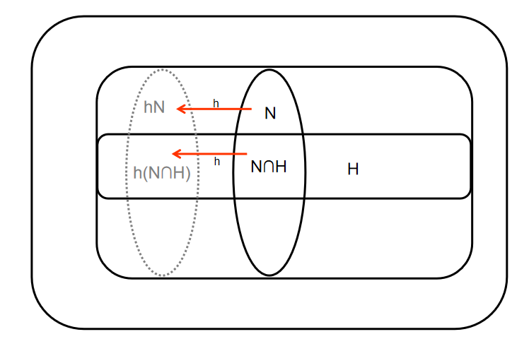

<meta http-equiv='Content-Type' content='text/html; charset=utf-8' />
断断续续看过一点，还是得记录一下，有的结论不那么直观的。

## 群
* 群同态$\sigma(G) \to \tilde{G}$ 的同态核是$G$的正规子群。
* 记$\mathbb{Z}_m^{\ast}$为模$m$的剩余环中的可逆元的集合，其中$\bar{a}\in \mathbb{Z}_m^{\ast}$当且仅当$a,m$互素(易证)，那么$\mathbb{Z}_m^{\ast}$是一个阿贝尔群。
* 有限域$F$的所有非零元的集合$F^{\ast}$对于乘法成为一个循环群。
* 如果$m = m_1 m_2, (m_1, m_2) =1 $有$\phi(m) = \phi(m_1)\phi(m_2)$。其中$\phi(m)$是欧拉函数，代表不大于$m$且和$m$互质的数的个数。
* 如果$a \in G$，$a$的阶数为$n$，有$\forall k$: $\vert a^k \vert = \frac{n}{(n,k)}$。
* 如果$a,b \in G,~ ab=ba,~\vert a \vert = m,\vert b \vert= n,~(m,n) = 1$， 则$\vert ab \vert = mn$。
* 有限阿贝尔群中必有一个元素的阶是其它元素的阶的倍数。事实上，有一个元素的阶是所有元素阶中最大的，那么其它元素的阶都是这个阶的因数(可以构造阶为公倍数的元素)。
* 有限阿贝尔群$G$，如果对于任意正整数$m$，$x^m = e$的解都不超过$m$，那么$G$是循环群(阶最大的那个一定是生成元)。
* 质数阶群一定是循环群。有限域的非零元对于乘法构成一个循环群。
* 任意一个$m$阶循环群都同构于$(\mathbb{Z}_m,+)$
* 有限阶循环群的子群一定是循环群，且每个阶数的子群只有一个。
* $H,K$是$G$的子群，则$HK$ 是 $G$ 的子群当且仅当$HK=KH$。
* $H,K$是$G$的子群，则$H\times K \cong G$ 当且仅当 
  * $G=HK$
  * $H \cap K = \{e\}$
  * $\forall h\in H, k\in K$ 都有 $ hk=kh$
* 对于群$G$的子群$H$，任意$a \in G$，有$aHa^{-1}$是$G$的一个子群，称**共轭子群**。
* 对于一个群同态，$a (\mathrm{Ker}\sigma) =(\mathrm{Ker}\sigma) a $
* **群同态基本定理：** $\sigma$ 是$G \to \tilde G$ 的一个同态，有$\mathrm{Ker} \sigma $是$G$的一个正规子群，且$G/\mathrm{Ker} \sigma \cong \mathrm{Im} \sigma$。
* 注意$G$的正规子群的正规子群不一定是$G$的正规子群。
* **第一群同构定理：** 对于群$G$，$H<G, N \triangleleft G$，有：
  1. $HN<G$, 
  2. $H\cap N \triangleleft H, ~ H/H\cap N \cong HN/N$

  这个的意思是：如果有一个**正规子群** $N$，那么另一个**子群** $H$ 作用到它上面能得到一个 **子群** $K$。 $N$和$H$的交是这个子群$K$的**正规子群**，由此会生成一个商群；这个商群和另一个商群$HN/N$同构。
  
  可以用这么个例子来感受：$G$是二维坐标系，运算是向量加法。$N,H$ 分别是 $x,y$ 轴整点。$K$是坐标整点，$L$是原点。$K/N$ 的元素是平行于 $x$ 的整点集，$H/L \cong H$ 是$y$ 轴上的整点。可以这样感受：$H \cap N \to H$的生成方式和$N \to HN$的方式是一致的。
  
* **第二群同构定理：** 对于群$G$，$H,N \triangleleft G,~ N \subset H$，有：
  * $ H/N \triangleleft G/N$
  * $(G/N)/(H/N) \cong G/H$。

### 可解群
* **希望找到对哪些正规子群的商群是阿贝尔的**。令$\sigma$是到这个正规子群的同态，群$\mathrm{Im} \sigma$ 是 Abel 的 $\Leftrightarrow \{xyx^{-1}y^{-1}\vert x,y \in G\} \subseteq \mathrm{Ker}\sigma$。其中$xyx^{-1}y^{-1}$称做 **换位子**。换位子 **自己不成为一个群**，称其生成的子群为**换位子群**或者 **导群**，记为$G^{\prime}$。而且有：
  * $G^{\prime} \subseteq \mathrm{Ker} \sigma$
  * $G^{\prime} \triangleleft G$
  * $G/G^{\prime}$ 是 Abel 的
  * 若$N\triangleleft G$。 有$G/N$是阿贝尔的 $\Leftrightarrow G^{\prime} \subseteq N$。即$G$的所有阿贝尔商群中 $G/G^{\prime}$是最大的。
* 记$G^{n+1} = G^{n\prime}$，如果存在$G^{k} = \{e\}$，称$G$是 **可解**的。
* $G$ 可解 $\Leftrightarrow$ 当且仅当存在 $G \triangleright G_1 \triangleright G_2 \triangleright \cdots \triangleright G_s = {e}$，且$G_n / G_{n+1}$ 是阿贝尔群。
* 可解群的子群和群同态的像都是可解的。可以推得，可解群的商群都是可解群。其中用到的一个重要结论是 **“导群的像是像的导群:$\sigma(G^{(n)}) = (\sigma(G))^{(n)}$”**。
* Able群$G$是单群，当且仅当$G$是素数阶循环群。
* 非Abel群如果是单群，则不可解。非Abel群可解，则不是单群。
* 定义**次正规子群列：** $G \triangleright G_1 \triangleright G_2 \triangleright \cdots \triangleright G_s = {e}$；如果每个$G_n/G_{n+1}$都是单群，则称为**合成群列**
* 每个有限群都有至少一个合成群列。
* 有限群可解当且仅当存在一个递降的子群列，每相邻项的商群都是素数阶循环群。这是因为：
  * 充分性因为素数阶循环群是Abel的。
  * 必要性因为有合成群列，而这个群列中的是子群，所以可解，相邻的商群也可解；又商群是单群，单且可解故是Abel群。单且Abel，故只能是素数阶的循环群。

## 域
* 定义为：一个有单位元$e$的交换环，如果其每个非零元都是可逆元，则其是域。
* 若$p$是质数，$\mathbb{Z}_p$ 是域。
* 域上可以建立多项式的概念，而且，如果$a$是多项式的根，那么有$x-a$是项式的一个因子。
