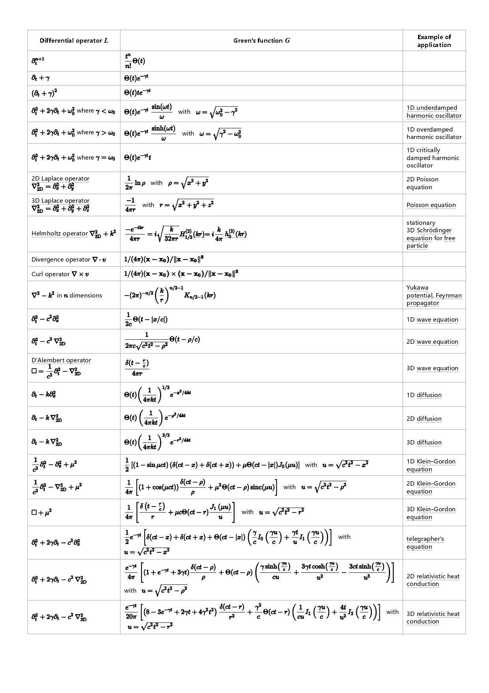

<meta http-equiv='Content-Type' content='text/html; charset=utf-8' />

学到格林函数的时候，已经到数理方程学期快结束了，老师也没有好好讲，再回想一下吧。

[Wiki上](https://zh.wikipedia.org/wiki/%E6%A0%BC%E6%9E%97%E5%87%BD%E6%95%B8)的定义十分的宽泛：给定流形 $M$ 上的 微分算子 $L$(线性的)， 其格林函数 $G(x,s)$ 为方程 $LG(x, s) = \delta (x-s)$ 的解，需要注意 $LG(x,s)$ 只对 $x$ 作用，写清楚其实有：
$$
\begin{eqnarray*}
LG(x,s) &=& L(g(s)(x))
\end{eqnarray*}
$$

它可以用于求解形为 $Lu(x) = f(x)$ 的方程，解为(只在$L$的零空间平凡的时候有效)：
$$
\begin{eqnarray*}
u(x) = \int f(x) G(x,s) ds
\end{eqnarray*}
$$

这个太宽了，一般用的时候，常用在Strum-Liuville算子：$L = \frac{d}{dx} [p(x) \frac{d}{dx}] + q(x)$ 上。而给定边界算子：
$$
\begin{equation}
Du = \left\{
\begin{aligned}
 \alpha_1 u^{\prime}(0) + \beta_1 u(0) \\
 \alpha_2 u^{\prime}(l) + \beta_2 u(l)
\end{aligned}
\right\}
\end{equation}
$$
对$[0,l]$区间的连续函数$f(x)$，下面方程：
$$
\begin{eqnarray*}
Lu = f \\
Du = 0
\end{eqnarray*}
$$
也就是Strum-Liuville问题下的[齐次边界条件](敛散性.md#齐次边界条件)。这时$G(x,s)$ 有几个性质：

1. $G(x, s )$ 对 $x,s$ 连续
2. 对 $s \ne x $, 有 $LG(x,s)$ = 0
3. 对 $s \ne 0,l$, 有 $DG(x,s)$ = 0
4. $G(x,s ) = G(s,x)$
5. $G^{\prime} (s_{+0},s)-G^{\prime}(s_{-0},s) = 1/p(s)$

#### 电阻的互能定理
在看[范德堡法](https://zh.wikipedia.org/wiki/%E8%8C%83%E5%BE%B7%E5%A0%A1%E6%B3%95)的时候，看到一个结论：
对于一个各向同性的电阻材料，安排4个电极$1,2,3,4$，在$1 \rightarrow 2$输入电流$I_{12}$，并测$3,4$间的电压 $U_{34}$。定义$R_{34,12} = \frac{U_{34}}{I_{12}}$。有：

$$
R_{34,12} = R_{12,34}
$$

证明想了好久，尝试从循环对称性的角度来证明失败了。应该还是少用了一个对称性，这个对称性就是 $G(x,s ) = G(s,x)$。

设由$1,2$分别输入电流$I$,在$3,4$产生的电流势分别为：$V_{3,1},V_{4,1}, V_{3,2}, V_{4,2}$。$1 \rightarrow 2$有电流$I$时：$U_{34} = (V_{4,1}-V_{4,2}) -(V_{3,1}-V_{3,2}) $(这里考虑到$4$点实际流出，对应电流势也反号)。相应的$3 \rightarrow 4$有电流$I$时，有$U_{12} = (V_{2,3}-V_{2,4}) - (V_{1,3}-V_{1,4})$。此时，要注意 $V_{a,b} = V_{b,a}$。可得 $R_{34,12} = R_{12,34}$。

### 泊松方程
好吧，再缩小一点范围，回到学的时候的，只是解泊松方程$L = \nabla^2, \nabla^2 \phi(x) = \rho(x)$。这时候用一个 *“格林定理”* (嘿，终于格林了)：
$$
\begin{eqnarray*}
\int \limits_V (\phi \nabla^2 \psi - \psi \nabla^2 \phi) dV = \int \limits_S (\phi \nabla \psi - \psi \nabla \phi) \cdot d\hat{\sigma}
\end{eqnarray*}
$$
代入任意格林函数，即令$\psi(x^{\prime}) = G(x,x^{\prime})$，都有形式上的解为:
$$
\begin{eqnarray*}
\phi(x) = 
\int \limits_V G(x,x^{\prime}) \rho^{\prime} (x^{\prime}) d^3 x^{\prime} + 
\int \limits_S \phi(x^{\prime})\nabla^{\prime}G(x,x^{\prime})- G(x,x^{\prime})\nabla^{\prime}\phi(x^{\prime})\cdot d \hat{\sigma}^{\prime}
\end{eqnarray*}
$$

#### 边界条件

注意到，这个时候$G(x,x^{\prime})$还有一定的任意性：**它没有给边界条件**，我们可以挑一个好用的。
* 比如在 **狄利克雷边界条件** 下，也就是说 $\phi(x)$ 在$S$上是给定的时候，我们可以挑选一个$G_S (x,x^{\prime}) = 0$ 的格林函数，此时面积分的第二项为$0$，而第一项的一切都是已知的，从而可以直接积分；
* 同理，在**诺伊曼边界条件**，也就是说 $\phi(x)$ 在 $S$ 上的法向导数一定的情况下，我们可以挑 $\frac{\partial G_S (x,x^{\prime})}{\partial \hat{n}} = 0$ 的格林函数，此时面积分的第一项为$0$。同上可以直接积分。

#### 物理对应
上面说了，$G(x,x^{\prime})$ 还有一定的任意性，那么我们可以这样试一个计算：选用自由空间的格林函数$G(x, x^{\prime}) ={\frac{-1}{4\pi r}}$，来计算一下给定**零势边界**的格林函数 $g(x,x^{\prime \prime})$。
$$
\begin{eqnarray*}
g(x,x^{\prime\prime}) &=& \int \limits_V G(x,x^{\prime}) \delta (x^{\prime},x^{\prime\prime}) d^3 x^{\prime} + 
\int \limits_S \phi(x^{\prime})\nabla^{\prime}G(x,x^{\prime})- G(x,x^{\prime})\nabla^{\prime}\phi(x^{\prime})\cdot d \hat{\sigma}^{\prime} \\
&=&G(x,x^{\prime \prime}) + \int \limits_S - G(x,x^{\prime})\nabla^{\prime}\phi(x^{\prime})\cdot d \hat{\sigma}^{\prime} \\
\end{eqnarray*}
$$
嘿，看上去就是自由空间的格林函数加一项，那加的积分项是什么呢？考虑边界的内外，外部电场应该为$0$，而内部电场为$-\nabla \phi$。中学的时候的小技巧了，紧贴边界的内外电场之差为靠近的那一小片电荷产生，对应电荷面密度，有被积量 $\nabla^{\prime}\phi(x^{\prime})\cdot d \hat{\sigma}^{\prime}$ 对应在 $x^{\prime}$点的电量。所以这个式子的含义就是 “**零势导体边界内的格林函数为内部电荷和边界感应电荷的格林函数之和**”，完美。

### 格林函数表 
[Wiki](https://en.wikipedia.org/wiki/Green%27s_function#Table_of_Green's_functions)还给了一个常见线性算子下的格林函数的列表，如下：

