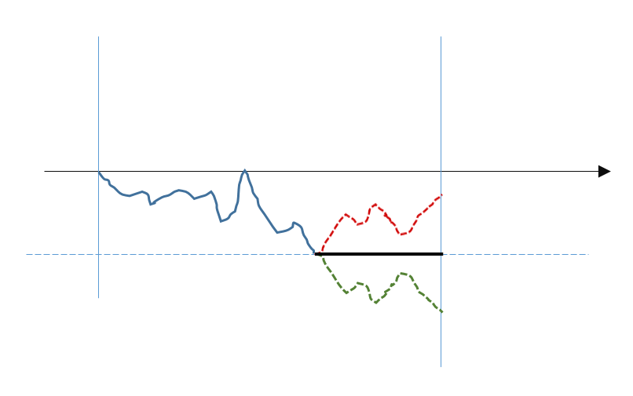
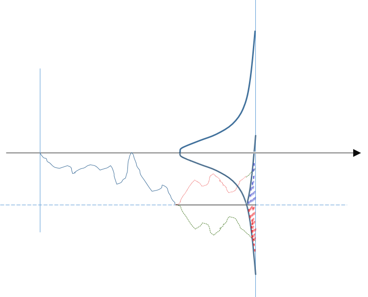

<meta http-equiv='Content-Type' content='text/html; charset=utf-8' />
“牛熊证”是一个曾经在香港市场活跃过一阵的工具，工具本身已经没有什么意思了，但是它有一个很有意思的结论：**一个连续观察的，One touch knock out 的 ITM 的香草期权，如果Knock out price 和 Strike 在同一个点，那么它是 Delta one 的。** 正好借此感受下下面几个概念。
* 停止过程，反射原理
* 布朗运动，Ito lemma中的二阶项

*简洁起见，我们还是简单的认为无风险利率是0*
### 估值视角
很显然，这是个停止过程，满足：

根据下面的Optional-Stopping Theorem，有`P(S) = S-K`。接下来很显然Delta为1。

详见[本文](../att/Stopped process.pdf)

对于上面这个结论，可以直观的理解一下。首先，任一碰到敲出价的路径，其有一条等概率路径在到期时落到相对于敲出价对称的位置(反射原理)。可知，所有碰到敲出价的路径其到期价格的期望也就是敲出价。反过来看，一个碰触敲出价则获得敲出价的payoff，其估值同碰触原过程一致。

如果同香草对比，香草是对应下图红色区域被堆积到Strike对应的线上。而牛证对应把红色和蓝色区域都堆积到Strike上(每一个收到红色区域的路径都一定碰触过Strike，故有反射对称点)。

### 对冲操作视角
另一个分析的方式是思考如何对牛熊证进行对冲。其实也非常直接：进行*0-1对冲*在没碰到Strike的时候，按名义金额反向持有对冲头寸，碰到Strike立刻平仓。这样，显然在存续期间是Delta one的，问题其实答完了。但是此时，应该想清楚的一个问题是：**那么为什么不能用*0-1对冲*来对冲香草期权？**
首先，我们看看对于香草期权进行*0-1*对冲的结果，如下。对于一个开始ITM的期权，全部没有碰到过Strik的，会堆积在0点，而碰到过的，会有很大的散布。

再直接给出定性的结论，牛熊证和香草的区别在于：离散的看，在进行*0-1*对冲时，当价格穿越Strike的时候，是会产生损失的。对于牛熊证这个穿越是一次性的，那么在减少步长从而减少一步价格变动的极限下，这个损失是会消失的。而对于期权，由于不是立即结束，将会多次穿越Strike的情况。而且，随着步长的减少，穿越次数也会增加，损失并不会收敛到零(能感受到一个在某时段穿越某点的布朗运动几乎必然在这个时段穿越它无数次吧，所以是有希望的)。下面来估一下：

用二叉树来逼近，对同一个过程的逼近，设步长为$dt$。有：
*  每一步的价格变动步长：$ds \propto \sqrt{dt}$。这一步的损失$dl \propto ds \propto \sqrt{dt}$。
*  出现在Strike上下相邻的节点(邻点)，下一步都有1/2的概率穿越，所以只要累记这些点的概率和，虽然可以准确算，不过我们估一估就得了。
	*	 在时间轴上，取一小段，这一小段的邻点数量反比于步长 $dn \propto \frac{1}{\sqrt{dt}}$。
	*	 在一个时间切片上，出现在一个节点上的概率，实际上近似为真布朗运动的切片分布在这一个节点“控制范围”内的累积值。反比于采点密度，故正比于价格变动步长：$dp \propto ds \propto \sqrt{dt}$。
	*	 这一小段的上的全部损失有 $l \propto dl \times dn \times dp $不随步长变化。

于是，我们证明了损失不会收敛到零，也说明了*0-1*对冲对于香草期权不是一个有效的对冲手段。(事实上，上面的问题和Ito Lemma中的二阶项的原理是一致的)。
