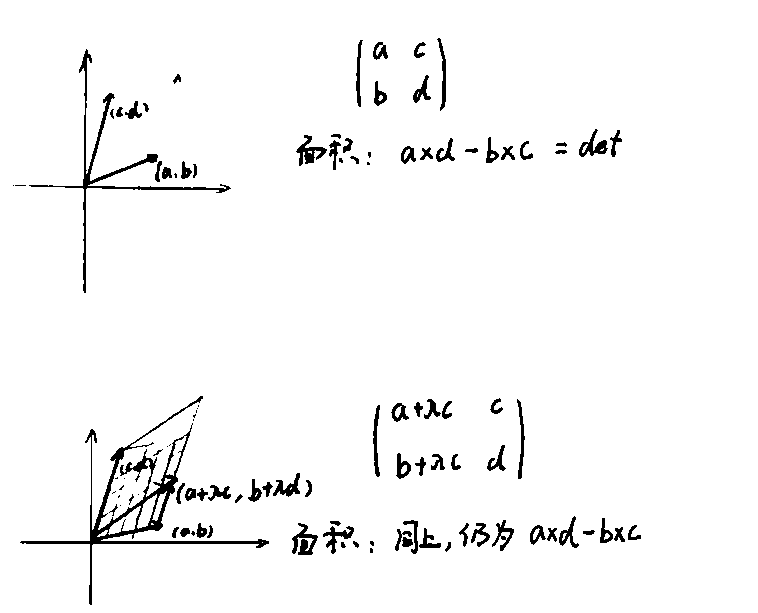

<meta http-equiv='Content-Type' content='text/html; charset=utf-8' />

## 线性代数常用方法和结论

### 行列式

行列式主要是一个工具，可以从线性变换的“体积元”的方式去理解：

属性有：

* 三角形$\Delta$为对角元之积
* 交换两行或两列，变号(体积方向改变)
* 某行全0，$\Delta=0$
* 一行同乘$\lambda$加到另一行，值不变
* 一行乘$\lambda$，值变$\lambda$倍
* 把某一行拆成两项和，那可以依此拆成两个行列式，原式值为新两式值之和
* 令$A_{ij}=(-1)^{i+j}M_{ij}$($M$的代数余子式)，有$\Delta=\sum\limits_{i=1}^n a_{ij}A_{ij} \forall j$
* $\sum\limits_{i=1}^n a_{ij}A_{ik} =0, j\neq k$
* **Cramer 法则：** 线性方程组的系数行列式不等于0则方程有唯一解。对应的，如果是齐次的方程，在行列式不为0的时候，只有0解；如果有非0解，行列式只能为0(这个在后面求矩阵的特征值的时候有用)。

### 矩阵运算

* **求逆**：$A^{-1} = \frac{1}{\Delta A}A^{\ast}$。其中$A^{\ast}$ 是“伴随矩阵”，其矩阵元为$A$对应位置的代数余子式
* **分块乘法**：两个矩阵相乘(维数是可乘的)，可以将每个矩阵进行分块(当然维数上也要是可乘的)，然后将块矩阵当矩阵元进行乘法
* $\Delta(AB) = \Delta(A)\Delta(B)$

### 线性空间

性质有：

1. $\exists \theta, \forall a, a+\theta = \theta$ 零元
2. $\forall a, \exists b, a+b=\theta$ 负元
3. $a+b = b+a$
4. $a+(b+c) = (a+b)+c$
5. $1a = a$
6. $\lambda(\mu a) = (\lambda\mu) a $ $\lambda, \mu$是数
7. $(\lambda + \mu)a = \lambda a + \mu a$
8. $\lambda(a+b) = \lambda a + \lambda b$

#### 线性表示

* **坐标表示**：在一组基$(e_{1\sim n})$下，可以表示为数组$(\eta_{1\sim n})^T$，代表$(e_{1\sim n})(\eta_{1\sim n})^T$。*事实上，一切运算带着基(单位)，很多东西就清楚了*
* 若另一组基$(d_{1\sim n})$满足：$(d_{1\sim n}) = (e_{1\sim n})T$($T$称为过渡矩阵)，有在$(d_{1\sim n})$下的坐标表示为$(\nu_{1\sim n})=T^{-1}(\eta_{1 \sim n})$

#### 轶

* 行轶等于列轶
* 线性方程组有解的充要条件是系数矩阵的轶等于增广矩阵的轶
* 若齐次线性方程组有非零解，则其基础解系的解的个数为$n- \mathrm{rank} A$
* 任意矩阵 $A$ 可有 $P,Q$ 使得
  $$
  \begin{eqnarray*}
  PAQ=\left[ \begin{matrix} I_r & 0 \\ 0 & 0\end{matrix}\right]
  \end{eqnarray*}
  $$
  其中$P,Q$为初等矩阵的积，$r$为轶
* 若$A$可逆，可表示为多个初等矩阵的积

#### 线性变换

线性变换$\Lambda$的性质有：
$\Lambda (x+y) = \Lambda(x)+\Lambda(y)$
$\Lambda(\lambda x) = \lambda\Lambda(x)$

* **相似矩阵**: 若线性变换$\Lambda$d在两组基$(d_{1\sim n}) ,(e_{1\sim n})$下的矩阵分别为$B,A$，而$(d_{1\sim n}) = (e_{1\sim n})T$。那么有$B=T^{-1}AT$。称$A$和$B$相似。
 	* n阶方阵A相似于对角阵的充要条件是：A有n个线性无关的特征向量
 	* 任意方阵总可以相似于上三角阵，且三角阵的对角元为特征值
 
* **特征向量**
 	* 属于不同特征值的特征向量线性无关
 	* 特征值的求法：$\Delta(\lambda I - A)=0$，解得特征值(在复数域)

 	* 行列式等于全部n个特征值之积
 	* 迹等于所有特征值之和
 
 所以相似变换有不变量：
 1)行列式
 2)特征值
 3)迹

#### 内积空间

线性空间中有两个向量到实数的映射，如果满足下面条件，就是内积：

1. $(x,y)=(y,x)$
2. $(x, y+z) = (x,y) + (x,z)$
3. $(x, \lambda y) = \lambda (x,y)$
4. $(x,x) \ge 0$, 等号当且仅当 $x = \theta$

定义$\sqrt{(x,x)}$为$x$的模，计为$\vert x \vert $。有**Cauchy-Schwarz**不等式：$\vert(x,y)\vert\le \vert x\vert \vert y \vert$

##### 正交变换

定义保持内积不变的线性变换为正交变换。有其等价于：

* 保持任意向量的模不变
* 将标准正交基变为标准正交基

正交变换在标准正交基下的矩阵是正交矩阵：$A^{\prime}=A^{-1}$，正交矩阵有性质：

1. 其行(列)向量是一组标准正交基，反之亦然
2. 正交阵的积仍是正交阵
3. 其行列式为1或-1

##### 对称变换

一个线性变换$\beta$满足$(\beta x,y) = (x, \beta y), \forall x,y $。称其为对称变换

* 对称变换在标准正交基下的表示为对称矩阵：$A^{\prime}=A$
* 设 $A$ 是 n 阶实对称阵，则$R_n$中属于$A$的不同特征值的特征向量必正交

### 二次型

二次型总能表示为$X^{\prime}AX$的形式，其中$A$是实对称阵。$B=P^{\prime}AP$称$B$和$A$相合。

* 一个实对称阵总能相合于一个对角阵
* 一个实对称阵总能通过初等矩阵的积相合于一个对角阵

$$
\begin{eqnarray*}
\exists T,~T^{\prime}AT =\left[ \begin{matrix} I_r & 0 &0 \\ 0 & -I_s&0\\0&0&0\end{matrix}\right]
\end{eqnarray*}
$$
$r,s$为相合变换的不变量，分别称为正负惯性指数

#### 正定

为什么感兴趣？Covariance Matrix 是正定的。

* 正定性是一个不变量
* n阶阵$A$正定的充要条件有：
 	* $r = \mathrm{rank} A = n$
 	* $\exists V, A=V^{\prime}V，V$为实可逆
 	* 各阶顺序主子式大于零
* 若$A,B$为实对称阵，$A$正定，则$A,B$可以被一同相合对角化$\exists P: P^{\prime}AP \in \mathrm{diag} \& P^{\prime}BP \in \mathrm{diag}$

### 子空间

* $P$阶$P$次幂零矩阵相似于：
 $$
 \left[ \begin{matrix}
 0& 1 &0 & 0 & ... & 0 & 0\\
 0& 0 &1 & 0 & ... & 0 & 0\\
 0& 0 &0 & 1 & ... & 0 & 0\\
 ...& ... &... & ... & ... & ... & ...\\ 
 0& 0 &0 & 0 & ... & 0 & 1\\
 0& 0 &0 & 0 & ... & 0 & 0\\
 \end{matrix}\right]_{P*P}
 $$
*  $N$阶$P$次幂零矩阵相似于
 $$
 \left[ \begin{matrix}
 N_{p_1}& & & \\
  &N_{p_2} & & \\
  & & ... & \\
  & & & N_{p_4}
 \end{matrix}\right]_{P*P}
 $$
 其中$\sum P_i = N$。$N_{p_i}$是$P_i$次幂零矩阵。
* **准对角化** 设$C$上的$n$阶方阵$A$的特征多项式为：
 $$
 \begin{eqnarray*}
 P_a(\lambda) &=& \sum \limits_{i}(\lambda - \lambda_i)^{n_i} \\
 \sum \limits_{i} n_i &=& n\\
 \lambda_i &\neq& \lambda_j, i \neq j\\
 A &\sim& \mathrm{diag} \{ J_{n_1},J_{n_2},J_{n_3}...\}
 \end{eqnarray*}
 $$
 且：
 	* $C$有直和分解$C= C^{(1)} \oplus C^{(2)} \oplus C^{(3)}...$
 	* $\mathrm{dim}C^{(i)} = n_i$
 	* $C^{(i)}$ 关于$A$ 不变
 	* $A$在$C^{(i)}$上的导出矩阵$J_{n_i} = \lambda_iI_{n_i}+N_{n_i}$。$N_{n_i}$是$n_i$ 阶幂零方阵

### 常见分解

* $A=LU$，$L,U$分别为下三角和上三角阵
* $A=QR$，$Q$为正交阵，$R$为上三角阵
* $A=Q\Lambda Q^T$，$Q$为正交阵，$\Lambda$为特征值矩阵
* $A=X\Lambda X^{-1}$，$\Lambda$为特征值矩阵，$X$为特征向量矩阵
* $A=U\Sigma V^T$，$\Sigma$为奇异值，$U,V$为正交单位奇异向量

## 扩展阅读

[Github上的The art of linear algebra](https://github.com/kenjihiranabe/The-Art-of-Linear-Algebra)是很好的， [这里](../att/The-Art-of-Linear-Algebra-zh-CN.pdf)也放一份。
