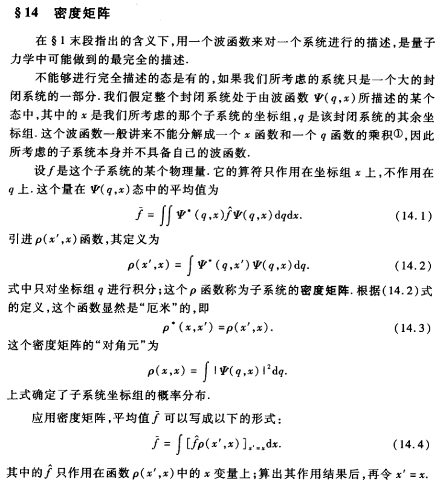

<meta http-equiv='Content-Type' content='text/html; charset=utf-8' />

**可能得接受，这是一个完全不一样的认识世界的逻辑。**

* **波函数：** 粒子的在某一时刻的 **状态**，由位置$q$的一个函数$\Psi(q)$确定，这就是波函数，这个函数的模方$\lvert \Psi \rvert ^2$是测量粒子位置的概率。

* **物理量：** 物理量测量，可以得到某些结果，而得到某结果的**概率**是粒子的波函数的一个双线性函数，一般形式是：$\int \int \Psi(q) \Psi^{\ast}(q^{\prime})\phi(q,q^{\prime})\mathrm{d}q \mathrm{d}q^{\prime}$。在这个框架下，位置的测量也对应一个双线性函数$\phi(q, q^{\prime}) = \delta (q-q_0) \delta (q^{\prime} -q_0)$。

* **叠加：** 如果一个波函数$\Psi_i$，在测量$M$下，得到某固定值$\lambda_i$的概率是1，那称$\Psi_i$是$M$的对应$\lambda_i$的本征态。而任意$\Psi = \sum \limits_i a_i \Psi_i$ ($a_i$ 是复数)。可以容易的推得(应用上一条的假设)在这个情况下，$\lvert a_i \rvert ^2$ 是测得 $\lambda_i$ 的概率。

* **算符：** 我们希望有一个函数 $\hat{f}$，使得有平均值 $\bar{f}$ 有关系：$ \bar{f} = \int \Psi^{\ast} (\hat{f} \Psi) \mathrm{d}q $， 其中 $\bar{f} = \sum \limits_n f_n \lvert a_n \rvert^2 $。要注意到希望 $\hat{f}$ 并不同 $a_n$ 有关。
  * $\hat{f}\Psi = \int \sum \limits_n [f_n \Psi^{\ast}_n(q^{\prime})\Psi_n(q)] \Psi(q^{\prime}) \mathrm{d}q^{\prime}$，注意到，它的确和 $a_n$ 无关。另外，很明显，它还是$q$的函数。称 $\sum \limits_n [f_n \Psi^{\ast}_n(q^{\prime})\Psi_n(q)]$ 为 $K(q,q^{\prime})$
  * 有$\hat{f} \Psi_n = f_n \Psi_n $，所以各常数$f_n$(物理量的值)是 $\hat{f}\Psi = f\Psi$ 的解，也就是说是 $\hat{f}$ 的本征值，对应 $\Psi_n$ 是本征态。
  * 由于物理量是实数，对$\hat{f}$ 形成了要求：
	a. $\int \Psi^{\ast}(\hat{f} \Psi) \mathrm{d}q = \int \Psi(\hat{f}^{\ast} \Psi^{\ast})\mathrm{d}q$ —— 实数的要求。
	b. 存在转置算符 $\tilde{\hat{f}}$，使得 $\int \Phi(\hat{f}\Psi) \mathrm{d}q = \int \Psi (\tilde{\hat{f}}\Phi) \mathrm{d}q$，称$\tilde{\hat{f}}$为 $\hat{f}$ 的转置。应用$\hat{f}$的推导过程之到这个转置是存在的。同时，矩阵化前面的推导过程，容易知道“转置”这个名称的由来。
	c. 上两个要求，可以得到$\tilde{\hat{f}}$ = $\hat{f}^{\ast}$。称$\hat{f}$是厄米的。矩阵表示上，是说它的转置等于它的共轭。另外，也说明$K(q,q^{\prime}) = K^{\ast}(q^{\prime},q)$。
	d. 两个物理量$\hat{f},\hat{g}$，要是可以同时得确定值，需要$\hat{f},\hat{g}$有同样的本征态，反之亦然。这时，有$[\hat{f},\hat{g}] = \hat{f}\hat{g}-\hat{g}\hat{f} = 0$。称$\hat{f},\hat{g}$对易。**注意，对易不是等价关系**。

* **测量：** 对于测量的表述是这样的：
  * 有个**经典**客体，称为*仪器*，它的本征态为 $\Phi_n(\xi)$。这个仪器一开始处于基态 $\Phi_0(\xi)$的态。
  * 有个待测量的粒子，它的波函数为$\Psi(q)$。
  * 系统的初态为 $\Psi(q)\Phi_0(\xi)$。
  * **作用**(我们现在还不知道怎么作用)后，得到一个新的波函数，它可以展开到仪器的本征函数：$\sum \limits_n A_n(q)\Phi_n(\xi)$。其中$A_n(q)$为$q$的某函数。
  * 所谓“经典”，是指是非“概率”的。测量后的态只能是仪器的一个本征态。结果不是和，而只有某一项$n$对应的：$A_n(q)\Phi_n(\xi)$。而注意，这个$A_n(q)\Phi_n(\xi)$是对于$n$这个整体的态的一个表述，$A_n(q)$是其中关于粒子的态的部分，是由仪器和$n$完全决定了的，同原始的粒子波函数无关(也不是完全无关，因为$A_n(q)$不是归一化的，它还含有取$n$这个态的概率的信息，$A_n(q) = a_n \psi_n(q)$。其中$a_n$是概率的部分，$\psi_n(q)$是波形的部分)。

* **经典过渡：** 先考虑一下，我们用过了一个词，**波**函数。这里的波字，暂时是没有来源的。下面的讨论，是假设了形式就是波而开始的(希望什么时候我能回来说明为什么应该是个波，不循环论证的说明)。
  * 对应一个经典表示的粒子，它是有确定的位置的，那说明在波的表示下，它也只应该在有限的范围内有非零的出现概率。
  * 应该有形式$\Psi = a(q)e^{i\phi}$，要使经典尺度上是粒子，应该有$\phi$的变化尺度非常小，远小于经典尺度。
  * 注意，经典力学中，有作用量$S$取极限值的要求。而回忆一下光学中，经典的**光程最短(长)**是可以由光波到光线的**惠更斯－菲涅耳原理**是可以直接推导的————这是一个数学的关系，不依赖于*电磁*。可以猜测，在量子表述下，应该有对应的**波程**取极限，那么$S$和$\phi$最好是同一个东西，只差一个常数：$S = \hbar \phi$。($\hbar$这就出来了耶)，这就有

$$
  \begin{eqnarray*}
  \Psi & = & a e ^{\frac{iS}{\hbar}} \tag{1}\\
  \end{eqnarray*}
$$

**下面要开始飞了。**(飞之前的这些更是该多读的)

### 能量和动量

#### 能量 

先来考虑随时间的变化，希望有 $d\Psi /dt = \alpha \hat{H}\Psi$。考虑叠加原理，希望 $H$能是一个线性算符。

* 要保障$\Psi(q)$的归一性，有 $ \frac{d \int \lvert \Psi(q) \rvert^2 \mathrm{d}q}{ dt}  = 0$， 可得$\tilde{\hat{H}}$ = $\hat{H}^{\ast}$。即$\hat{H}$是厄米的。
* 应用$\Psi = a e ^{\frac{iS}{\hbar}}$的形式，可以有 $\frac{\partial \Psi}{\partial t} = \frac{i}{\hbar} \frac{\partial S}{\partial t} \Psi$。和前面的式子比，可以得到$\alpha = i\hbar$。而 $\hat{H} \sim - \frac{\partial S}{\partial t}$。即对应**哈密顿量**。这个方程就是**波动方程**。
* 对应前面对算符的论述中关于“平均”的概念，可以再定义$f$的时间导数$\dot{f}$为$\bar{\dot{f}} = \dot{\bar{f}}$。直接展开 $\dot{\bar{f}}$ 并考虑前面的波动方程以及$\hat{H}$的厄米性，可以得到 $\hat{\dot{f}} = \frac{\partial \hat{f}}{\partial t} + \frac{i}{\hbar} (\hat{H}\hat{f} - \hat{f}\hat{H}) \tag{a}$
  * 在$\hat{f}$不显含时间的情况下，如果$\hat{f}$和$\hat{H}$对易，那么有 $\hat{\dot{f}} = 0$。明显这样的量称为**守恒量**，和经典的一致。
* 能量的本征态有，
$$
\begin{eqnarray*}
\Psi_n = e^{-(i/\hbar)E_n t} \psi_n(q) \tag{E}
\end{eqnarray*}
$$
任一物理量的**平均值**不随时间变化。另外，有对任意的不显含时的$\hat{f}$：
$$
\begin{eqnarray*}
f_{nm} &=& f_{nm}e^{i\omega_{nm}t} \\
\omega_{nm} &=& \frac{E_n-E_m}{\hbar} \tag{E1} \\
(\dot{f})_{nm} &=& i\omega_{nm}f_{nm} = \frac{i}{\hbar}(E_n - E_m) f_{nm} \tag{E2} 
\end{eqnarray*}
$$

#### 动量

如果要求一个系统的 **哈密顿量** 对于空间平移是不变的，那意味着空间平移算符 $\hat{O}$ 下，因该有 $\hat{O}\hat{H} = \hat{H}\hat{O}$。而在平移 $\vec{r} \rightarrow \vec{r} + \delta \vec{r}$ 下：
$$
\begin{eqnarray*}
\hat{O}\psi({\vec{r}}) &=& {\psi(\vec{r} + \delta \vec{r})} \\
&=& \psi({\vec{r}}) + \delta{\vec{r}} \cdot \nabla \psi(\vec{r}) \\
\hat{O} &=& 1 + \delta r \cdot \nabla
\end{eqnarray*}
$$
这样，有 $\hat{O}\hat{H} - \hat{H}\hat{O} = \nabla \hat{H} - \hat{H} \nabla$。可见 $\nabla$ 是守恒的，又对比经典力学，可令 $\hat{p} = - i \hbar \nabla$，为动量。带入 **(1)** 有 $\hat{p} \Psi = -i\hbar(i/\hbar)\Psi\nabla S = \Psi \nabla S$。同经典一致。

#### 薛定谔方程

回到[能量](#能量)，我们其实还没有$\hat{H}$ 的具体形式。然而，同经典物理对比，应该有在 $\hat{p}$ 和 $\hat{H}$ 的每一个共同本征态下都有：$E = p^2/2m$。那有：

$$
\begin{eqnarray*}
\hat{H} &=& -\frac{\hbar^2}{2m} \triangle  \tag{2} \\
\triangle &=& \nabla \cdot \nabla
\end{eqnarray*}
$$
在有相互作用的情况下，
$$
\begin{eqnarray*}
\hat{H} &=& -\frac{\hbar^2}{2m} \triangle + U(\vec{r}) \tag{3} \\
\end{eqnarray*}
$$
这样我们有薛定谔方程：
$$
\begin{eqnarray*}
i\hbar \frac{\partial \Psi}{\partial t} &=& -\frac{\hbar^2}{2m} \triangle \Psi + U(\vec{r})\Psi \tag{4}
\end{eqnarray*}
$$
以及分离变量后定态的薛定谔方程：
$$
\begin{eqnarray*}
\frac{\hbar^2}{2m} \triangle \psi + (E-U(\vec{r}))\psi = 0 \tag{5}
\end{eqnarray*}
$$
常用时，往往只用到定态的薛定谔方程。

### 矩阵 ###

到这个时候再说矩阵，基础的东西多一点，方便理解。虽然它其实和薛定谔方程、和动量都无关。

#### 表象 ####

对一个物理量 $\hat{f}$ 的本征态 $\Psi_n$ 有任意态 $\Psi = \sum \limits_n a_n \Psi_n$。另一物理量 $\hat{g}$ 有：

$$
\begin{eqnarray*}
\bar{g} &=& \sum \limits_n \sum \limits_m a^{\ast}_n a_m g_{nm} \\
g_{nm} &=& \int \Psi_n^{\ast} \hat{g} \Psi_m \mathrm{d}q
\end{eqnarray*}
$$
$g_{nm}$ 称为 $\hat{g}$ 在$f$ 表象下的**矩阵元**，有时也记做$g_{nm} = \langle n \vert g \vert m \rangle$。

提问：为什么这么个东西要叫**矩阵**元呢？

* 因为对于算符的复合有 
  $$
  (fg)_{nm} = \langle n \vert fg \vert m \rangle = \sum \limits_l f_{nl} g_{lm} 
  $$
  同矩阵运算的原则一致。接下来，任何一个物理的方程，就可以化成矩阵元的方程，而通过矩阵的一些要求，推出部分性质。
* 再这样看问题：一个态 $\Phi$ 可以正交的分成 $\psi = a_i \psi_i$。也可以按一个物理量的本征态展开为 $\sum \limits_{i} \psi = b_j \phi_j$。$\sum \limits_{j}\psi_i,\phi_j$可视为同一线性空间的单位正交基。注意$ \sum \limits_{i} \vert a_i \vert^2 =   \sum \limits_{j} \vert b_j \vert^2 = 1$ 可见$a,b$的确是**单位向量**。如果 $\phi_j$是$f$本征值为$f_j$的本征态，有。
$$
\begin{eqnarray*}
\bar{f} = \sum \limits_{j} b_j^{\ast} b_j f_j = B^{\ast T} F B
\end{eqnarray*}
$$
其中$F$是一个对角阵，即把本征值填到对角线上，这就是$f$在$\phi$表象中的矩阵。继续考虑 $\psi$到$\phi$只差一个“正交变换” $\psi_i = \sum \limits_{j}k_{ij}\phi_j, \psi = K \phi$。知$B = KA$。从而：
$$
\begin{eqnarray*}
\bar{f} &=& B^{\ast T} F B \\
	&=& (KA)^{\ast T} F (KA) \\
	&=& A^{\ast T} (K^{\ast T} F K) A \tag{F}\\ 
	&=:& A^{\ast T} F_A A
\end{eqnarray*}
$$
$F_A$ 就是$f$在$\psi$表象中的矩阵。

#### 密度矩阵 ####

上面说的是单一的态，可是如果系统不是处于单一的态，而是**依概率混合**的态，情况是什么样呢？假设系统有 $\omega_n$的概率处于$\Phi_n$的态，有：
$$
\begin{eqnarray*}
\bar{f} &=& \sum \limits_{n} \omega_n B^{\ast T} F B \\
&=&  \sum \limits_{n} \sum \limits_{j}\omega_n B_j F_{jj} B_j  = tr (\Lambda(w_n) B B^{\ast T} F)\\ 
&=&  \sum \limits_{n} \sum \limits_{i} \sum \limits_{j}\omega_n A_j F_{A ij} A_i = tr (\Lambda(w_n) A A^{\ast T} F_{A})\\
\end{eqnarray*}
$$
这里把$\omega_n B B^{\ast T}$叫做密度矩阵。形式上可以表示为$\rho = \sum \limits_{n}\sum \limits_{i} \omega_n\vert i \rangle \langle i \vert $。然而上面的**依概率混合**有点混乱，什么是“概率”？难道这只是一个系综的理论？朗道的书上有另一个表述:

我们先展开**F**式：
$$
\begin{eqnarray*}
\bar{f} &=& \sum \limits_{i}\sum \limits_{h}\sum \limits_{j} a_i a_h (f_j k_{ij} k_{jh}) \tag{F'}
\end{eqnarray*}
$$
对于如果有一个态是$\Phi = \sum \limits_{i} a_{ni} \vert ni \rangle$，而$f$只含第二个参数，$\vert nj \rangle$是观测值为$f_j$的本征态。
$$
\begin{eqnarray*}
\Phi &=& \sum \limits_{n,i,j} a_{ni} k_{ij} \vert nj \rangle \\
&=& \sum \limits_{n,j} (\sum \limits_{i}a_{ni}k_{ij}) \vert nj \rangle \\
\bar{f} &=&\sum \limits_{n,j} \vert(\sum \limits_{i}a_{ni}k_{ij}) \vert^2 f_j\\
&=& \sum \limits_{n}(\sum \limits_{i}\sum \limits_{h}\sum \limits_{j}   a_{ni} a_{nh} (f_j k_{ij} k_{jh}))
\end{eqnarray*}
$$
可见，如果我们不能得到每一个$a_{ni}$，只需得到$\rho_{ih} = \sum \limits_{n}  a_{ni} a_{nh}$是可以用于所有的物理量测量了$\bar{f} = \sum \limits_{i}\sum \limits_{h}\sum \limits_{j} \rho_{ih} (f_j k_{ij} k_{jh})$。如果有$a_{ni} = a_n a_i, \sum \limits_{n} a_n^2 = \sum \limits_{i}a_i^2 = 1$的形式。$\rho_{ih} = a_i a_h$ 回到 **F'** 的情况。对应的有$\omega_n = \sum \limits_{i,h}a_{ni}a_{nh}$。

#### 常用表象 ####

在很多时候，我们喜欢用 $H$ 的表象下矩阵元，因为可以有 $g_{nm}(t) = g_{nm}e^{i\omega_{nm}t},~ \omega_{nm} = \frac{E_n-E_m}{\hbar}$。而$g_{nm} = \int \psi_n^{\ast} \hat{g} \psi_m \mathrm{d}q$，是非时变的。此时 
$$ 
\dot {g}_{nm}(t) = i \omega_{nm} g_{nm}(t) 
$$

* 对于 $\Psi = \sum \limits_m c_m \psi_m，~ \hat{f}$，有 $\sum \limits_m f_{nm} c_m = fc_n$。这个视为 $c_i$为未知数的方程组，有非零解的条件是 ${\rm det} (f_{nm} - f\delta_{nm}) = 0$。这时可以解得所有 $f$ 的可能值。
* 任意$f$的演化 $ \dot{f_{mn}} = i\omega_{mn}f_{mn} = \frac{i}{\hbar}(E_m - E_n)f_{mn} $。

#### 在矩阵中的直接推导 ####

**陈童**的讲义中给了另一种推导的方法：
* 经典意义上的物理量，如 $x$ 是不可观测的，不真实存在的。根据氢原子的辐射，认为只存在一些“跃迁”，$[x] _{mn}$。
* 考虑发出的光波，取 $ [x] _{mn} = [x _0]  _{mn} e ^{- i \omega _{mn}t} $ 的形式。
* 要求 $ [x _0] _{mn} = [x _0] _{nm}^{\ast} $。
* 对时间求导得速度，进而动量 $p = m \dot{[x]} _{mn} = -i m \omega _{mn} [x _0] _{mn} e^{-i \omega _{mn}t} =: [p _0] _{mn} e ^{- i \omega _{mn}t}$。
* 任何物理量都应该是$x,p$的函数。
* **能量** 守恒应该还成立。考虑矩阵的非对角元都含时，这要求 $[H] _{mn}$ 的非对角元应该都是0，$[H] _{mn} = \Lambda(E _n)$。而且有 $\omega _{mn} = (E _n - E _m) /\hbar$。
* 注意对于任意物理量$[A]$，有$[A] _{mn} = [A _0] _{mn} e ^{- i \omega _{mn}t}$。从而$\frac{\mathrm{d} [A] _{mn}}{\mathrm{d} t} = -\omega _{mn}[A] _{mn} = -\frac{i}{\hbar} ([A] _{mn}E _n - [A _{mn}]E _m) =: -\frac{i}{\hbar}[A,H]$，称海森伯运动方程(矩阵元是时变的，对应下面的海森伯绘景)，也对应薛定谔方程。
* 考虑$H$是$X,P$的函数，如果$[X,P] = 0$会有$[H,X] = [H,P] = 0$，这不合理。于是：
  * 如果有$[X,P]=C$，对比经典$H = \frac{P^2}{2m} + V(x)$，有$\frac{\mathrm{d} X}{\mathrm{d} t} = i\hbar[X,H] = \frac{1}{2i\hbar m}(CP+PC)$
  * 再对比经典 $\frac{\mathrm{d} X}{\mathrm{d} t} = \frac{P}{m}, \frac{\mathrm{d} P}{\mathrm{d} t}= -\nabla V(X)$。对比发现，如果$[X,P] = i\hbar$，将是能满足条件的。
  
  这样我们得到了基本对易关系。

#### 海森伯绘景

前面说的系统对时间的演化为：

$$
\begin{eqnarray*}
\bar{f}(t) &=& \int \Psi^{\ast}(q,t)\hat{f}\Psi (q,t) \mathrm{d}q
\end{eqnarray*}
$$

时变的部分解释为波函数的演化。这称为**薛定谔绘景**，而如果把时变的关系吸收到算符上去，就成了 **海森伯绘景**，这时有：

$$
\begin{eqnarray*}
\hat{S} &=& e^{-\frac{i}{\hbar}\hat{H}t} \\
\Psi(q,t) &=& \hat{S}\Psi(q,0) \\
\hat{f}(t) &=& \hat{S}^{-1}\hat{f}\hat{S} \tag{b0}\\
\rightarrow \bar{f}(t) &=& \int \Psi^{\ast}(q,0)\hat{f}(t)\Psi (q,0) \mathrm{d}q
\end{eqnarray*}
$$
**(b0)** 对时间求导，有：

$$
\begin{eqnarray*}
\frac{\partial }{\partial t} \hat{f} (t) &=& \frac{i}{\hbar} [\hat{H}\hat{f}(t) - \hat{f}(t)\hat{H}] \tag{b} \\
\end{eqnarray*}
$$

对比一下 **(a)** 和 **(b)**，绘景上的区别是 **(a)** 中的 $\hat{\dot{f}}$ 是 $\dot{f}$ 这个物理量的定义，**(b)** 中的 $\frac{\partial }{\partial t} \hat{f} (t)$ 是物理量算符 $\hat{f}(t)$ 本身对时间的微商。

#### 幺正性
简单的说，$ U(t) = e^{-iHt/\hbar}$ 代表了时间的演化，而注意到$UU^{\dagger}= U^{\dagger}U = 1$，这就叫幺正。于是有$\langle \phi(t) \vert \psi(t) \rangle = \langle \phi  \vert U^{\dagger}U \vert \psi \rangle = \langle \phi \vert \psi \rangle$。说明量子态的内积不随时变化。

##### 量子不可克隆性
幺正性的一个有用的推论是量子不可克隆性：目标是通过一个$U$，使得对于任意$\vert \phi \rangle$和一个“空白”的态$\vert 0 \rangle$，有$U (\vert \phi \rangle \vert 0 \rangle) = \vert \phi \rangle \vert \phi \rangle$。然而，对于两个不同的态$\vert \phi \rangle \vert \psi \rangle $，有$U (\vert \phi \rangle \vert 0 \rangle) = \vert \phi \rangle \vert \phi \rangle, U (\vert \psi \rangle \vert 0 \rangle) = \vert \psi \rangle \vert \psi \rangle$，由幺正性有：
$$
\begin{eqnarray*}
(\langle \phi \vert \langle \phi \vert)(\vert \psi \rangle \vert \psi \rangle) = (\langle \phi \vert \langle 0 \vert)(\vert psi \rangle \vert 0 \rangle)\\
(\langle \phi \vert \vert \psi \rangle)^2 = \langle \phi \vert \vert \psi \rangle \langle 0 \vert \vert 0 \rangle = \langle \phi \vert \vert \psi \rangle 
\end{eqnarray*}
$$
只有$\vert \phi \rangle,\vert \psi \rangle$要么一致要么正交，和“任意”的要求不符。

### 典型结论

#### 自由粒子，方势阱
自由粒子很简单，就是在薛定谔方程中$U$为常数，$\Psi(x,t) = a e^{\frac{i\sqrt{2mE}}{\hbar} x - \frac{iE}{\hbar} t + \delta}$。
方势阱的话，注意到薛定谔方程是局域的，可以推得在每个等势能的区域，解都是平面波。并且在$U$有限的情况下，$\psi$和其导数都是连续的。一个特别简单的例子是**无限深**方势阱，$\psi$在阱外陡降为$0$，容易得到阱宽是半波长的整数倍的驻波。

#### 谐振子
谐振子的哈密顿量为 $\hat{H} = \frac{\hat{p}^2}{2m} + \frac{m\omega^2 x^2}{2}$。

最常见的处理方法是用升降算符：$a^{\dagger} = \sqrt{\frac{m\omega}{2\hbar}}(x + \frac{i}{m\omega}p),~ a = \sqrt{\frac{m\omega}{2\hbar}}(x - \frac{i}{m\omega}p)$。有：
$$
\begin{eqnarray*}
H &=& \hbar \omega (a^{\dagger}a+1/2)\\
[a,a ^{\dagger}] &=& 1\\
\end{eqnarray*}
$$
又由于
$$
\begin{eqnarray*}
\langle \psi_E \vert a^{\dagger}a \vert \psi_E \rangle &\ge& 0 \\
\langle \psi_E \vert H \vert \psi_E \rangle &\ge& \hbar\omega/2 \\
E&\ge&\hbar\omega/2
\end{eqnarray*}
$$

以及

$$
\begin{eqnarray*}
H(a\vert \psi_E \rangle) &=& (E-\hbar\omega) (a \vert \psi_E \rangle) \\
H(a^{\dagger}\vert \psi_E \rangle) &=& (E+\hbar\omega) (a \vert \psi_E \rangle)
\end{eqnarray*}
$$

说明用$a^{\dagger}$和$a$分别作用一个定态，能得到能量分别增加和下降$\hbar\omega$的定态。所以叫升降算符。为了不使能量可以小于$\hbar\omega/2$，需要让$a$作用这个过程能截断，对应 $a \vert 0 \rangle = 0$，称为基态，能量为 $\hbar \omega/2$。对这个态不停的用 $a^{\dagger}$ 作用可以得到别的态(反证法可以知道没有别的能量的态)。对应能量 $(n + 1/2)\omega \hbar$。

这里奇怪的是，为什么会想到$a^{\dagger},a$这么两个算符呢？其实只要注意到经典中的能量守恒守的是：$\frac{kx^2+p^2/m}{2} = \frac{1}{2}(\sqrt{k}x+ip/\sqrt{m})(\sqrt{k}x-ip/\sqrt{m})$。

另有一种朗道上提到的方法，感觉更有意思点。先用到几个有用的技巧和结论：
$$
\begin{eqnarray*}
\hat{p}f(r) - f(r)\hat{p}  &=& -i\hbar\nabla f \\
f(\hat{p})r - rf(\hat{p}) &=& -i\hbar \frac{\partial f}{\partial p} \\
m\hat(\dot{v}) = \frac{mi}{\hbar}[\hat{H},\hat{v}] &=& \frac{i}{m\hbar}[U, \hat{p}] & = & -\nabla U \\
\end{eqnarray*}
$$
其中最后一步用到了$\hat{H}$的其它部分和$\hat{p}$对易。这样，有谐振子的方程为。
$$
\begin{eqnarray*}
\hat{\ddot{x}} + \omega^2 x &=& 0 \\
\end{eqnarray*} 
$$
势能可无穷大，所以只有有限运动，所以只有离散的能谱(对比方势阱，可以感觉到这是因为在边界条件下为了波函数和其导数连续，形成了一个强的约束，只有“少量”的解满足条件)。化成能量表象下的矩阵方程有：
$$
\begin{eqnarray*}
&(\hat{\ddot{x}})_{mn} + \omega^2 x_{mn} &=& 0 \\
&(\ddot{x})_{mn} &=& -\omega_{mn}^2 x_{mn} \\
\rightarrow & (\omega_{mn}^2 - \omega^2)x_{mn} & = & 0
\end{eqnarray*} 
$$
记住，我们下面目标是得到 $\omega_{mn}$，只有 $\omega_{mn} = \pm \omega$ 的时候(即相差 $\hbar \omega$ 的两个态的跃迁元)，$x_{mn}$ 才不为$0$(显然有$x_{nn} = 0$)。现在把定态进行编号，使得 $n \rightarrow n \pm 1$的跃迁频率为$\pm \omega$，也就是 $ \omega_{n, n\pm 1} = \pm \omega $ 。注意 $\omega_{mn}$ 是反对称的，$x_{mn}$ 是对称的。
注意：

$$
\begin{eqnarray*}
\hat{\dot{x}}\hat{x} - \hat{x}\hat{\dot{x}} &=& -i\frac{\hbar}{m} \\
(\dot{x}x)_{mn} - (x \dot{x})_{mn} &=& -\frac{i\hbar}{m}\delta_{mn} 
\end{eqnarray*}
$$

令$m=n$，有：

$$
\begin{eqnarray*}
i\sum\limits_l (\omega_{nl}x_{nl}x_{nl} - x_{nl}\omega_{ln}x_{ln}) = 2i\sum\limits_l \omega_{nl}x^2_{nl} = -i\frac{i\hbar}{m}
\end{eqnarray*}
$$

又注意到，只有 $l = n\pm 1$ 的时候求和项不为零，那就是说：
$$
\begin{eqnarray*}
(x_{n+1,n})^2-(x_{n,n-1})^2 = \frac{\hbar}{2m\omega}
\end{eqnarray*}
$$
考虑上面这个式子项的非负性，需要有某个$x_{n,n-1} = 0$，一般把这个 $n$ 计为 $0$。同时有。
$$
\begin{eqnarray*}
(x_{n,n-1})^2 = (x_{n-1,n})^2 = \frac{n\hbar}{2m\omega} \tag{x}
\end{eqnarray*}
$$
上面只是准备，下面终于可以看能量了：
$$
\begin{eqnarray*}
E_n &=& H_{nn} = \frac{m}{2}((\dot{x}^2)_{nn}+\omega^2(x^2)_{nn}) \\
&=&\frac{m}{2} \sum\limits_l(\omega^2+\omega_{nl}^2)x^2_{ln}
\end{eqnarray*}
$$
这次注意只有$l=n\pm 1$的项不为$0$，应用 **(x)** 式，有$E_n = (n+\frac{1}{2})\hbar \omega$，得到一样的结果。

#### 角动量
对应之前的动量，由于空间的旋转对称性有，对于无穷小转动 $\delta r = \delta \phi \times r$，有：
$$
\begin{eqnarray*}
\psi(r) &\rightarrow& \psi(r + \delta r) \\
&=& (1+\delta \phi \cdot r\times \nabla) \psi(r)
\end{eqnarray*}
$$
要求该变换和 $H$ 对易，可知 $[H,r \times \nabla] = 0$。定义$ -i \hbar r \times \nabla =: \hbar \hat{l}$ 为角动量算符。容易得到：
$$
\begin{eqnarray*}
[\hat{l}_i, x_k] &=& i e_{ikj}x_j \\
[\hat{l}_i, p_k] &=& i e_{ikj}p_j \\
[\hat{l}_i, \hat{l}_k] &=& i e_{ikj} l_j 
\end{eqnarray*}
$$
令$ \hat{L}^2 = \sum \limits_{i} \hat{L_i}^2$，易见有 $[\hat{L}^2, L_i] = 0$。
下面定义
$$
\begin{eqnarray*}
\hat{L}_+ = \hat{L}_x + i \hat{L}_y, \hat{L}_+ = \hat{L}_x - i \hat{L}_y
\end{eqnarray*}
$$
有：
$$
\begin{eqnarray*}
[\hat{L}_+,\hat{L}_-] &=& 2 \hat{L}_z \\
[\hat{L}_z,\hat{L}_+] &=& \hat{L}_+  \tag{U}\\
[\hat{L}_z,\hat{L}_-] &=& -\hat{L}_- \tag{D}
\end{eqnarray*}
$$

在极坐标下写出角动量算符，在$z$方向有$\hat{l}_z = -i \frac{\partial }{\partial \phi}$。考虑特征方程$\hat{l}_z \psi = l_z \psi$，有$\psi = f(r,\theta) e^{il_z\phi}$。周期性边界条件说明$l_z$只能取整数值。一般计为$M$，称**磁量子数**。

考虑$\hat{L}^2 - \hat{L} _z^2 = \hat{L} _x^2 + \hat{L} _y^2$ 得到其本征值非负。可以定义$L$为给定$L^2$后 $M$ 的最大值。注意到 $\hat{L} _z \hat{L} _{\pm}\psi _M = (M\pm 1) \hat{L} _{\pm}\psi _M$，于对于$M=L$ 有$\hat{L} _z \hat{L} _+ \psi _L = (L+1) \hat{L} _+ \psi _L$，然而我们知道不存在本征值$(L+1)$的态，故有$\hat{L} _+ \psi _L=0$。

又注意到$\hat{L} _-\hat{L} _+ = (\hat{L}^2 -\hat{L} _z^2 - \hat{L} _z^2)$，作用了$\psi _L$上还是$0$，知：$L^2 = L(L+1)$。$L$称角量子数，$M = L,L-1,L-2,\cdots,-L$这$2L+1$ 个值。

再注意：$\hat{L}^2 = \hat{L} _+ \hat{L} _- + \hat{L} _z^2 - \hat{L} _z$。取矩阵元且注意$\hat{L} _+，\hat{L} _-$ 各只有一个元不为$0$，有：
$$
\begin{eqnarray*}
L(L+1) &=& \langle M \vert \hat{L}_+ \vert M-1 \rangle \langle M-1 \vert \hat{L}_- \vert M \rangle +M^2+M \\
\langle M \vert \hat{L}_+ \vert M-1 \rangle  &= &\langle M-1 \vert \hat{L}_- \vert M \rangle^{ast}
\end{eqnarray*}
$$
故有：
$$
\begin{eqnarray*}
\langle M \vert \hat{L}_+ \vert M-1 \rangle &=& \langle M-1 \vert \hat{L}_- \vert M \rangle &=& \sqrt{(L+M)(L-M+1)} \\
\langle M-1 \vert \hat{L}_x \vert M \rangle &=& \frac{1}{2} \sqrt{(L+M)(L-M+1)} \\
\langle M-1 \vert \hat{L}_y \vert M \rangle &=& -\frac{i}{2} \sqrt{(L+M)(L-M+1)} \\
\end{eqnarray*}
$$

#### 中心势场

