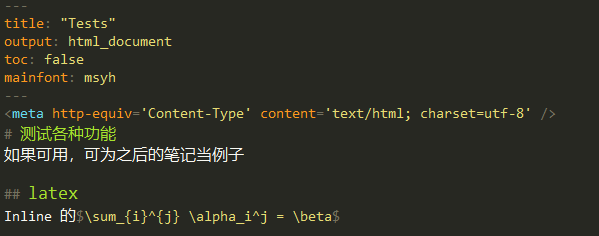

<meta http-equiv='Content-Type' content='text/html; charset=utf-8' />

[toc]
# 测试各种功能
如果可用，可为之后的笔记当例子

## latex
Inline 的$\sum_{i}^{j} \alpha_i^j = \beta$

## 贴图

## 内链
[到test目标的链接](./testAimFile.md)
